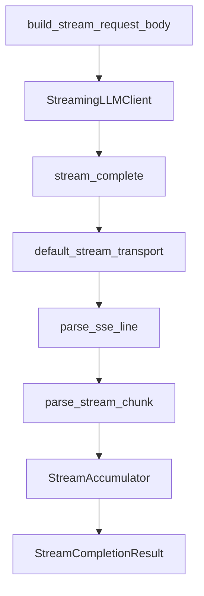

# Day 16 完整代码走查

**文件**：`nexus-agent-platform/src/llm/streaming.py`  
**行号**：以仓库当前版本为准

---

## 1. 模块头与导入

```python
"""
LLM 流式输出（SSE）模块
需求：ZL-NA-REQ-016
"""
```

依赖：

- `LLMClient`, `build_request_body` — Day 12  
- `TokenUsage` — Day 15  
- `APIError` — 统一异常

类型别名：

```python
StreamTransportFunc = Callable[[str, dict, dict], Iterator[dict]]
DeltaCallback = Callable[[str], None]
```

---

## 2. build_stream_request_body（约 66–73 行）

```python
def build_stream_request_body(messages, config):
    body = build_request_body(messages, config)
    body["stream"] = True
    return body
```

**走查点**：是否 mutate 了共享 dict？`build_request_body` 每次应返回新 dict（确认 client 实现）。

---

## 3. parse_sse_line（约 76–94 行）

逻辑顺序：

1. `strip`  
2. 空 / 注释 → `None`  
3. 非 `data:` → `None`  
4. `[DONE]` → `{"done": True}`  
5. 否则 `json.loads`

**走查点**：`JSONDecodeError` 包装为 `APIError`，保留 `from exc`。

---

## 4. parse_stream_chunk（约 97–116 行）

```python
if data.get("done"):
    return StreamChunk(raw=data)
```

`done` 标记不会进入 `stream_complete` 主循环（transport 已 break），但函数防御性处理。

**走查点**：`delta.get("content") or ""` 处理 `None`。

---

## 5. StreamAccumulator（约 119–135 行）

```python
def feed(self, chunk: StreamChunk) -> str:
    if chunk.delta_content:
        self._parts.append(chunk.delta_content)
    return chunk.delta_content
```

**走查点**：返回本次 delta 供 `on_delta` 使用，避免重复从 chunk 取。

---

## 6. iter_sse_events（约 138–143 行）

薄封装，过滤 `None`。可单测独立验证。

---

## 7. default_stream_transport（约 146–172 行）

关键循环：

```python
for raw_line in resp:
    line = raw_line.decode("utf-8")
    parsed = parse_sse_line(line)
    if parsed is None:
        continue
    if parsed.get("done"):
        break
    yield parsed
```

**走查点**：

- timeout 120 > Day 12 的 60，因长流  
- `HTTPError` 读 body 再抛 `APIError`

---

## 8. mock_stream_from_sse_file（约 175–187 行）

读文件 → `splitlines` → `iter_sse_events`。  
**不走 HTTP**，但 yield 的 dict 与真 API 同形。

---

## 9. mock_stream_from_text（约 190–210 行）

逐字符 yield chunk，末包带 `usage` 样本。  
**走查点**：`completion_tokens = max(len(text), 1)` 防零除（展示用）。

---

## 10. StreamingLLMClient.__init__（约 222–238 行）

transport 选择优先级：

1. 构造参数 `stream_transport`  
2. `env.mock` → SSE 文件  
3. 默认 `default_stream_transport`

---

## 11. stream_complete（约 240–292 行）— 核心

```python
body = build_stream_request_body(messages, self.config)
accumulator = StreamAccumulator()
...
for raw_chunk in self._stream_transport(...):
    chunk_count += 1
    parsed = parse_stream_chunk(raw_chunk)
    ...
    delta = accumulator.feed(parsed)
    if delta and on_delta:
        on_delta(delta)
    ...
    usage_raw = raw_chunk.get("usage")
    if usage_raw:
        usage = TokenUsage.from_usage_dict(usage_raw)
```

**走查点**：

- `if delta and on_delta`：空串不回调  
- 结束后 `if not content: raise APIError`  
- 构造 `StreamCompletionResult`

---

## 12. stream_chat / collect_stream_text

便捷封装，逻辑简单，适合 demo。

---

## 13. 演示脚本走查

### sse_parse_demos.py

`get_path("stream_mock_sse")` → `iter_sse_events` → 打印 delta。

### streaming_demo.py

`on_delta=lambda ch: print(ch, end="", flush=True)` — 标准打字机。

### async_stream_demos.py

`asyncio.to_thread` 包装同步 transport — 预习异步。

---

## 14. 测试走查要点

`tests/day16/test_streaming.py` 应覆盖：

- `[DONE]` 解析  
- 文本重建  
- `stream_complete` Mock 端到端  
- 空流异常

---

## 15. 走查路线图



---

## 16. Code Review Checklist

- [ ] 未在 `on_delta` 内做阻塞 IO（调用方责任）  
- [ ] Mock 与生产 transport 接口一致  
- [ ] usage 覆盖式更新正确  
- [ ] 异常均转 `APIError`  
- [ ] 类型注解完整

---

## 17. 与 Day 5 函数名同名的关系

`parse_stream_chunk` 在 Day 5 教材出现，Day 16 在 `streaming.py` **实现**。学员勿与 `parse_chat_completion` 混淆。
