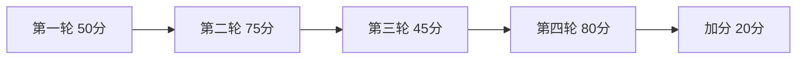

# Day 16 课堂知识竞赛

**形式**：小组抢答 + 个人闭卷  
**题量**：20 题  
**建议时长**：25 分钟

---

## 第一轮：快问快答（每题 10 分）

### 1

流式请求体相比阻塞多哪个字段？

答案
`stream: true`

### 2

SSE 协议终止标记是什么？

答案
`data: [DONE]`

### 3

`parse_sse_line` 对 `: keep-alive` 注释行返回什么？

答案
`None`

### 4

delta content 的 JSON 路径是？

答案
`choices[0].delta.content`

### 5

累积全文用哪个类？

答案
`StreamAccumulator`

---

## 第二轮：代码追踪（每题 15 分）

### 6

`stream_complete` 中 `on_delta` 何时被调用？

答案
`delta` 非空且回调非 None 时

### 7

`default_stream_transport` 如何读取响应？

答案
`for raw_line in resp` 逐行 decode

### 8

Mock 模式默认读哪个文件？

答案
`llm/sample_data/stream_mock.sse`

### 9

`chunk_count` 是否包含 `[DONE]` 行？

答案
不包含，只计 yield 的 JSON chunk

### 10

零 content 结束抛什么异常信息？

答案
`流式响应未产生任何 content`

---

## 第三轮：对比 Day 12（每题 15 分）

### 11

Day 12 用什么一次读完响应？

答案
`resp.read()`

### 12

阻塞模式 usage 在哪？

答案
响应 JSON 根对象 `usage`

### 13

假流式的错误做法是什么？

答案
流式 API 却 `read()` 全文再 split

---

## 第四轮：综合应用（每题 20 分）

### 14

为何 `print` 要 `flush=True`？

答案
避免 stdout 缓冲，实现打字机效果

### 15

流式能否降低 API 总费用？简述。

答案
不能，token 数不变，只改善感知延迟

### 16

Day 15 与流式 usage 如何衔接？

答案
末 chunk `usage` 经 `TokenUsage.from_usage_dict` 解析

### 17

`StreamTransportFunc` 为何可注入？

答案
解耦网络与解析，便于 Mock 与单测

### 18

首包只有 `delta.role` 是否正常？

答案
正常，content 可能为空

---

## 第五轮：预告 Day 17（加分 10 分）

### 19

Day 17 主题是什么？

答案
Prompt 模板 / 系统提示词工程

### 20

如何用 Day 17 产物配合流式？

答案
`stream_chat(..., system_prompt=template.render(...), on_delta=...)`

---

## 评分与奖项

| 总分 | 等级 |
|------|------|
| ≥180 | 流式大师 |
| 150–179 | 熟练 |
| 120–149 | 及格 |
| <120 | 复习 16 卡片 |

---

## 竞赛流程图

---

## 讲师主持词参考

「第 7 题，抢答开始——Day 16 和 Day 12 读 socket 的区别！」

---

## 错题沉淀

将错题号记录到学习群，当晚对应复习卡片编号。
