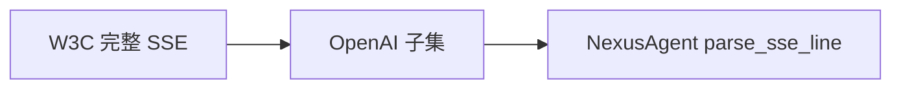

# Day 16 SSE 协议深度讲义

**专题**：Server-Sent Events 与 OpenAI 流式方言

---

## 1. SSE 诞生背景

Web 需要**服务端主动推送**到浏览器。WebSocket 双向过重；SSE 在 HTTP 上提供**单向文本流**，实现简单、自动重连。

LLM 生成天然是单向推送，SSE 成为事实标准。

---

## 2. W3C 事件流格式

```
field: value\n
\n
```

常见字段：

| 字段 | 含义 |
|------|------|
| `data` | 事件数据（可多行） |
| `event` | 事件类型 |
| `id` | 最后事件 ID |
| `retry` | 重连毫秒 |
| `:` | 注释 |

事件以**空行**分隔。

---

## 3. OpenAI Chat 流式方言

简化规则：

1. 仅使用 `data:` 单行 JSON  
2. 事件间可有可无空行  
3. 结束 `data: [DONE]`  
4. POST + `stream: true`（非经典 GET EventSource）



---

## 4. data: [DONE] 协议语义

| 层 | 含义 |
|----|------|
| HTTP | 连接可关闭，无更多 body |
| 应用 | 无更多 chat.completion.chunk |
| 代码 | `{"done": True}`，transport break |

**不是 JSON**。切勿 `json.loads("[DONE]")`。

---

## 5. 与 WebSocket 对比

| 特性 | SSE | WebSocket |
|------|-----|-----------|
| 方向 | 单向 | 双向 |
| 协议 | HTTP | 独立帧 |
| 重连 | 内置机制 | 需自建 |
| LLM Chat | ✅ 主流 | 少见 |

---

## 6. 注释与心跳

部分服务发送：

```
: ping\n
```

`parse_sse_line` 以 `:` 开头返回 `None`，忽略之。  
用于穿透代理超时。

---

## 7. 多行 data（扩展）

W3C 允许多行 `data:` 拼成一个事件。OpenAI 不使用。  
若未来厂商使用，需升级解析器拼接逻辑。

---

## 8. 编码与字符集

规范要求 UTF-8。`default_stream_transport` 使用 `decode("utf-8")`。  
非法序列可讨论 `errors="replace"`（当前严格 UTF-8）。

---

## 9. Content-Type

响应头通常：

```
Content-Type: text/event-stream; charset=utf-8
```

urllib 不强制检查，靠行格式解析。

---

## 10. 代理与缓冲

Nginx 等默认缓冲 SSE，导致客户端「批量」收到事件。  
网关需：

```
proxy_buffering off;
X-Accel-Buffering: no;
```

CLI 直连 API 较少遇到。

---

## 11. 安全考虑

- SSE 是明文 HTTP 文本，勿含密钥  
- 日志脱敏：不记录完整用户 prompt 流  
- CSRF：POST 流式需鉴权头

---

## 12. 解析状态机（完整）

```mermaid
stateDiagram-v2
    [*] --> Idle
    Idle --> SkipEmpty: 空行
    Idle --> SkipComment: 注释
    Idle --> ParseData: data:
    ParseData --> JsonChunk: 非 DONE
    ParseData --> Done: [DONE]
    JsonChunk --> Idle
    Done --> [*]
    SkipEmpty --> Idle
    SkipComment --> Idle
```

---

## 13. 故障模式

| 故障 | 现象 | 处理 |
|------|------|------|
| 中途断连 | 无 [DONE] | 超时/重试策略 |
| 粘包 | 多 JSON 一行 | OpenAI 少见 |
| 坏 JSON | 解析异常 | APIError |
| 重复 [DONE] | 无害 | break 已退出 |

---

## 14. 与 HTTP/1.1 chunked

传输编码 chunked 与 SSE 逻辑独立：  
urllib 先解 chunked 为字节流，再按 `\n` 分行。

---

## 15. 实验：手工解析

```bash
python3 src/day16/sse_parse_demos.py
```

对照 `stream_mock.sse` 每一行手写 `parse_sse_line` 输出。

---

## 16. 规范链接（备课）

- W3C Server-Sent Events  
- OpenAI API Reference — Chat streaming

（具体 URL 以官方为准，课件不固化链接防过期。）

---

## 17. 小结

> **SSE 是载体，`chat.completion.chunk` 是载荷，`[DONE]` 是句号。**

NexusAgent `parse_sse_line` 实现 OpenAI 子集，满足 ZL-NA-REQ-016。
