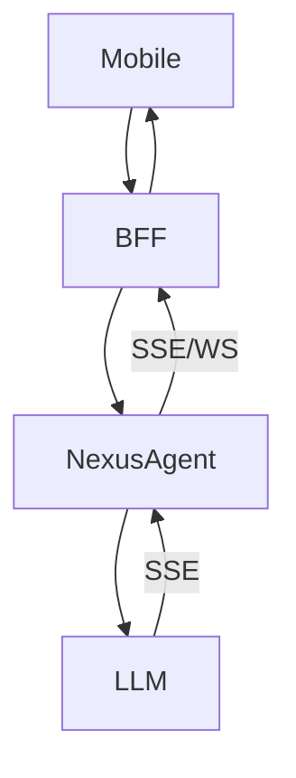
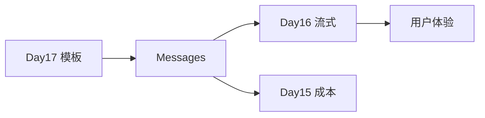

# Day 16 流式输出企业实践

**视角**：产品、架构、运维、财务  
**关联**：ZL-NA-REQ-016 落地指南

---

## 1. 产品指标：TTFT 与 TPS

| 指标 | 定义 | 流式影响 |
|------|------|----------|
| TTFT | 首 token 时间 | 显著下降（感知） |
| TPS | 每秒 token 数 | 与模型相关，流式不改变 |
| 完成时间 | 末 token 时间 | 近似不变 |

**看板建议**：同时展示 TTFT 与总时长，避免只优化一半。

---

## 2. 用户体验设计

### CLI

```python
on_delta=lambda ch: print(ch, end="", flush=True)
```

### Web

- 光标闪烁占位  
- 首 delta 到达后移除 loading  
- 长文自动滚动到底

### 错误态

流中断时保留已生成 partial +「继续生成」按钮（扩展）。

---

## 3. 架构模式：BFF 转发



BFF 层复用 `parse_sse_line`，统一鉴权与审计。

---

## 4. 可观测性

### 日志字段

```json
{
  "event": "stream_complete",
  "chunk_count": 42,
  "ttft_ms": 580,
  "total_ms": 4100,
  "prompt_tokens": 120,
  "completion_tokens": 85
}
```

### 追踪

OpenTelemetry span：`llm.stream` 子 span 每 N 个 chunk 打点（勿每 delta 一条，爆炸）。

---

## 5. 成本与财务

流式 **不减免** token。  
财务规则：

- 仍以 API `usage` 为准（Day 15）  
- 用户中断连接是否计费 → 查厂商条款  
- 内部 chargeback 按 `StreamCompletionResult.total_tokens`

---

## 6. 稳定性

| 风险 | 缓解 |
|------|------|
| 长连接超时 | 调大 LB idle timeout |
| 代理缓冲 | 关闭 buffering |
| 客户端断开 | 服务端检测连接，停止读流 |
| 重试 | 非幂等生成谨慎重试 |

---

## 7. 安全与合规

- 流式输出同样需内容安全策略  
- `finish_reason: content_filter` 要友好提示  
- 审计日志记录 prompt hash，不必存全文

---

## 8. 测试策略

| 环境 | 做法 |
|------|------|
| 本地 | `NEXUS_LLM_MOCK=1` |
| CI | `stream_mock.sse` 金样本 |
| 预发 | 限流真实 API 抽样 |
| 压测 | mock_stream_from_text 模拟高 chunk 率 |

---

## 9. 发布清单

- [ ] `pytest tests/day16/` 绿  
- [ ] demo 录屏归档  
- [ ] 监控 TTFT 基线  
- [ ] 文档更新 API 差异（阻塞 vs 流式）  
- [ ] 客服话术：「字会慢慢出来是正常现象」

---

## 10. 组织协作 RACI

| 活动 | R | A | C | I |
|------|---|---|---|---|
| 协议对齐 | 架构 | TL | 后端 | 产品 |
| UI 打字机 | 前端 | 产品 | 后端 | QA |
| Mock 样本 | 后端 | TL | QA | 运维 |
| 成本报表 | 财务 | 产品 | 后端 | 全员 |

---

## 11. 反模式 catalog

1. **假流式**：`read()` 全文再播放  
2. **delta 当 usage**：按 chunk 数估算费用  
3. **阻塞 on_delta**：回调里调另一个 LLM  
4. **无超时**：urllib 默认挂死  
5. **日志泄密**：完整 SSE 写盘

---

## 12. 与 Day 17 Prompt 工程衔接

企业 system 提示词常超 2k token。流式只改善**输出**等待；**输入**优化靠模板与裁剪（明日）。



---

## 13. 案例 ROI 估算（示意）

假设日活 1000，每用户每日 10 次对话：

- 阻塞投诉率 20% → 流式 6%  
- 客服工单减少 → 年省人力成本可观  
- API 费用不变

具体数字因组织而异，产品应做 A/B。

---

## 14. 演进路线

| 阶段 | 能力 |
|------|------|
| Day 16 | 同步 urllib SSE |
| Sprint 3+ | ChatAssistant 可选流式 |
| Sprint 4 | async transport |
| 生产 | 网关转发 + 可中断 |

---

## 15. 企业实践一句话

> **流式是体验功能，计量仍信 API；Transport 可换，协议不要乱。**
