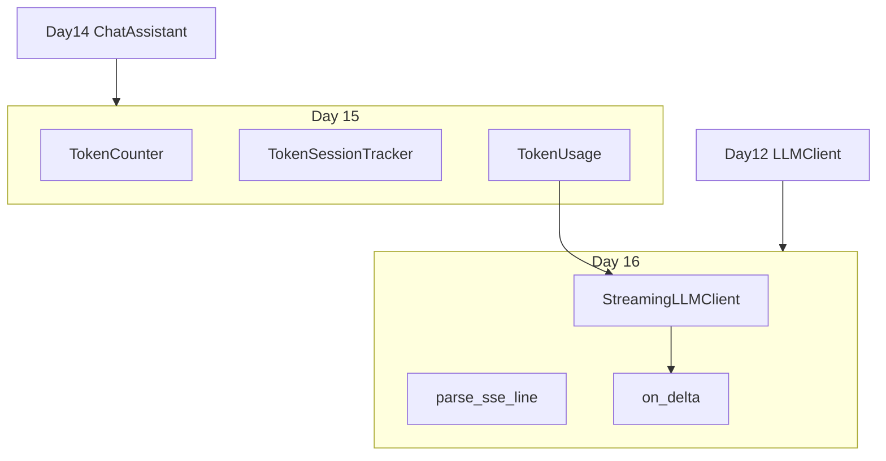
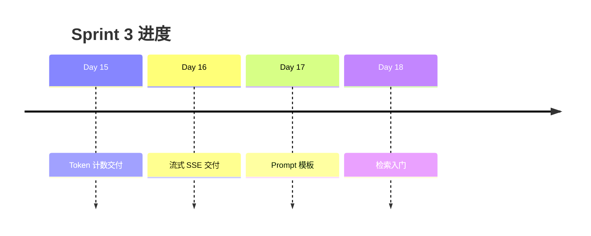

# Day 16 Sprint 3 阶段回顾

**位置**：Sprint 3 第二日（Day 15–24）  
**已完成**：Day 15 Token 计数、Day 16 流式输出

---

## 1. Sprint 3 目标回顾

Phase 2 从「能对话」到「可观测、体验好、可扩展」：

| 主题 | 状态 |
|------|------|
| Token 计量与成本 | ✅ Day 15 |
| 流式输出 SSE | ✅ Day 16 |
| Prompt 模板 | 🔜 Day 17 |
| RAG 检索 | Day 18–19 |
| 工具调用 | Day 20+ |

---

## 2. 两日能力拼图



---

## 3. 代码资产清单

| 路径 | 引入日 | 职责 |
|------|--------|------|
| `llm/token_counter.py` | Day 15 | 估算与 usage |
| `llm/streaming.py` | Day 16 | 流式客户端 |
| `llm/sample_data/stream_mock.sse` | Day 16 | Mock 样本 |
| `day15/*` | Day 15 | Token 演示 |
| `day16/*` | Day 16 | 流式演示 |
| `tests/day15/` | Day 15 | Token 测试 |
| `tests/day16/` | Day 16 | 流式测试 |

---

## 4. 学员能力自检（Day 15–16）

- [ ] 能解释多轮对话 prompt 膨胀  
- [ ] 能使用 `/tokens` 或 `usage_summary()`  
- [ ] 能配置 `NEXUS_LLM_MOCK=1` 跑流式 demo  
- [ ] 能区分 `read()` 与逐行迭代  
- [ ] 能手写 `parse_sse_line` 三种分支  
- [ ] 能说明 usage 在阻塞 vs 流式的位置差异

---

## 5. 技术债与已知限制

| 项 | 说明 | 计划 |
|----|------|------|
| CLI 主路径仍阻塞 | 未集成 stream_turn | Sprint 3 后期 |
| 同步 urllib | 阻塞线程 | async transport |
| 无断点续传 | 断连即失败 | 企业扩展 |
| tool_calls 流式 | 未解析 | Day 20+ |

---

## 6. 与 Sprint 1 对比

| 维度 | Sprint 1 | Sprint 3 前两日 |
|------|----------|----------------|
| 用户价值 | 能聊 | 看见字 + 看见钱 |
| 测试重点 | 功能闭环 | Mock 样本 + 协议 |
| 文档深度 | API 入门 | SSE + Token 双专题 |

---

## 7. 里程碑时间线



---

## 8. 团队反馈摘要（虚构内测）

- 产品：「打字机效果明显，投诉降了。」  
- 财务：「usage 还是在末包，报表能对上。」  
- 学员林晓：「终于把 Day 5 的 delta 用起来了。」

---

## 9. 下一阶段风险

1. Day 17 模板若与流式耦合过紧，难单测 → **保持输入输出分离**  
2. RAG 加入后 prompt 更长 → Token 压力上升 → 需检索裁剪  
3. 异步预习若跳太快 → 先巩固同步 SSE

---

## 10. 复习周建议

周末可选：

- 重跑 `day15` + `day16` 全部 demo  
- 完成 Day 16 作业 A–D  
- 阅读 18 对照表 + 25 精读

---

## 11. Sprint 3 全景表

| Day | 主题 | 需求编号 |
|-----|------|----------|
| 15 | Token 计数 | ZL-NA-REQ-015 |
| 16 | 流式输出 | ZL-NA-REQ-016 |
| 17 | Prompt 模板 | ZL-NA-REQ-017（预告） |
| 18–24 | RAG / Agent | 待定 |

---

## 12. 阶段回顾金句

> **Day 15 让成本可见，Day 16 让等待可见；两者合起来，内测才像成熟产品。**

---

## 13. 交付验收总命令

```bash
export PYTHONPATH=src NEXUS_LLM_MOCK=1
python3 -m pytest tests/day15/ tests/day16/ -v
python3 src/day16/streaming_demo.py
```

全绿 + demo 正常 = Sprint 3 前两日达标。
