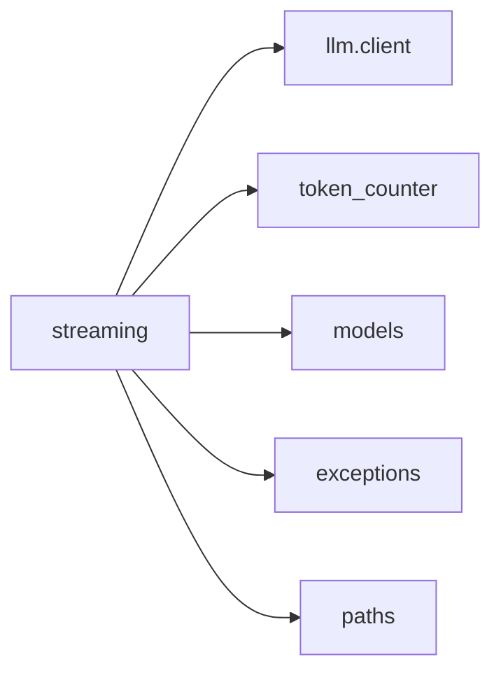
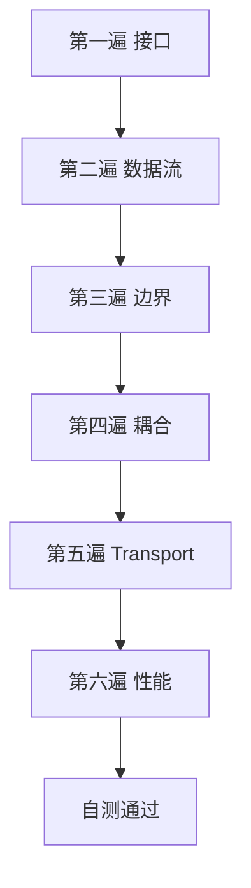

# Day 16 streaming 精读

**文件**：`llm/streaming.py`  
**读法**：分六遍，每遍 15 分钟

---

## 第一遍：接口面

圈出所有 `def` 与 `class`：

| 公开符号 | 类别 |
|----------|------|
| `build_stream_request_body` | 函数 |
| `parse_sse_line` | 函数 |
| `parse_stream_chunk` | 函数 |
| `StreamAccumulator` | 类 |
| `iter_sse_events` | 函数 |
| `default_stream_transport` | 函数 |
| `mock_stream_from_sse_file` | 函数 |
| `mock_stream_from_text` | 函数 |
| `StreamingLLMClient` | 类 |
| `collect_stream_text` | 函数 |

**问题**：哪些是纯函数？哪些有 IO？

---

## 第二遍：数据流

从 `stream_complete` 往回追：

```
messages → build_stream_request_body → transport → raw_chunk
→ parse_stream_chunk → StreamChunk → accumulator / on_delta
→ StreamCompletionResult
```

手绘数据类型变化：`list[ChatMessage]` → `dict` → `dict` → `StreamChunk` → `str` → `ChatMessage`。

---

## 第三遍：边界条件

逐条验证：

1. 空文件 SSE  
2. 仅 `[DONE]`  
3. 中间 HTTP 断连  
4. `on_delta=None`  
5. 末包无 usage  
6. `content` 为 `None` 的 JSON

对照 `tests/day16/` 是否覆盖。

---

## 第四遍：与邻模块耦合



列出每个 import 的**最小必需**子集。

---

## 第五遍：Transport 抽象

阅读三种 transport 实现，填写表：

| 实现 | 输入 | yield 次数 | 用途 |
|------|------|------------|------|
| default_stream_transport | 真 URL | 动态 | 生产 |
| mock_stream_from_sse_file | Path | 文件行数 | CI |
| mock_stream_from_text | str | len+1 | 单测 |

**思考**：若要模拟网络延迟，在哪加 `sleep` 不改变接口？

---

## 第六遍：性能与风格

- `StreamAccumulator` 用 `list` + `join` 而非 `+=` 字符串 — O(n) 优势  
- `chunk_count` 可观测性 — 排障高 chunk 率异常  
- 类型别名 `StreamTransportFunc` — 提高可读性

---

## 精读笔记模板

```markdown
### 函数：parse_sse_line
- 输入：
- 输出：
- 副作用：
- 测试：
- 我仍不懂：
```

---

## 对照 stream_mock.sse 精读

逐行抄写 `data:` 内容，写出对应 `StreamChunk` 四字段：

| 行号 | delta_content | finish_reason | 备注 |
|------|---------------|---------------|------|
| 1 | "" | "" | role 包 |
| 3 | 你 | | |
| ... | | | |
| 15 | "" | stop | 含 usage |
| 17 | — | — | [DONE] |

---

## stream_complete 循环展开（伪代码）

```python
for raw_chunk in transport(...):
    chunk_count += 1
    parsed = parse_stream_chunk(raw_chunk)
    model = parsed.model if parsed.model != "unknown" else model
    delta = accumulator.feed(parsed)
    if delta and on_delta:
        on_delta(delta)
    if parsed.finish_reason:
        finish_reason = parsed.finish_reason
    if raw_chunk.get("usage"):
        usage = TokenUsage.from_usage_dict(...)
```

**默写**：漏掉哪一行会导致无 usage？

---

## on_delta 契约

- 同步调用  
- 参数为**增量**非累积  
- 可能高频（每字一次）  
- 不应抛未捕获异常（否则中断流）

---

## 与 Day 5 parse_stream_chunk 名称

同一函数，Day 16 落地实现。精读时对照 Day 5 课件字段表。

---

## 扩展阅读顺序

1. 本文件  
2. [20_完整代码走查.md](20_完整代码走查.md)  
3. [22_SSE协议深度讲义.md](22_SSE协议深度讲义.md)  
4. 源码 `streaming.py`  
5. `tests/day16/test_streaming.py`

---

## 精读自测

1. `iter_sse_events` 与 transport 内联 parse 有何区别？  
2. 为何 `mock_stream_from_text` 末包要带 usage？  
3. `collect_stream_text` 是否统计 chunk_count？（读源码）

<details>
<summary>答案提示</summary>
1. 复用与单测；transport 内联避免重复 yield done  
2. 模拟真实 API 末包计量  
3. 不返回，仅要字符串
</details>

---

## 精读完成标志

你能不看代码，在白板上画出从 `stream=True` 到 `usage_summary()` 的完整链路。


