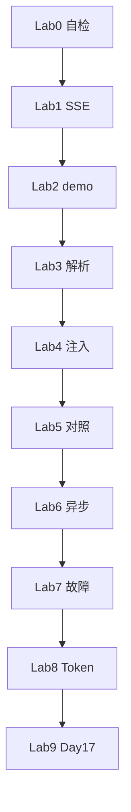

# Day 16 实操 Lab 手册

**实验环境**：`nexus-agent-platform` + `PYTHONPATH=src`  
**建议时长**：120 分钟  
**角色**：学员独立完成，助教巡场

---

## Lab 0：环境自检（10 min）

```bash
cd /path/to/nexus-agent-platform
export PYTHONPATH=src
export NEXUS_LLM_MOCK=1
python3 -m pytest tests/day16/ -v --tb=short
```

**通过标准**：全部 PASSED。

---

## Lab 1：SSE 肉眼观察（15 min）

### 步骤

```bash
cat src/llm/sample_data/stream_mock.sse
python3 src/day16/sse_parse_demos.py
```

### 记录表

| 序号 | data 行摘要 | delta_content | 累计文本 |
|------|-------------|---------------|----------|
| 1 | role 包 | | |
| 2 | 你 | 你 | 你 |
| ... | | | |
| 末 | usage 包 | | 全文 |

### 思考题

首包为何 content 为空？（role 声明）

---

## Lab 2：打字机 demo（20 min）

```bash
NEXUS_LLM_MOCK=1 python3 src/day16/streaming_demo.py
```

### 任务

1. 抄写终端完整输出  
2. 记录 `chunk_count` 与 `total_tokens`  
3. 修改 `on_delta` 为打印 `[{ch}]`，观察分隔

### 验收

输出含「你好，我是 NexusAgent 助手。」且 `finish_reason: stop`。

---

## Lab 3：parse_sse_line 单步调试（20 min）

### 步骤

在 Python REPL：

```python
import sys; sys.path.insert(0, "src")
from llm.streaming import parse_sse_line, parse_stream_chunk

line = 'data: {"choices":[{"delta":{"content":"测"}}]}'
ev = parse_sse_line(line)
chunk = parse_stream_chunk(ev)
print(chunk.delta_content)
```

再测：

```python
parse_sse_line("data: [DONE]")
parse_sse_line(": ping")
parse_sse_line("")
```

### 记录

每个输入的返回值类型与内容。

---

## Lab 4：Mock transport 注入（25 min）

### 步骤

创建 `/tmp/lab16_custom.py`：

```python
import os, sys
from pathlib import Path
os.environ["NEXUS_LLM_MOCK"] = "1"
sys.path.insert(0, "src")

from llm.streaming import StreamingLLMClient, mock_stream_from_text
from models import ModelConfig

text = "Lab4完成"
transport = mock_stream_from_text(text)
client = StreamingLLMClient(ModelConfig(), stream_transport=transport)
parts = []

result = client.stream_complete(
    [],  # mock 忽略 messages
    on_delta=parts.append,
)
print("".join(parts))
print(result.chunk_count, result.completion_tokens)
```

### 预期

- 拼接 `Lab4完成`  
- `chunk_count == len(text) + 1`（末包 finish）

---

## Lab 5：Day 12 对照实验（15 min）

### 步骤

1. 打开 `src/llm/client.py`，找到 `complete` 的 `resp.read()`  
2. 打开 `src/llm/streaming.py` 的 `for raw_line in resp`  
3. 填写 [18_与Day12阻塞调用对照表.md](18_与Day12阻塞调用对照表.md) 至少 5 行

### 讨论

若把流式当阻塞 `read()`，TTFT 如何变化？

---

## Lab 6：异步预习（10 min）

```bash
python3 src/day16/async_stream_demos.py
```

阅读 `async_stream_demos.py`，回答：

- 为何用 `asyncio.to_thread`？  
- 若去掉 `sleep(0.01)` 有何影响？

---

## Lab 7：故障注入（15 min）

### 任务 A：坏 JSON

创建 `bad.sse`：

```
data: {invalid
```

用 `iter_sse_events` 读取，捕获异常类型。

### 任务 B：空 content 流

仅保留 role 包与 `[DONE]`，观察 `stream_complete` 是否 `APIError`。

---

## Lab 8：与 Day 15 联想（10 min）

不运行代码，书面回答：

1. `stream_mock.sse` 末包 `usage` 三字段值？  
2. 若用 `TokenSessionTracker`，应在何时 `record_turn`？（提示：流结束后）

---

## Lab 9：预习 Day 17（10 min）

阅读 [00_旁白解读.md](00_旁白解读.md) 末尾 Day 17 预告。

草拟一条理财顾问 `system` 提示词（3–5 条约束），设想如何传入 `stream_chat`。

---

## Lab 10：综合挑战（可选 +15 min）

实现最小 REPL：

```python
while True:
    q = input("> ")
    if q == "q": break
    client.stream_chat(q, on_delta=lambda c: print(c, end="", flush=True))
    print()
```

Mock 模式下体验流式对话。

---

## Lab 路线图



---

## 提交清单

| Lab | 提交物 |
|-----|--------|
| 1 | 记录表照片或 markdown |
| 2 | 终端输出复制 |
| 4 | custom.py 或截图 |
| 5 | 对照表摘录 |
| 8 | 书面回答 |

---

## 助教巡场检查点

- [ ] `PYTHONPATH` 正确  
- [ ] 学员区分 delta 与全文  
- [ ] 无人修改 `stream_mock.sse` 原文件（应复制）  
- [ ] 能解释 `[DONE]`  

---

## 常见 Lab 失败

| 现象 | 解决 |
|------|------|
| ModuleNotFoundError | `export PYTHONPATH=src` |
| 无打字机 | `flush=True` |
| pytest 红 | 先 Lab0 定位 |

---

## 完成祝贺

完成 Lab 0–8 即达到 Day 16 实操达标。Lab 9 为明日 Day 17 Prompt 模板热身。
