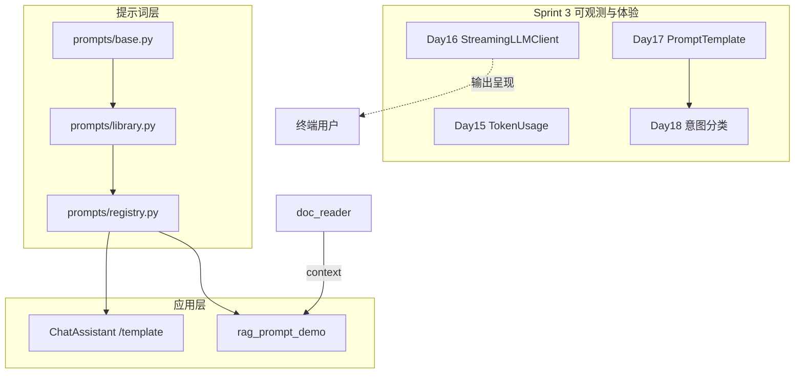

# Day 17 旁白解读：让助手「有身份、有规矩」

> **前置要求**：完成 Day 2 字符串格式化、Day 12 `LLMClient.complete`、Day 16 流式输出概念

---

## 旁白

2026 年 7 月 22 日，周三。智链科技合规部发来一封邮件，附上一段理财宣传文案：

> 「本产品稳赚不赔，年化 15%，内部资料请勿外传。」

赵岩把同一段文字分别丢进三个内测环境：A 用默认助手、B 用「理财 FAQ」人格、C 用「合规审阅」模板。三份输出截然不同——A 泛泛而谈，B 礼貌提醒风险，C 直接标出「高风险」并列出修改建议。

林晓盯着屏幕：「我们 Day 12 的 `system_prompt` 是写死在代码里的字符串……换场景就要改代码、重新部署？」

陈默在白板上画了一个框：

```
PromptTemplate(name, template, required_vars)
        ↓ render(**vars)
   ChatMessage("system", content)
```

> 「今天把『怎么说』从业务代码里抽出来。模板是**数据**，渲染是**函数**，注册表是**目录**。产品经理改 `.txt` 文件，开发只负责变量契约。」

周航补充运维视角：

> 「`default_registry.load_directory()` 启动时扫 `prompts/templates/`。客服同事可以 PR 一个新模板，不必动 Python。」

下午，林晓运行 `registry_demos.py`，看见 `customer_service` 从 `customer_service.txt` 加载；又跑 `rag_prompt_demo.py`，`doc_reader` 读入 `raw_notice.txt`，截断 300 字塞进 `RAG_QA` 的 `{context}`。她恍然大悟：

> 「流式解决『怎么显示』，模板解决『喂什么 system』——两条线正交，可以叠加。」

陈默在站会末尾预告 Day 18：

> 「明天加一层**意图分类**：用户一句话进来，先判断该用 `rag_qa` 还是 `doc_summary`，再 `apply_template`。」

---

## 今日在架构中的位置



---

## 林晓的学习建议

1. 先读 `prompts/base.py`，理解 `extract_variables` 与 `render` 的校验逻辑  
2. 运行 `prompt_demos.py`，对比 `render` 与 `preview` 的差异  
3. 运行 `registry_demos.py`，确认 `customer_service` 来自文件加载  
4. 阅读 `library.py` 五个内置模板，思考各自 `required_vars` 设计  
5. 跑 `NEXUS_LLM_MOCK=1 rag_prompt_demo.py`，观察 system 长度与 context 截断  
6. 在 REPL 里试验 `/template list` 与 `apply_template`，对照 `tests/day17/test_prompts.py`

---

## 与前后日的衔接

| 方向 | 内容 |
|------|------|
| 回顾 Day 2 | f-string / `str.format` 变量插值是今日 `render` 的语法基础 |
| 回顾 Day 12 | `ChatMessage("system", ...)` 进入 `complete` 的消息列表 |
| 回顾 Day 16 | 流式管输出；Prompt 管输入，互不替代 |
| 今日核心 | `PromptTemplate` + `PromptRegistry` + `/template` |
| 预告 Day 18 | 意图分类决定选用哪个模板 |
| 预告 Day 28 | `RAG_QA` 的 `{context}` 将接入向量检索 |

---

## 今日一句话

> **Prompt 模板不是「多写几句提示词」，而是把 system 提示词变成可版本化、可测试、可分发的工程资产。**
