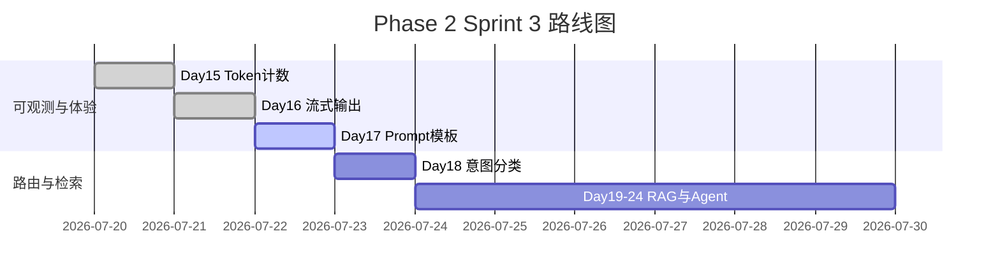

# Day 17 企业背景与今日任务

**日期**：2026 年 7 月 22 日  
**Sprint**：Sprint 3 第三日 — 提示词工程化

## 晨会纪要

### 赵岩（产品）

> 「内测反馈第二条：同一助手在不同业务线『人格分裂』——理财咨询太随意，合规审阅又太啰嗦。我们需要**场景化 system 提示词**，且运营能改文案不必等发版。」

### 陈默（架构）

> 「新增 `prompts` 包：`PromptTemplate` 封装 `{var}` 插值；`library.py` 放企业预设；`PromptRegistry` 统一查找与文件加载。`ChatAssistant` 增加 `/template` 与 `apply_template`，切换模板时保留 user/assistant 历史、仅替换 system。」

### 周航（DevOps）

> 「模板文件 UTF-8 存放 `prompts/templates/*.txt`，首行 `# 描述` 可选。CI 跑 `pytest tests/day17/ -v`，覆盖渲染、注册表、助手集成。」

### 林晓（学员代表）

> 「Day 2 学过 f-string，今天是不是同一个套路？」

陈默：「语法同源，但今天加**契约**：缺变量就 `ConfigError`，不让坏 prompt 悄悄进 API。」

## 任务分配

| ID | 任务 | 负责人 | 优先级 |
|----|------|--------|--------|
| ZL-NA-REQ-017 | 实现 `prompts/` 包 | 全员 | P0 |
| ZL-NA-101 | `PromptTemplate` + `extract_variables` | 林晓 | P0 |
| ZL-NA-102 | `library.py` 五类内置模板 | 林晓 | P0 |
| ZL-NA-103 | `PromptRegistry` + 文件加载 | 助教 | P0 |
| ZL-NA-104 | `ChatAssistant.apply_template` + `/template` | 助教 | P0 |
| ZL-NA-105 | `day17/*` 演示脚本 | 助教 | P1 |
| ZL-NA-106 | `tests/day17/` 全绿 | 周航 | P0 |

## Definition of Done

- [ ] `python3 src/day17/prompt_demos.py` 正确渲染三类模板
- [ ] `python3 src/day17/registry_demos.py` 列出含 `customer_service` 的模板
- [ ] `NEXUS_LLM_MOCK=1 python3 src/day17/rag_prompt_demo.py` 联调 doc_reader
- [ ] `NEXUS_LLM_MOCK=1 python3 src/day17/assistant_prompt_demo.py` `/template list` 可用
- [ ] `pytest tests/day17/ -v` 全绿
- [ ] 能口述：`render` 与 `preview` 的区别
- [ ] 能解释：`apply_template` 如何保留非 system 消息
- [ ] 能说明：`RAG_QA` 中 `{context}` 与 Day 28 向量检索的关系（预习）

## 今日节奏

| 时段 | 内容 |
|------|------|
| 09:00-09:30 | Prompt 工程概论、Day 2 f-string 回顾 |
| 09:30-10:30 | `PromptTemplate` 手写练习 |
| 10:45-12:00 | `library.py` 场景模板走读 |
| 14:00-15:30 | `PromptRegistry` + 文件模板 |
| 15:45-17:00 | `ChatAssistant` 集成、`rag_prompt_demo` |

## 环境准备

```bash
cd nexus-agent-platform
export PYTHONPATH=src
export NEXUS_LLM_MOCK=1

python3 src/day17/prompt_demos.py
python3 src/day17/registry_demos.py
python3 src/day17/rag_prompt_demo.py
python3 -m pytest tests/day17/ -v
```

## Sprint 3 全景（Day 15–24 预览）



## 与 Day 16 的差异

| 维度 | Day 16 流式输出 | Day 17 Prompt 模板 |
|------|-----------------|-------------------|
| 关注点 | 响应如何**逐字显示** | 请求如何**构造 system** |
| 核心类 | `StreamingLLMClient` | `PromptTemplate` |
| 用户命令 | （无新增） | `/template list`、`/template 名称` |
| 数据资产 | `stream_mock.sse` | `library.py` + `templates/*.txt` |
| 与 RAG 关系 | 间接（显示检索答案） | 直接（`RAG_QA` 嵌入 context） |
