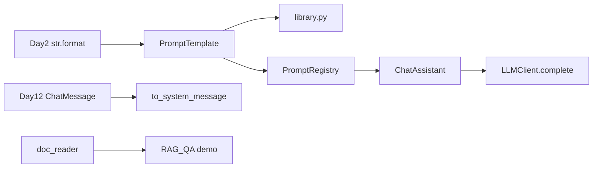

# ZL-NA-REQ-017 需求文档

**需求编号**：ZL-NA-REQ-017  
**需求名称**：Prompt 模板库  
**优先级**：P0  
**Sprint**：Sprint 3 第三日  
**状态**：已交付

---

## 1. 背景

智链科技 NexusAgent 在多业务线复用同一 LLM 客户端，但 system 提示词散落在代码与配置中，难以版本管理与 A/B 测试。产品要求建立 **Prompt 模板库**：支持变量插值、场景预设、文件扩展，并与 `ChatAssistant` 集成切换。

## 2. 目标用户

- 业务运营（修改 `.txt` 模板文案，无需改 Python）
- 后端开发（通过 `PromptRegistry` 按名称获取模板）
- 测试与 CI（校验必填变量、渲染结果、助手集成）

## 3. 功能需求

### FR-001 PromptTemplate 基类

| 项 | 描述 |
|----|------|
| 模块 | `prompts/base.py` |
| 类 | `PromptTemplate`（dataclass） |
| 字段 | `name`、`template`、`description`、`required_vars` |
| 推断 | `required_vars` 为空时从 `template` 自动提取 `{var}` |
| 校验 | `name` / `template` 非空，否则 `ValueError` |

### FR-002 变量提取与渲染

| 项 | 描述 |
|----|------|
| 函数 | `extract_variables(template: str) -> tuple[str, ...]` |
| 规则 | 正则 `\{([a-zA-Z_][a-zA-Z0-9_]*)\}`，去重保序 |
| 方法 | `render(**variables) -> str` |
| 缺变量 | 抛出 `ConfigError`，列出 missing 列表 |
| 安全渲染 | `render_safe` 返回 `(结果, 错误消息)` |

### FR-003 与消息模型集成

| 项 | 描述 |
|----|------|
| 方法 | `to_system_message(**variables) -> ChatMessage` |
| 角色 | 固定 `"system"` |
| 预览 | `preview(**variables)` 未提供变量用 `<var>` 占位 |

### FR-004 内置模板库

| 项 | 描述 |
|----|------|
| 模块 | `prompts/library.py` |
| 模板 | `DEFAULT_ASSISTANT`、`RAG_QA`、`DOC_SUMMARY`、`PRODUCT_FAQ`、`COMPLIANCE_REVIEW` |
| 导出 | `BUILTIN_TEMPLATES: dict[str, PromptTemplate]` |

### FR-005 注册表

| 项 | 描述 |
|----|------|
| 类 | `PromptRegistry` |
| 初始化 | 预加载 `BUILTIN_TEMPLATES` |
| 方法 | `register`、`get`、`list_names` |
| 文件加载 | `load_from_file(path, name=None)` 支持 `# 描述` 首行 |
| 目录加载 | `load_directory` 扫描 `*.txt` |
| 全局实例 | `default_registry`，启动时 `load_directory()` |

### FR-006 ChatAssistant 集成

| 项 | 描述 |
|----|------|
| 构造参数 | `prompt_template`、`template_variables`、`prompt_registry` |
| 方法 | `apply_template(name, variables=None)` |
| 行为 | 切换模板、合并变量、替换 history 中 system、保留其他消息 |
| 命令 | `/template list`、`/template 名称` |

### FR-007 演示与测试

| 项 | 描述 |
|----|------|
| 脚本 | `day17/prompt_demos.py`、`registry_demos.py`、`rag_prompt_demo.py`、`assistant_prompt_demo.py` |
| 测试 | `tests/day17/test_prompts.py` 覆盖渲染、注册表、助手 |

## 4. 非功能需求

| 编号 | 要求 |
|------|------|
| NFR-001 | 仅依赖标准库 + 项目已有模块，无 Jinja2 等外部模板引擎 |
| NFR-002 | 模板文件 UTF-8 编码 |
| NFR-003 | 单测无外网，Mock LLM 可跑助手演示 |
| NFR-004 | 与 Day 2 `str.format` 语法兼容，降低学习成本 |

## 5. 验收标准

```bash
export PYTHONPATH=src
python3 src/day17/prompt_demos.py
python3 src/day17/registry_demos.py
NEXUS_LLM_MOCK=1 python3 src/day17/rag_prompt_demo.py
NEXUS_LLM_MOCK=1 python3 src/day17/assistant_prompt_demo.py
python3 -m pytest tests/day17/ -v
```

全部通过且五类内置模板 + `customer_service` 文件模板可列出。

## 6. 范围外（后续迭代）

- Day 18：意图分类自动选模板  
- Day 28：向量检索填充 `RAG_QA.context`  
- 条件分支模板（Jinja2 风格 ``）— 本期不做

## 7. 依赖关系


