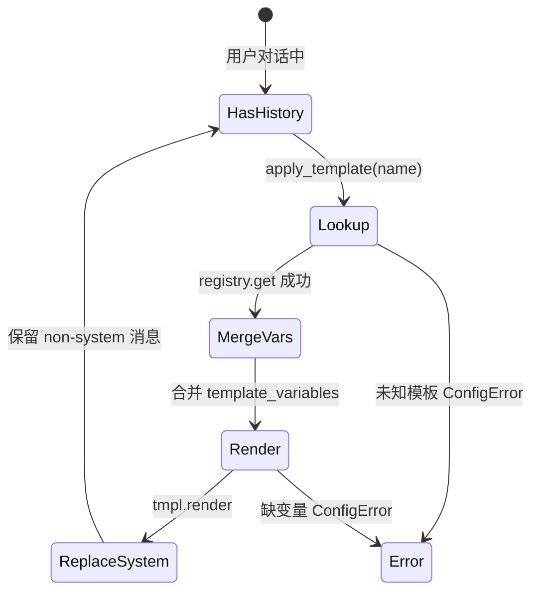

# ZL-NA-REQ-017 需求文档（扩展）

**关联主文档**：[02_需求文档.md](02_需求文档.md)  
**读者**：架构师、Tech Lead、安全与合规评审

---

## E1. 五类内置模板业务契约

### DEFAULT_ASSISTANT

| 变量 | 类型 | 示例 | 说明 |
|------|------|------|------|
| `company` | str | 智链科技 | 品牌注入，影响助手自我认同 |

**验收话术**：渲染结果须含公司名 +「简洁、专业」+「不要编造事实」。

### RAG_QA

| 变量 | 类型 | 示例 | 说明 |
|------|------|------|------|
| `company` | str | 智链科技 | 知识库归属 |
| `context` | str | doc_reader 输出 | 参考资料正文，可能截断 |

**关键约束**：须含「仅根据参考资料」「资料中未找到」兜底句式，降低幻觉风险。

### DOC_SUMMARY

| 变量 | 类型 | 示例 | 说明 |
|------|------|------|------|
| `max_points` | str | 3 | 要点数量（字符串以便 format） |
| `document` | str | 全文 | 待摘要正文 |

### PRODUCT_FAQ

| 变量 | 类型 | 示例 | 说明 |
|------|------|------|------|
| `company` | str | 智链科技 | 理财顾问身份 |
| `product_name` | str | 稳健增利 A | 产品上下文 |

**合规硬要求**：模板正文必须含「投资有风险，入市需谨慎」。

### COMPLIANCE_REVIEW

| 变量 | 类型 | 示例 | 说明 |
|------|------|------|------|
| `company` | str | 智链科技 | 审阅方身份 |
| `text` | str | 宣传文案 | 待审内容 |

**输出格式**：`【风险等级：高/中/低】` + 说明 + 修改建议。

---

## E2. customer_service.txt 文件规范

```
# 自定义客服问候模板          ← 可选描述行，载入 description
你是{company}客服助手...      ← 正文，支持多行
```

| 规则 | 说明 |
|------|------|
| 编码 | UTF-8 |
| 命名 | 文件名 stem 即默认 `name`（`customer_service`） |
| 覆盖 | `load_from_file` 后 `register` 同名会覆盖（本期无内置同名） |
| 变量 | `company`、`channel`、`max_chars` |

---

## E3. apply_template 状态机



**边界**：若 `variables` 参数传入新键，与实例级 `template_variables` 合并，后者可被覆盖。

---

## E4. 与 doc_reader 集成（RAG 预习）

`rag_prompt_demo.py` 流程：

1. `read_document(path, clean=True)` 读取 `sample_docs/raw_notice.txt`
2. 取 `doc.cleaned or doc.content` 作为 context
3. **截断 300 字符**（演示用，非生产策略）
4. `RAG_QA.to_system_message(company=..., context=...)`
5. `LLMClient.complete([system, user])`

| 决策 | 理由 |
|------|------|
| 截断 300 | 课堂演示控制 token；生产用 chunk 策略 |
| clean=True | 去除多余空白，提高 context 密度 |
| system 非 user | 资料放 system，符合「模型指令 vs 用户问题」分离 |

---

## E5. 错误码与异常映射

| 场景 | 异常 | 用户可见（CLI） |
|------|------|-----------------|
| 未知模板名 | `ConfigError` | `模板切换失败: 未知模板...` |
| 缺必填变量 | `ConfigError` | `模板 xxx 缺少变量: [...]` |
| 模板文件不存在 | `StorageError` | 开发期抛出，不进 CLI |
| 空 name/template | `ValueError` | 构造时失败 |

---

## E6. 安全与合规检查清单

- [ ] 模板中不得硬编码 API Key  
- [ ] `context` / `text` / `document` 可能含用户 PII，日志脱敏  
- [ ] `PRODUCT_FAQ`、`COMPLIANCE_REVIEW` 须过法务预审  
- [ ] 文件模板目录写权限仅运维/研发，防未授权篡改  

---

## E7. Day 18 接口预留

意图分类器输出 → `apply_template` 输入：

```python
# 伪代码，Day 18 实现
intent = classify_intent(user_message)  # "rag_qa" | "doc_summary" | ...
assistant.apply_template(intent, variables=build_vars(intent, ctx))
```

今日须保证：**模板名与 `library.py` 中 `name` 字段一致**，供分类器直接引用。

---

## E8. 性能与 token 预算

| 模板 | 典型渲染长度 | 备注 |
|------|-------------|------|
| DEFAULT_ASSISTANT | ~80 字 | 轻量默认 |
| RAG_QA | 模板 + context | context 主导，需预算管理 |
| COMPLIANCE_REVIEW | 模板 + text | 审阅文本可能很长 |

建议：生产环境对 `context` 做 token 计数（复用 Day 15 `TokenCounter`）后再 `render`。
