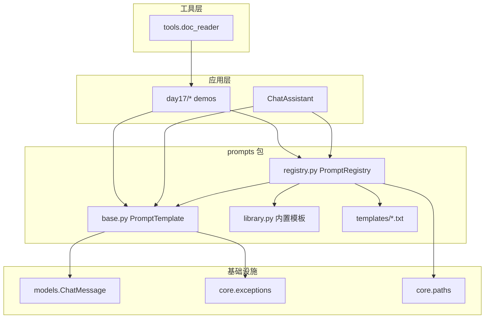
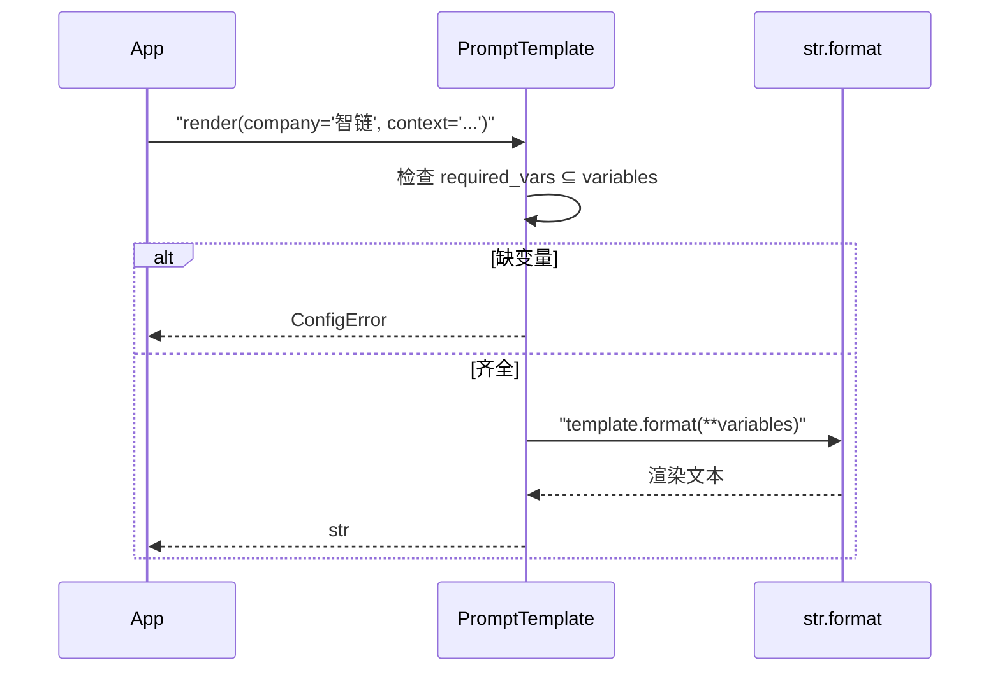
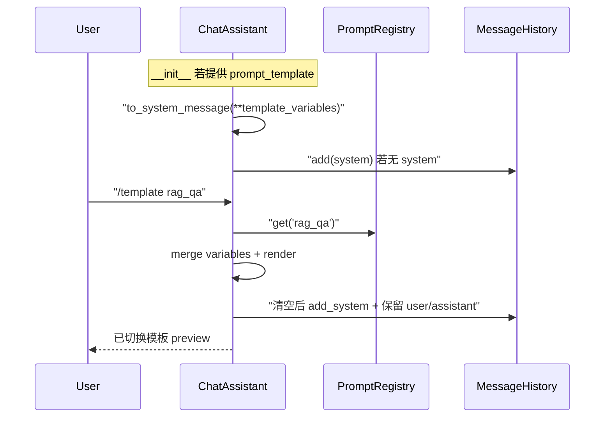
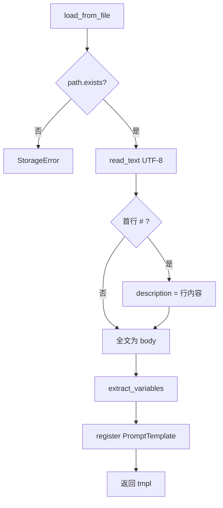

# Day 17 架构设计

**模块**：`prompts/` 包  
**需求**：ZL-NA-REQ-017

---

## 1. 分层架构



## 2. 核心类与函数

| 符号 | 模块 | 职责 |
|------|------|------|
| `extract_variables` | base.py | 正则提取 `{var}` 列表 |
| `PromptTemplate` | base.py | 模板数据 + render / preview / to_system_message |
| `DEFAULT_ASSISTANT` 等 | library.py | 企业场景预设实例 |
| `BUILTIN_TEMPLATES` | library.py | name → Template 字典 |
| `PromptRegistry` | registry.py | 注册、查找、文件加载 |
| `default_registry` | registry.py | 全局单例，已 load_directory |
| `apply_template` | cli_assistant.py | 运行时切换 system |
| `/template` | cli_assistant.py | 用户命令入口 |

## 3. render 控制流



## 4. ChatAssistant 初始化与模板



## 5. 文件加载流程



## 6. 模块依赖图

```
prompts/base.py
    → core.exceptions.ConfigError
    → models.ChatMessage

prompts/library.py
    → prompts.base.PromptTemplate

prompts/registry.py
    → prompts.base, prompts.library
    → core.paths.get_path("prompts_dir")

chat/cli_assistant.py
    → prompts.default_registry
    → PromptTemplate.apply via apply_template
```

**原则**：`library` 不依赖 `registry`；`registry` 聚合 `library` + 文件。

## 7. 与 LLM 层的边界

| 层 | 输入 | 输出 |
|----|------|------|
| Prompt | 变量 dict | `ChatMessage("system", rendered)` |
| LLM | `list[ChatMessage]` | `CompletionResult` |
| Streaming（Day 16） | 同上 | 逐 delta 显示 |

Prompt 层**不调用** LLM；仅构造 messages。`rag_prompt_demo.py` 在脚本层组装后调用 `LLMClient`。

## 8. 扩展点（后续 Sprint）

1. **Day 18**：`IntentClassifier` → 模板名  
2. **版本字段**：`PromptTemplate.version: str`（本期未实现）  
3. **多语言**：`name` 后缀 `_en` / `_zh`（约定即可）  
4. **模板组合**：system = header + body 两段 render（本期单段）

## 9. 设计权衡

| 选型 | 优点 | 缺点 |
|------|------|------|
| `str.format` 非 Jinja2 | 零依赖、与 Day 2 一致 | 无 if/for |
| dataclass | 清晰、可 repr | 非严格不可变 |
| 全局 default_registry | 演示简单 | 测试宜新建 `PromptRegistry()` |
| system 替换非追加 | 避免多 system 冲突 | `/system` 与 `/template` 需文档说明优先级 |
