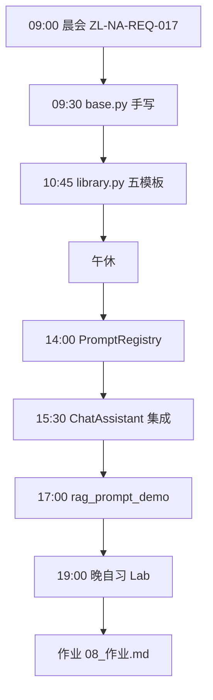
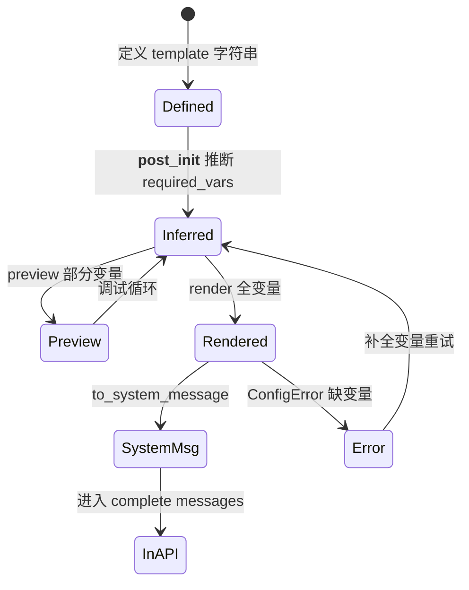
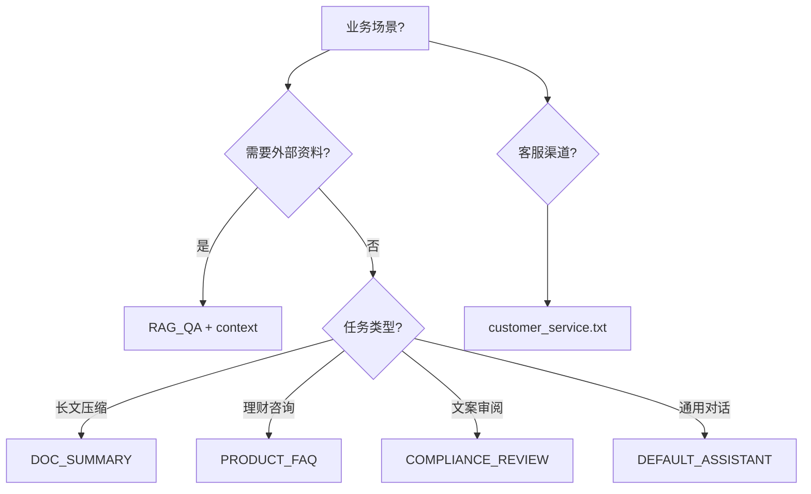
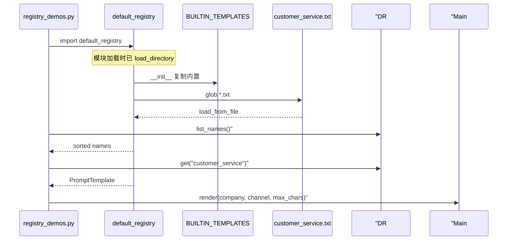
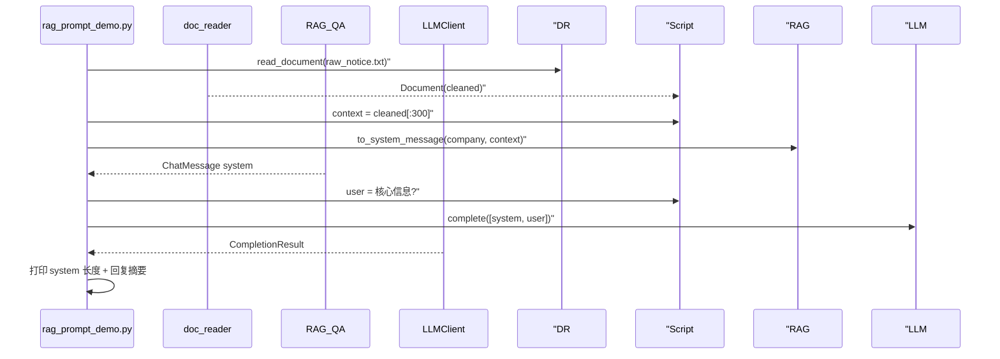
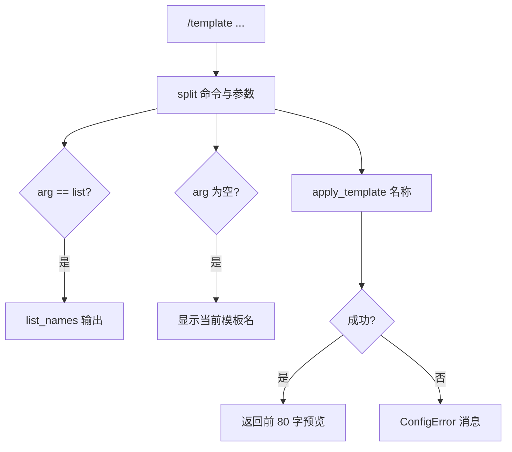
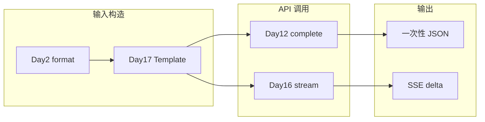
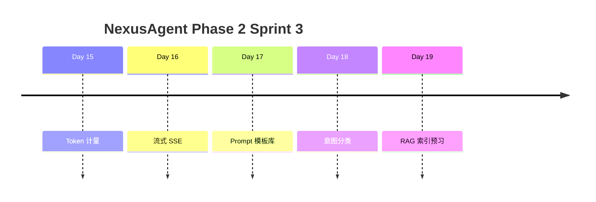
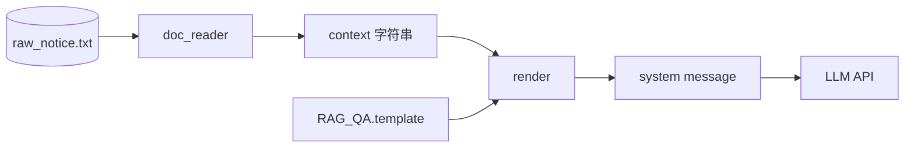
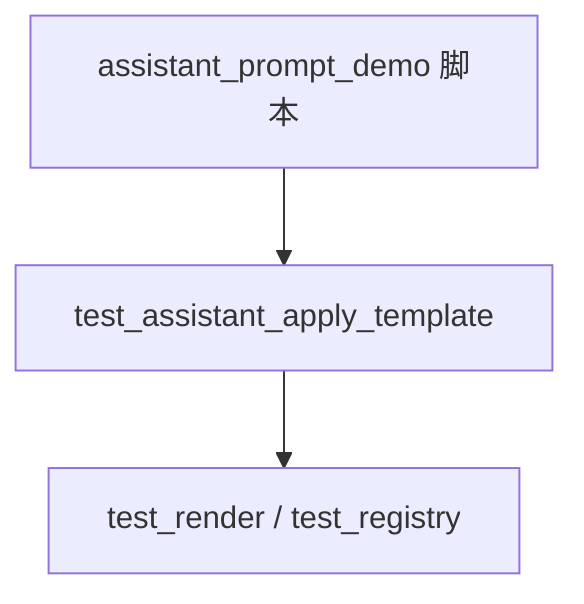

# Day 17 流程图与示意图

**主题**：Prompt 模板从定义到 API 调用的全链路

---

## 1. 学员日课总流程

---

## 2. PromptTemplate 生命周期

---

## 3. 内置模板选型决策树

---

## 4. registry_demos 数据流

---

## 5. rag_prompt_demo 端到端

---

## 6. /template 命令分支

---

## 7. 与 Day 2 / Day 16 关系图

---

## 8. Sprint 3 第三日位置

---

## 9. 模板变量数据流（RAG 场景）

---

## 10. 测试金字塔（Day 17）

单元测试覆盖：`extract_variables`、`ConfigError`、`load_from_file` tmp_path、`customer_service` 注册。
