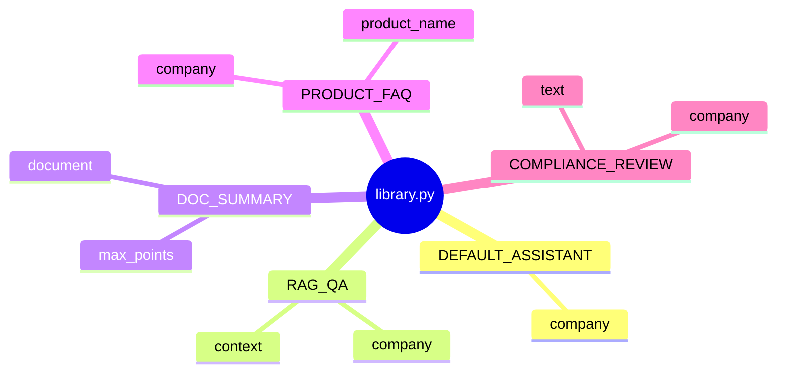

# Day 17 课堂笔记（上午）

**时间**：09:00–12:00  
**主讲**：陈默  
**记录**：林晓

---

## 09:00–09:30 Prompt 工程概论

### 核心观点

- **System prompt** 定义模型角色、边界、输出格式；**User** 承载具体问题  
- 硬编码字符串 → 难维护；模板 + 变量 → 可复用、可测试  
- 与 Day 2 连接：`"你是{}助手".format(name)` 今日升级为带校验的 `PromptTemplate`

### 白板摘录

```
messages = [
  ChatMessage("system", rendered_prompt),
  ChatMessage("user", user_input),
]
```

---

## 09:30–10:30 base.py 精读

### extract_variables

```python
_PLACEHOLDER_RE = re.compile(r"\{([a-zA-Z_][a-zA-Z0-9_]*)\}")
```

- 只认「标识符」风格占位符，不支持 `{0}` 位置参数  
- 去重保序：先出现的变量先列在 `required_vars`

### PromptTemplate.__post_init__

- `required_vars` 为空 → 自动 `extract_variables(self.template)`  
- 显式传入 `required_vars` 可**缩小**必填集（高级用法，本期少见）

### render vs preview

| 方法 | 缺变量 | 用途 |
|------|--------|------|
| `render` | `ConfigError` | 生产渲染 |
| `preview` | `<var>` 占位 | 调试、长度估算 |
| `render_safe` | 返回错误字符串 | CLI 友好 |

### 课堂练习

手写模板 `hello_{name}`，缺 `name` 调用 `render()`，观察 `ConfigError` 消息格式。

---

## 10:45–12:00 library.py 五模板走读

### DEFAULT_ASSISTANT

- 单变量 `company`，默认人格  
- `to_system_message(company="智链科技")` 一行进 history

### RAG_QA

- **今日重点**：`context` 占位，演示用 doc_reader 填充  
- 防幻觉句式：「仅根据参考资料」「资料中未找到」

### DOC_SUMMARY

- `max_points` 设计为字符串 `"3"` 而非 int —— 统一 `**variables: str` 签名

### PRODUCT_FAQ / COMPLIANCE_REVIEW

- 金融业务合规：风险揭示、夸大收益检测  
- 产品强调：模板即「合规策略代码化」

### 示意图（师绘）



---

## 上午疑问与解答

**Q：为什么不用 Jinja2？**  
A：Sprint 3 坚持标准库；`{var}` 够覆盖 80% 企业场景。条件逻辑留 Day 18+ 路由层。

**Q：`format` 里有大括号字面量怎么办？**  
A：双写 `{{` `}}` 转义，与 Python 一致。本期模板未用到。

**Q：能否多个 system 消息？**  
A：OpenAI 兼容 API 允许多 system，但 `ChatAssistant.apply_template` **替换为单一 system**，避免冲突。

---

## 上午自检清单

- [ ] 能默写 `PromptTemplate` 四个字段  
- [ ] 能解释 `required_vars` 自动推断时机  
- [ ] 能说出五类内置模板各需要什么变量  
- [ ] 运行通过 `prompt_demos.py`

---

## 与下午衔接

下午进入 `PromptRegistry`、`load_from_file`、`ChatAssistant /template`。预习：阅读 `customer_service.txt` 全文。
