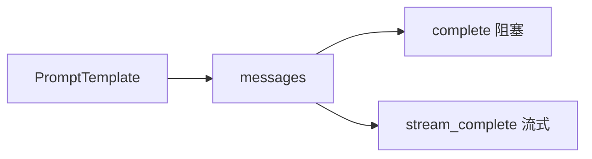

# Day 17 课堂笔记（下午）

**时间**：14:00–17:00  
**主讲**：陈默 + 助教  
**记录**：林晓

---

## 14:00–15:00 PromptRegistry

### 初始化顺序

```python
default_registry = PromptRegistry()  # 复制 BUILTIN_TEMPLATES
default_registry.load_directory()    # 扫描 prompts/templates/*.txt
```

### load_from_file 要点

1. 首行 `# xxx` → `description`，其余为 template body  
2. `name` 默认 `path.stem`（`customer_service.txt` → `customer_service`）  
3. 读完即 `register`，同名后加载覆盖先加载

### list_names / get

- `get` 未知名 → `ConfigError`，消息含**排序后的可用列表**（利于排错）  
- 测试里常 `PromptRegistry()` 空注册表 + 手动 `register`，隔离全局状态

### 演示输出（registry_demos.py）

```
已注册模板 (6):
  - compliance_review: ...
  - customer_service: 自定义客服问候模板
  - default_assistant: ...
  ...
```

---

## 15:00–15:45 ChatAssistant 集成

### 构造参数

```python
ChatAssistant(
    prompt_template=DEFAULT_ASSISTANT,
    template_variables={"company": "智链科技"},
    track_tokens=False,
)
```

初始化时若有 `prompt_template` 且 history 无 system → 自动 `to_system_message`。

### apply_template 源码逻辑（摘要）

1. `tmpl = registry.get(name)`  
2. `merged = {**self.template_variables, **(variables or {})}`  
3. `rendered = tmpl.render(**merged)`  
4. 提取 `non_system` 消息，重建 history：`system` + 原对话

**设计意图**：换人格不换上下文，用户无需重问。

### /template 命令

| 输入 | 行为 |
|------|------|
| `/template list` | 列出所有 name |
| `/template` | 显示当前模板 + 用法 |
| `/template rag_qa` | `apply_template("rag_qa")` |

错误时：`模板切换失败: ...`（`ConfigError.message`）

---

## 15:45–17:00 rag_prompt_demo 联调

### 步骤回顾

```python
doc = read_document(get_path("sample_docs") / "raw_notice.txt", clean=True)
context = doc.cleaned or doc.content
system = RAG_QA.to_system_message(company="智链科技", context=context[:300])
```

### 观察点

- `system` 长度 ≈ 模板固定部分 + 300 字 context  
- Mock LLM 返回固定「好的」，重点在**消息构造**  
- `usage_summary()` 仍可用（Day 15 衔接）

### 与 Day 16 叠加思考



同一套 messages，两种输出体验。

---

## 17:00 课堂演示 bug 记录

| 现象 | 原因 | 解决 |
|------|------|------|
| `/template rag_qa` 失败 | 未传 `context` | 先 `apply_template(..., variables={"context":"..."})` 或切换前设变量 |
| `customer_service` 找不到 | 未 load_directory | 用 `default_registry` 勿空 `PromptRegistry()` |
| format KeyError | 模板写了 `{undefined}` 但未列入 required_vars 手工缩减 | 保持自动推断 |

---

## 下午实操成果

林晓完成：

1. `assistant_prompt_demo.py` 输出 `/template list`  
2. 手动 `apply_template("product_faq", variables={"company":"智链科技","product_name":"稳健A"})`  
3. `pytest tests/day17/test_prompts.py` 12 passed

---

## 今日金句

> 「注册表是电话簿，模板是剧本，render 是演员照剧本念——变量是当天场次信息。」

---

## 课后待办

- 晚自习：Lab 1–3（见 26_实操Lab手册.md）  
- 预习 Day 18：什么样的用户话该走 `compliance_review`？
