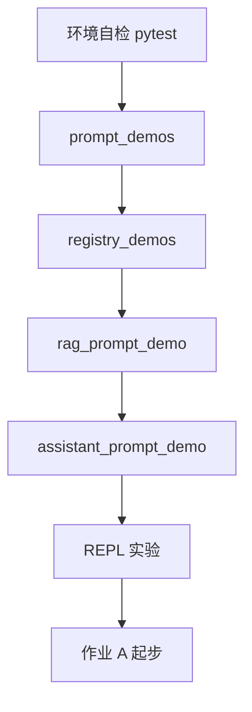

# Day 17 晚自习

**时间**：19:00–21:00  
**地点**：实训室 / 线上自习室  
**助教**：现场答疑

---

## 晚自习目标

1. 跑通四个 `day17` 演示脚本  
2. 完成 [12_课堂练习册.md](12_课堂练习册.md) 练习 1–4  
3. 开始 [08_作业.md](08_作业.md) 作业 A  

---

## 19:00–19:20 环境统一

```bash
cd nexus-agent-platform
export PYTHONPATH=src
export NEXUS_LLM_MOCK=1
python3 -m pytest tests/day17/ -v --tb=short
```

**通过标准**：全部 PASSED。若有失败，先查 `PYTHONPATH` 与是否在项目根目录。

---

## 19:20–19:50 四脚本跟打

| 顺序 | 命令 | 关注输出 |
|------|------|----------|
| 1 | `python3 src/day17/prompt_demos.py` | 三段渲染文本 |
| 2 | `python3 src/day17/registry_demos.py` | 6 个模板名 + customer_service |
| 3 | `python3 src/day17/rag_prompt_demo.py` | system 长度、助手摘要 |
| 4 | `python3 src/day17/assistant_prompt_demo.py` | `/template list` |

---

## 19:50–20:30 REPL 实验

```python
import sys; sys.path.insert(0, "src")
from prompts import RAG_QA, PromptRegistry

# 实验 1：preview 缺 context
print(RAG_QA.preview(company="智链科技"))

# 实验 2：render 缺 context
try:
    RAG_QA.render(company="智链科技")
except Exception as e:
    print(type(e).__name__, e)

# 实验 3：临时注册表
reg = PromptRegistry()
reg.register(RAG_QA)
print(reg.list_names())
```

记录：`preview` 与 `render` 对缺变量的行为差异。

---

## 20:30–21:00 答疑速记

### 常见问题

**Q：`apply_template` 后 `/history` 里 system 变了吗？**  
A：是，第一条 system 被替换，user/assistant 序号可能变化但内容保留。

**Q：能否同时用 `/system` 和 `/template`？**  
A：`/system` 追加 system；`/template` 替换。建议产品层二选一，避免多 system。

**Q：RAG context 300 字够吗？**  
A：课堂演示够用；生产按 token 预算与检索 chunk 策略，Day 19+ 展开。

---

## 晚自习示意图



---

## 明日预习（5 分钟）

阅读需求文档中 Day 18「意图分类」预留段落：思考用户说「帮我审一下这段宣传语」应映射到哪个 `name`。

---

## 自习纪律

- 允许结对讨论模板设计，**禁止**代写作业完整代码  
- 遇到问题先查 [10_常见问题与排错指南.md](10_常见问题与排错指南.md)  
- 21:00 前在学习群接龙：pytest 截图 + 最喜欢的一个内置模板名
