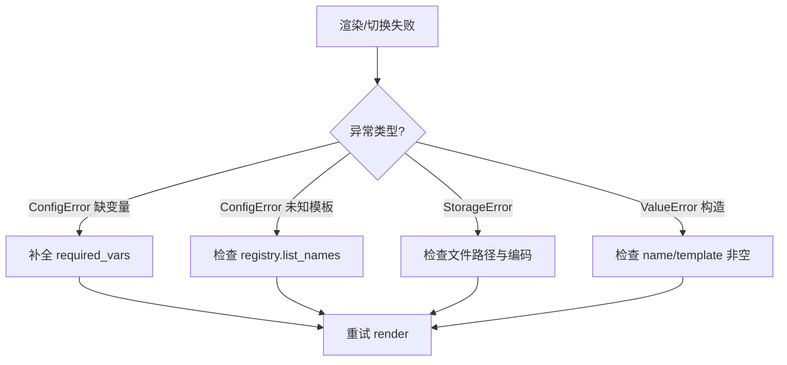

# Day 17 常见问题与排错指南

**适用版本**：`nexus-agent-platform` Sprint 3 Day 17  
**最后更新**：2026-07-22

---

## 1. 环境与导入

### Q：`ModuleNotFoundError: No module named 'prompts'`

**原因**：未设置 `PYTHONPATH=src` 或不在项目根目录。

**解决**：

```bash
cd nexus-agent-platform
export PYTHONPATH=src
```

### Q：测试通过但演示脚本报错

演示脚本已内置 `sys.path.insert`；若仍失败，检查是否在 `src/day17/` 外错误执行。

---

## 2. render 与 ConfigError

### Q：`模板 'rag_qa' 缺少变量: ['context']`

**原因**：`RAG_QA` 需要 `company` 和 `context`，只传了前者。

**解决**：

```python
RAG_QA.render(company="智链科技", context="参考资料正文...")
```

或调试时用 `preview(company="智链科技")` 查看 `<context>` 占位。

### Q：`模板 'xxx' 渲染失败: KeyError`

**原因**：模板正文含 `{foo}` 但未在 `variables` 中提供，且可能未被 `extract_variables` 捕获（非常规标识符）。

**解决**：检查占位符是否为 `[a-zA-Z_][a-zA-Z0-9_]*`；字面量大括号用 `{{` `}}`。

---

## 3. PromptRegistry

### Q：`未知模板: 'customer_service'`

**原因**：使用了空 `PromptRegistry()` 而未 `load_from_file`；或未 `load_directory`。

**解决**：使用 `from prompts import default_registry`，或手动：

```python
from core.paths import get_path
reg.load_directory(get_path("prompts_dir"))
```

### Q：修改 `customer_service.txt` 后无变化

**原因**：`default_registry` 在**首次 import** 时已加载；Python 进程未重启。

**解决**：重启 Python 进程；或新建 `PromptRegistry()` 重新 `load_from_file`。

---

## 4. ChatAssistant /template

### Q：`/template rag_qa` 提示切换失败

**原因**：`apply_template` 使用合并后的 `template_variables`，若从未设置 `context` 则 render 失败。

**解决**：

```python
assistant.apply_template(
    "rag_qa",
    variables={"company": "智链科技", "context": "..."},
)
```

### Q：切换模板后对话丢失？

**不应发生**。`apply_template` 保留非 system 消息。若丢失，检查是否调用了 `/clear` 或重建了 `ChatAssistant` 实例。

### Q：`/template list` 里没有内置模板

检查 `prompt_registry` 是否被替换为未加载内置的空注册表。默认应指向 `default_registry`。

---

## 5. rag_prompt_demo

### Q：`StorageError` 找不到 `raw_notice.txt`

**原因**：`get_path("sample_docs")` 路径错误或样本未检出。

**解决**：确认仓库含 `sample_docs/raw_notice.txt`；`PYTHONPATH=src`。

### Q：Mock 助手只回复「好的」

**预期行为**。Demo 验证的是 **system 构造与 API 调用链**，非回答质量。换真实 API 需配置 `LLMEnvConfig`。

---

## 6. 测试相关

### Q：`test_registry_loads_customer_service` 失败

确认 `prompts/templates/customer_service.txt` 存在且 `default_registry` 在模块加载时 `load_directory()`。

### Q：`tmp_path` 加载测试失败

检查写入编码为 UTF-8；首行 `# 描述` 后正文不能为空。

---

## 7. 设计误区

| 误区 | 纠正 |
|------|------|
| Prompt 模板能代替 RAG 检索 | 模板只**格式化** context，检索在 doc_reader / 向量库 |
| preview 可用于生产 | preview 用占位符，可能含 `<context>` 无效提示 |
| 流式能解决 prompt 过长 | 流式不减 prompt token；须截断 context |
| 每个 user 消息一个模板 | 通常一个会话一个 system，切换用 `/template` |

---

## 8. 排错流程图



---

## 9. 获取帮助

1. 阅读 [11_Prompt模板详解.md](11_Prompt模板详解.md)  
2. 运行 `pytest tests/day17/ -v` 对照失败用例  
3. 晚自习助教台 / 学习群 #day17-prompt
