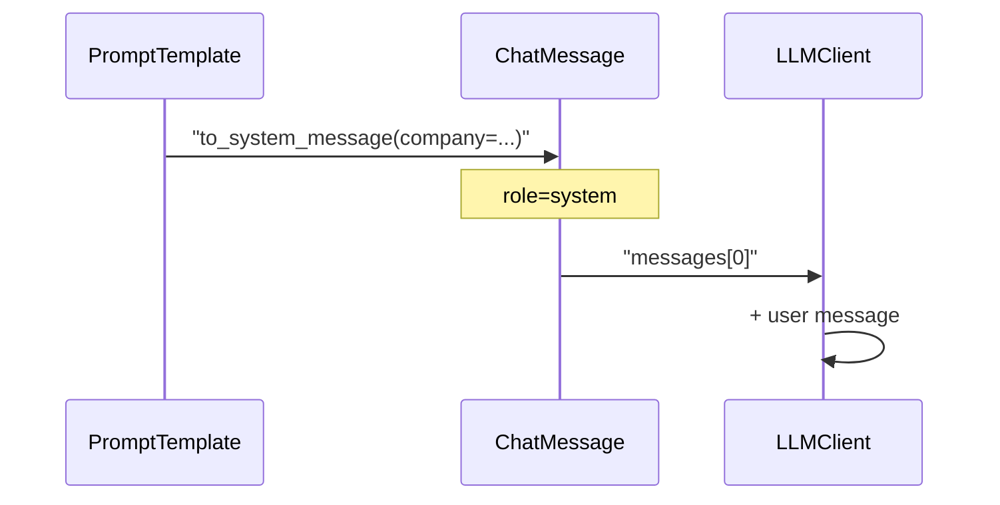
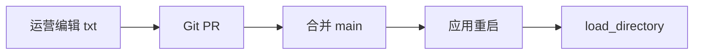
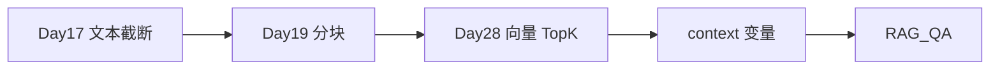

# Day 17 Prompt 模板详解

**专题**：从 `str.format` 到企业级 Prompt 资产 — NexusAgent 提示词全链路

---

## 1. 为什么需要 Prompt 模板？

大模型对 **system** 消息高度敏感：同一 user 问题，换 system 可得到完全不同风格与合规边界。

散落的问题：

1. 字符串硬编码在 `cli_assistant.py`，改文案要发版  
2. 多环境（理财 / 合规 / 客服）复制粘贴，易漂移  
3. 缺变量时静默失败或运行时 `KeyError`，难排查  

`PromptTemplate` 解决：**命名、校验、复用、测试**。

---

## 2. 占位符语法

与 Python `str.format` 一致：

```python
"你是{company}助手，渠道{channel}。".format(company="智链科技", channel="CLI")
```

`extract_variables` 正则：

```python
r"\{([a-zA-Z_][a-zA-Z0-9_]*)\}"
```

不支持：`{0}` 位置参数、`{obj.attr}` 属性访问（本期）。

---

## 3. PromptTemplate 数据模型

```python
@dataclass
class PromptTemplate:
    name: str
    template: str
    description: str = ""
    required_vars: tuple[str, ...] = field(default_factory=tuple)
```

`__post_init__`：

- 校验 `name`、`template` 非空  
- `required_vars` 为空 → 自动从 `template` 推断  

---

## 4. render 详解

```python
def render(self, **variables: str) -> str:
    missing = [v for v in self.required_vars if v not in variables]
    if missing:
        raise ConfigError(f"模板 {self.name!r} 缺少变量: {missing}")
    return self.template.format(**variables)
```

| 步骤 | 说明 |
|------|------|
| 缺失检测 | 按 `required_vars` 而非「模板里出现的所有括号」 |
| format | 多余 kwargs 被忽略（Python format 行为） |
| KeyError 包装 | 非常规占位仍可能 KeyError → 转 ConfigError |

---

## 5. preview 与 render_safe

**preview**：未提供变量填 `<var_name>`，便于 UI 预览与长度估算。

```python
filled = {v: variables.get(v, f"<{v}>") for v in self.required_vars}
return self.template.format(**filled)
```

**render_safe**：`(text, None)` 或 `(None, error_message)`，适合非异常控制流。

---

## 6. to_system_message

```python
def to_system_message(self, **variables: str) -> ChatMessage:
    return ChatMessage("system", self.render(**variables))
```

直接对接 Day 12 `LLMClient.complete(messages)`。

消息列表示意：



---

## 7. 内置模板场景矩阵

| 模板 | 典型触发 | 关键变量 | 输出约束 |
|------|----------|----------|----------|
| default_assistant | 默认对话 | company | 简洁、不编造 |
| rag_qa | 知识库问答 | company, context | 仅据资料 |
| doc_summary | 长文压缩 | max_points, document | bullet 列表 |
| product_faq | 理财咨询 | company, product_name | 风险揭示 |
| compliance_review | 文案审阅 | company, text | 风险等级 |

---

## 8. PromptRegistry 模式

**注册表** = 内置字典 + 动态注册 + 文件加载。

```python
class PromptRegistry:
    def __init__(self):
        self._templates = dict(BUILTIN_TEMPLATES)
```

`load_from_file` 解析 `# 描述` 首行，适合运营 PR 流程：



---

## 9. ChatAssistant 集成要点

- 初始化：`prompt_template` + `template_variables` → 首条 system  
- 切换：`apply_template` 替换 system，保留对话  
- 命令：`/template list` 发现性；`/template name` 操作性  

与 `/system` 区别：`/system` **追加**；`/template` **替换**为模板渲染结果。

---

## 10. RAG_QA 与 doc_reader

今日用**全文/截断文本**模拟 Day 28 检索结果：

```python
context = doc.cleaned or doc.content
system = RAG_QA.to_system_message(company="智链科技", context=context[:300])
```

生产演进：



---

## 11. 测试策略

| 层级 | 用例 |
|------|------|
| 单元 | extract、render、缺变量、preview |
| 注册表 | get 未知、load_from_file tmp |
| 集成 | apply_template 更新 history system |
| 命令 | `/template list` 含 rag_qa |

---

## 12. 反模式

1. **巨型单模板**：一个 template 试图覆盖所有场景 → 拆分为 library 多模板 + Day 18 路由  
2. **在 template 里写 JSON 示例未转义**：大括号干扰 format  
3. **把用户输入直接拼进 template 字符串**：应作为 `render` 的变量值，防注入与格式破坏  
4. **忽略 token**：RAG context 无限加长 → 结合 Day 15 计量  

---

## 13. 今日小结

> `PromptTemplate` = 契约化 system 提示词；`PromptRegistry` = 可发现目录；`render` = Day 2 format 的生产级封装。
