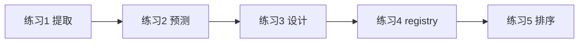

# Day 17 课堂练习册

**使用说明**：课堂上随堂完成，不打分，助教巡视。预计 45 分钟。

---

## 练习 1：变量提取（10 分钟）

阅读 `prompts/base.py` 中 `extract_variables`，完成：

1. 写出 `extract_variables("Hi {name}, role={role}, again {name}")` 的返回值  
2. 字符串 `"Price: {price_usd}"` 有几个变量？  
3. `"{{literal}} and {real}"` 会怎样？（提示：format 转义规则）

**答案区**：

```
1. 
2. 
3. 
```

---

## 练习 2：手写 render（10 分钟）

不运行代码，预测输出或异常：

```python
DEFAULT_ASSISTANT.render(company="测试")
DOC_SUMMARY.render(max_points="5", document="abc")
RAG_QA.render(company="X")
PRODUCT_FAQ.render(company="智链科技", product_name="产品A")
```

| 调用 | 结果（成功文本摘要 / 异常类型） |
|------|--------------------------------|
| DEFAULT_ASSISTANT | |
| DOC_SUMMARY | |
| RAG_QA | |
| PRODUCT_FAQ | |

---

## 练习 3：设计模板（15 分钟）

为「**会议纪要助手**」设计 `PromptTemplate`：

- `name`: `meeting_minutes`  
- 变量：`company`、`meeting_title`、`attendees`  
- 输出要求写在 template 正文：条列式、含行动项、中文  

写在下方或 `scratch/meeting_minutes.py`：

```python
MEETING_MINUTES = PromptTemplate(
    name="meeting_minutes",
    template="""...""",
)
```

同桌互换，检查是否缺 `required_vars` 推断。

---

## 练习 4：registry 操作（10 分钟）

REPL 完成：

```python
from prompts import PromptRegistry, DEFAULT_ASSISTANT

reg = PromptRegistry()
reg.register(DEFAULT_ASSISTANT)
assert reg.get("default_assistant") is DEFAULT_ASSISTANT

# 尝试 get("not_exist") —— 记录异常消息中的可用列表
```

问题：`PromptRegistry()` 与 `default_registry` 内置模板数量差多少？为什么？

---

## 练习 5：流程排序（加分）

将下列步骤按 `apply_template("rag_qa")` 执行顺序编号 1–6：

- [ ] `tmpl.render(**merged)`  
- [ ] `registry.get(name)`  
- [ ] 重建 history，add_system  
- [ ] 合并 `template_variables`  
- [ ] 过滤 non_system 消息  
- [ ] 设置 `self.prompt_template`

---

## 练习册示意图



---

## 参考答案（讲师）

**练习 1**：`("name", "role")`；1 个；`extract` 可能得到 `literal` 与 `real` 需实测——`{{` 不产生变量。

**练习 2**：成功含「测试」；成功；`ConfigError` 缺 context；成功含风险揭示。

**练习 5**：2 → 4 → 1 → 5 → 3 →（设置 template 在 render 前后，代码中先设 template 再重建 history）——以源码为准：get → merge → render → 设 template/vars → filter → rebuild。
