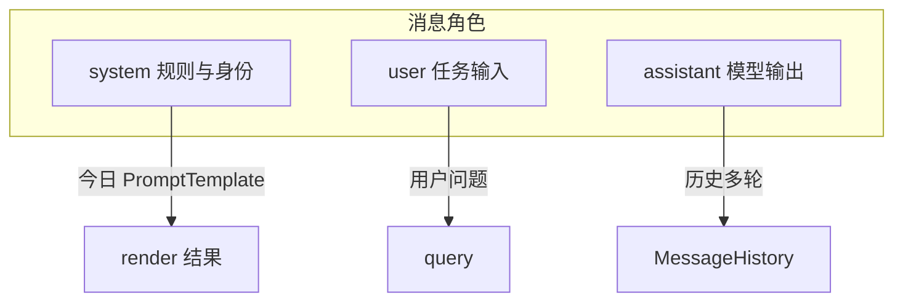
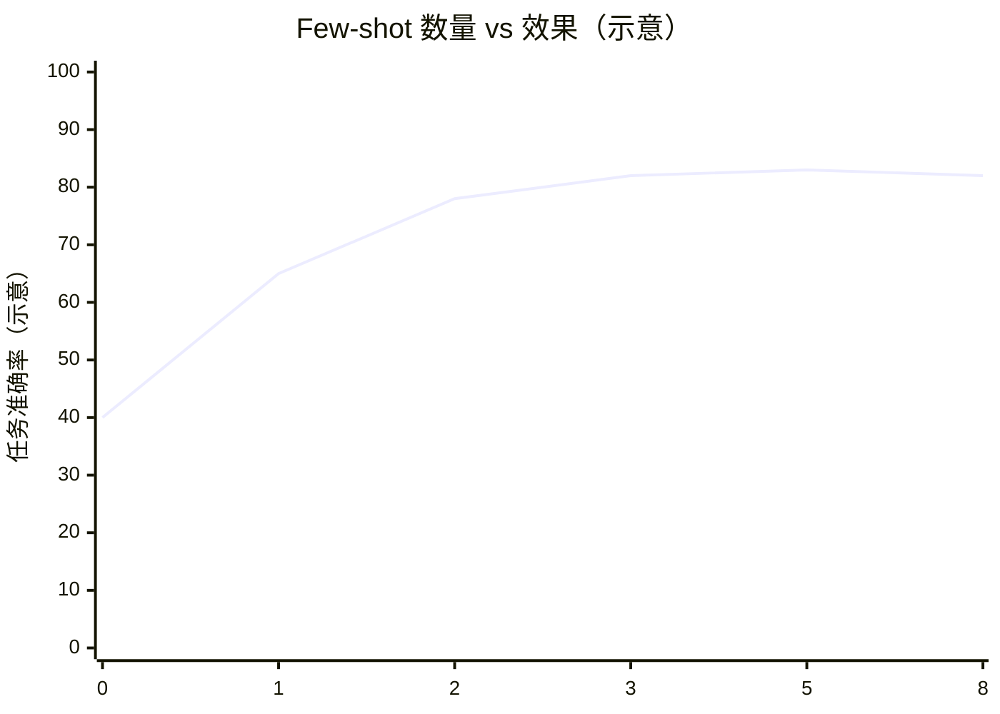
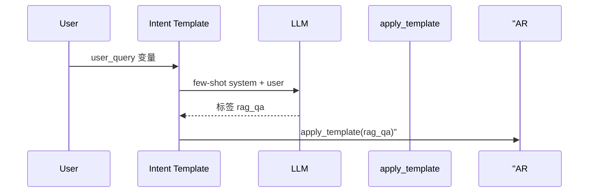

# Day 17 深度扩展：少样本与角色

**定位**：Day 17 正文用单段 system 模板；本文预习 **少样本（Few-shot）** 与 **角色分层**，为 Day 18+ 铺路。  
**代码状态**：本期 `PromptTemplate` 未内置 few-shot 字段，可用约定扩展。

---

## 1. 少样本提示是什么？

在 system 或 user/assistant 交替消息中插入**示例问答**，引导模型模仿格式与推理方式。

```
System: 你是分类器...
User: 示例输入 A
Assistant: 示例输出 A
User: 真实输入
```

与今日 `PromptTemplate` 关系：可将 few-shot 示例**编入 template 字符串**，或渲染后由调用方追加多条 `ChatMessage`。

---

## 2. 角色（Role）三层模型



| 角色 | 今日工程化 | 典型内容 |
|------|-----------|----------|
| system | `to_system_message` | 身份、边界、格式 |
| user | CLI 输入 | 问题、待处理文本 |
| assistant | LLM 输出 | 回答、分类标签 |

**原则**：稳定规则放 system；变动数据放 user 或 template 变量（如 `{context}`）。

---

## 3. 在 template 内嵌 few-shot（约定）

扩展模板正文（非代码变更）：

```
你是意图分类器。只输出一个标签：rag_qa | doc_summary | compliance_review

示例1：
用户：这份通知讲了什么？
标签：rag_qa

示例2：
用户：把下面文字改成三条要点：……
标签：doc_summary

现在分类：
用户：{user_query}
标签：
```

变量：`user_query`。Day 18 可专门做 `INTENT_CLASSIFIER` 模板。

---

## 4. 角色 vs 人格

| 概念 | 说明 | 今日对应 |
|------|------|----------|
| 人格 | 语气、称呼 | `DEFAULT_ASSISTANT` |
| 角色 | 职能边界 | `COMPLIANCE_REVIEW` |
| 场景 | 业务上下文 | `PRODUCT_FAQ` + product_name |

同一 `company` 变量在不同模板中**角色不同**，勿混为一个「超级 system」。

---

## 5. 少样本数量权衡



- 0-shot：仅靠 system 指令  
- 1–3 shot：常性价比最高  
- 过多：占用 prompt token，干扰（Day 15 计量）

---

## 6. 与 Day 18 意图分类衔接



今日作业：先手动 `apply_template`；明日自动。

---

## 7. 反模式

1. **把机密示例写进仓库模板** —— 用匿名化示例  
2. **few-shot 与 RAG context 争抢 token** —— 优先保证 context  
3. **assistant 示例消息伪造过多** —— 2–3 条足够  

---

## 8. 延伸阅读

- OpenAI Prompt Engineering Guide — System / User 分离  
- 课件 [22_Prompt工程深度讲义.md](22_Prompt工程深度讲义.md)  
- Day 18 需求：意图分类模板 `INTENT_CLASSIFIER`（规划）

---

## 9. 动手思考题

若要为 `COMPLIANCE_REVIEW` 增加 2 个少样本「高风险 / 低风险」审阅示例，应放在：

- A. template 字符串末尾  
- B. 单独 user 消息  
- C. 多条 assistant 历史  

写下理由（≥50 字）。

**参考**：A 或 C；B 易与用户真实输入混淆。本期推荐 A，单文件易 PR 审查。
