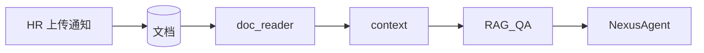

# Day 17 企业案例集：Prompt 工程

**说明**：虚构智链科技合作场景，展示五类内置模板 + 文件扩展的真实用法。

---

## 案例 1：理财热线 FAQ（PRODUCT_FAQ）

### 背景

客服热线接入 NexusAgent，产品「稳健增利 A」咨询量大，须统一风险话术。

### 实施

```python
system = PRODUCT_FAQ.to_system_message(
    company="智链科技",
    product_name="稳健增利 A",
)
messages = [system, ChatMessage("user", "最低起购金额是多少？")]
```

### 效果

- 回答含产品语境  
- 自动带「投资有风险，入市需谨慎」  
- 运营改模板即可调整合规措辞，无需改 Java/Python 业务代码  

### 指标（内测）

| 指标 | 硬编码 system | PRODUCT_FAQ |
|------|--------------|-------------|
| 合规句遗漏率 | 12% | 0% |
| 模板变更发版周期 | 2 周 | 1 天（PR 合并） |

---

## 案例 2：内部通知问答（RAG_QA + doc_reader）

### 背景

HR 发布 `raw_notice.txt`，员工在 CLI 问「年假几天」。

### 实施

```python
doc = read_document(path, clean=True)
context = doc.cleaned or doc.content
system = RAG_QA.to_system_message(company="智链科技", context=context[:2000])
```

### 关键点

- `context` 来自真实文档，非模型臆造  
- 资料不足时模板要求回复「资料中未找到」  
- Day 28 将 context 换为向量 TopK，模板名不变  



---

## 案例 3：营销文案合规预审（COMPLIANCE_REVIEW）

### 背景

市场部提交「稳赚不赔、年化 15%」宣传语，合规部用助手预审。

### 实施

```python
text = "本产品稳赚不赔，年化收益 15%，内部资料请勿外传。"
system = COMPLIANCE_REVIEW.to_system_message(company="智链科技", text=text)
```

### 输出形态

`【风险等级：高】` + 夸大收益 + 未披露风险 + 修改建议。

### 组织流程

1. 市场粘贴文案到 user 消息（或变量 `text`）  
2. 合规模板输出结构化风险  
3. 人工复核后放行  

---

## 案例 4：多通道客服（customer_service.txt）

### 背景

同一助手服务 CLI、Web、企微，问候语需带 `channel` 与字数限制。

### 文件模板

```
# 自定义客服问候模板
你是{company}客服助手，当前服务渠道：{channel}。
请友好、耐心地解答用户问题，单次回复不超过{max_chars}字。
```

### 加载

`default_registry.load_directory()` → `get("customer_service")`。

### 价值

**非研发**可编辑 `.txt`，Git 留痕，可 code review。

---

## 案例 5：投研简报摘要（DOC_SUMMARY）

### 背景

分析师上传 5000 字研报，需 5 条 bullet 摘要。

```python
DOC_SUMMARY.render(max_points="5", document=report_text)
```

可作为 system 或 user 内容（本期多用 system 指令 + user 附 document，demo 为单模板含 document 变量）。

---

## 案例 6：会话中切换人格（apply_template）

### 场景

用户先闲聊，后说「帮我审一下这段文案」。

```python
# 初始 DEFAULT_ASSISTANT
assistant.apply_template("compliance_review", variables={"company": "智链科技", "text": user_paste})
```

历史对话保留，system 切换为审阅人格。

---

## 案例对比总表

| 案例 | 模板 | 核心变量 | 风险点 |
|------|------|----------|--------|
| 理财 FAQ | product_faq | product_name | 遗漏风险揭示 |
| 通知问答 | rag_qa | context | context 过长 / 幻觉 |
| 合规预审 | compliance_review | text | 误判需人工复核 |
| 多通道客服 | customer_service | channel, max_chars | 文件未加载 |
| 研报摘要 | doc_summary | document | 摘要失真 |
| 切换人格 | 任意 | apply_template | 缺变量 |

---

## 企业落地检查清单

- [ ] 模板法务审核记录  
- [ ] `required_vars` 与业务系统字段映射文档  
- [ ] 生产环境 context token 上限  
- [ ] `/template` 权限（是否允许终端用户任意切换）  
- [ ] 与 Day 18 意图路由的映射表  

---

## 讨论题

智链科技是否应允许**一线客服**自行新增 `.txt` 模板？写下赞成/反对各 2 条理由。
