# Day 17 授课实录（节选）

**日期**：2026-07-22  
**讲师**：陈默  
**整理**：助教（口语化删减）

---

## 开场（09:05）

「昨天流式，用户先看到字。今天管字从哪来——system prompt。你们 Day 2 写过 f-string，今天升级成带名字的 `PromptTemplate`。」

「需求号 ZL-NA-REQ-017，晚上 pytest 全绿算过关。」

---

## base.py 讲解（09:40）

「`extract_variables` 用正则扫 `{company}` 这种，不会去扫 JSON 里的花括号，除非你真把 JSON 裸写在 template 里——别这么干。」

「`render` 缺变量抛 `ConfigError`，消息里带模板名和 missing 列表。生产环境宁可失败，也不要把 `<context>` 发给 API。」

（学员问：preview 呢？）

「preview 给调试和运营后台用，`<context>` 一眼看出还没填。」

---

## library 走读（10:20）

「五个内置模板就是五个业务场景。`RAG_QA` 今天用 `doc_reader` 塞 context，下周向量检索来了，**模板不用改**，只改变量从哪来。」

「`PRODUCT_FAQ` 里那句风险提示是硬需求，赵岩和合规部对齐过，删了就算需求不达标。」

---

## 下午 registry（14:10）

「`default_registry` import 的时候就 `load_directory` 了。你们改 `customer_service.txt` 要重启进程，别疑惑。」

「`load_from_file` 第一行 `#` 是描述，不算正文。和 Markdown 标题像，但我们就认 `# `。」

---

## ChatAssistant 演示（15:20）

（助教投屏 `assistant_prompt_demo.py`）

「`/template list` 六行。切 `default_assistant` 会重渲染 system，你们刚才问的『对话丢不丢』——不丢，代码里 filter 了 non_system。」

（学员：切 rag_qa 报错？）

「没 context。要么初始化 `template_variables` 带齐，要么 `/template` 之前用 API 设变量——今晚作业会练。」

---

## rag_prompt_demo（16:30）

「注意 print 的 system 长度。300 字 context 加上固定指令，大概多少 token，心里要有数。Day 15 的 counter 明天可以接进来。」

「Mock 回『好的』别笑，我们今天验收的是**消息构造**，不是模型聪明程度。」

---

## 收尾（16:55）

「Day 18 做意图分类：用户一句话，模型或规则输出模板名，再 `apply_template`。今天把模板名背熟：`rag_qa`、`doc_summary`、`compliance_review`……」

「作业 A 自己写一个模板，别抄 library。晚自习 Lab 见。」

---

## 课堂互动统计

| 类型 | 次数 |
|------|------|
| 举手提问 | 14 |
| ConfigError 相关 | 5 |
| 与 Day 2 关系 | 3 |
| 与 Day 16 流式 | 2 |

---

## 实录时间线

```mermaid
gantt
    title Day 17 授课节奏
    dateFormat HH:mm
    section 上午
    概论           :09:00, 30m
    base.py        :09:30, 75m
    library        :10:45, 75m
    section 下午
    registry       :14:00, 60m
    ChatAssistant  :15:00, 45m
    rag demo       :15:45, 75m
```

---

## 讲师课后备注

- 下节课前收集「切模板缺变量」典型错误截图，做 FAQ  
- `COMPLIANCE_REVIEW` 需同步法务最新禁用词表（邮件跟进赵岩）  
- Day 18 幻灯片预留意图 → 模板映射表一页
