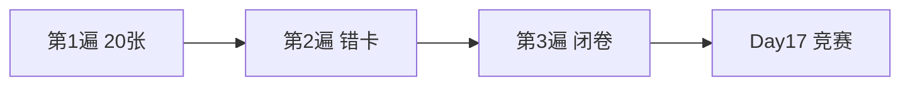

# Day 17 复习卡片

> 打印裁剪，正面问题背面答案

---

## 卡片 1

**Q**：`PromptTemplate` 四个核心字段？  
**A**：`name`、`template`、`description`、`required_vars`

---

## 卡片 2

**Q**：`required_vars` 何时自动推断？  
**A**：构造时为空元组，`__post_init__` 调用 `extract_variables`

---

## 卡片 3

**Q**：占位符正则认什么格式？  
**A**：`{identifier}`，`[a-zA-Z_][a-zA-Z0-9_]*`

---

## 卡片 4

**Q**：缺变量抛什么异常？  
**A**：`ConfigError`，含模板名与 missing 列表

---

## 卡片 5

**Q**：`preview` 缺变量显示什么？  
**A**：`<变量名>` 占位，如 `<context>`

---

## 卡片 6

**Q**：`to_system_message` 返回什么？  
**A**：`ChatMessage("system", rendered_text)`

---

## 卡片 7

**Q**：内置模板有几个？名称？  
**A**：5 个：default_assistant、rag_qa、doc_summary、product_faq、compliance_review

---

## 卡片 8

**Q**：`BUILTIN_TEMPLATES` 是什么？  
**A**：`dict[str, PromptTemplate]`，name → 实例

---

## 卡片 9

**Q**：`default_registry` 初始化做什么？  
**A**：加载内置 + `load_directory()` 扫 `templates/*.txt`

---

## 卡片 10

**Q**：`load_from_file` 首行 `#` 作用？  
**A**：写入 `description`，不计入 template 正文

---

## 卡片 11

**Q**：文件模板 `customer_service` 三个变量？  
**A**：`company`、`channel`、`max_chars`

---

## 卡片 12

**Q**：`apply_template` 会清空 user 消息吗？  
**A**：不会，仅替换 system，保留 non_system

---

## 卡片 13

**Q**：`/template list` 做什么？  
**A**：列出 `prompt_registry.list_names()`

---

## 卡片 14

**Q**：`RAG_QA` 防幻觉关键句？  
**A**：「仅根据参考资料」「资料中未找到相关信息」

---

## 卡片 15

**Q**：`rag_prompt_demo` context 来源？  
**A**：`doc_reader.read_document` → cleaned/content，演示截断 300 字

---

## 卡片 16

**Q**：`PRODUCT_FAQ` 合规硬句？  
**A**：「投资有风险，入市需谨慎」

---

## 卡片 17

**Q**：render 用何种格式化？  
**A**：`str.format`，同 Day 2

---

## 卡片 18

**Q**：`render_safe` 返回值？  
**A**：`(结果, None)` 或 `(None, 错误消息)`

---

## 卡片 19

**Q**：Day 18 与今日关系？  
**A**：意图分类选模板名，再 `apply_template`

---

## 卡片 20

**Q**：今日模块路径与需求号？  
**A**：`prompts/`，ZL-NA-REQ-017

---

## 复习计划

建议：与 [21_课堂知识竞赛.md](21_课堂知识竞赛.md) 配合使用。
