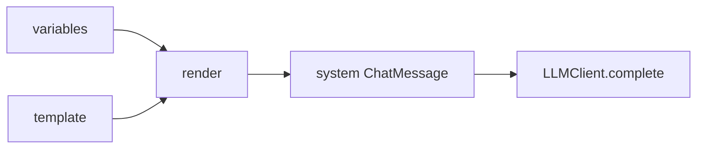

# Day 17 PromptTemplate 速查手册

**一页纸速查**（可打印）

---

## 快速导入

```python
from prompts import (
    PromptTemplate,
    PromptRegistry,
    default_registry,
    DEFAULT_ASSISTANT,
    RAG_QA,
    DOC_SUMMARY,
    PRODUCT_FAQ,
    COMPLIANCE_REVIEW,
    extract_variables,
)
```

---

## PromptTemplate API

| 方法/属性 | 签名 | 说明 |
|-----------|------|------|
| `name` | `str` | 唯一标识 |
| `template` | `str` | 含 `{var}` 正文 |
| `required_vars` | `tuple[str,...]` | 必填变量 |
| `render` | `(**vars) -> str` | 渲染，缺变量 ConfigError |
| `render_safe` | `(**vars) -> (str\|None, str\|None)` | 不抛异常 |
| `preview` | `(**vars) -> str` | `<var>` 占位 |
| `to_system_message` | `(**vars) -> ChatMessage` | system 消息 |

---

## 构造示例

```python
tmpl = PromptTemplate(
    name="my_tmpl",
    description="说明",
    template="你好 {user}",
)
# required_vars 自动为 ("user",)
```

---

## PromptRegistry API

| 方法 | 说明 |
|------|------|
| `register(tmpl)` | 注册/覆盖 |
| `get(name)` | 获取，未知 ConfigError |
| `list_names()` | 排序名称列表 |
| `load_from_file(path, name=None)` | 加载 .txt/.md |
| `load_directory(dir=None)` | 默认 prompts_dir |

---

## 内置模板变量

| name | required_vars |
|------|---------------|
| default_assistant | company |
| rag_qa | company, context |
| doc_summary | max_points, document |
| product_faq | company, product_name |
| compliance_review | company, text |
| customer_service | company, channel, max_chars |

---

## ChatAssistant

```python
assistant = ChatAssistant(
    prompt_template=DEFAULT_ASSISTANT,
    template_variables={"company": "智链科技"},
)
assistant.apply_template("rag_qa", variables={"context": "..."})
```

| 命令 | 行为 |
|------|------|
| `/template list` | 列模板 |
| `/template` | 当前模板 + 用法 |
| `/template NAME` | 切换 |

---

## 命令行演示

```bash
export PYTHONPATH=src
python3 src/day17/prompt_demos.py
python3 src/day17/registry_demos.py
NEXUS_LLM_MOCK=1 python3 src/day17/rag_prompt_demo.py
NEXUS_LLM_MOCK=1 python3 src/day17/assistant_prompt_demo.py
python3 -m pytest tests/day17/ -v
```

---

## 异常速查

| 异常 | 常见原因 |
|------|----------|
| `ConfigError` 缺变量 | render 未传全 required_vars |
| `ConfigError` 未知模板 | get 错误 name |
| `StorageError` | 模板文件不存在 |
| `ValueError` | name/template 为空 |

---

## 数据流简图



---

## 与 Day 2 对照

| Day 2 | Day 17 |
|-------|--------|
| `"{}".format(x)` | `tmpl.render(x=...)` |
| KeyError | ConfigError |
| 无命名 | name + registry |

详见 [18_与Day2_fstring对照表.md](18_与Day2_fstring对照表.md)。
