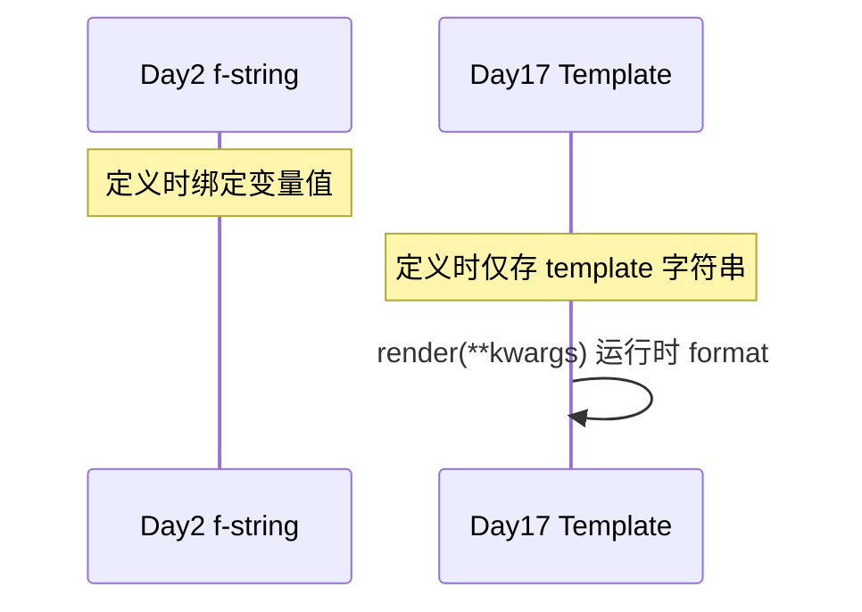
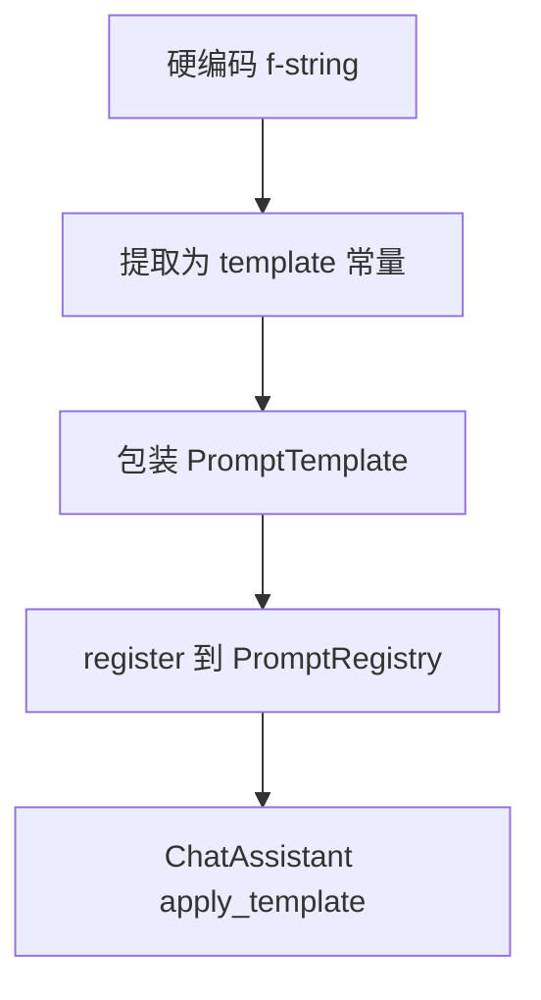

# Day 17 与 Day 2 f-string 对照表

**目的**：把 Sprint 1 字符串格式化知识映射到 Prompt 工程化实现。

---

## 1. 语法对照

| 场景 | Day 2 写法 | Day 17 写法 |
|------|-----------|-------------|
| 单变量 | `f"你好 {name}"` | `tmpl.render(name=name)` |
| 多变量 | `"{}-{}".format(a, b)` | `tmpl.render(a=a, b=b)` |
| 字面量大括号 | `"{{x}}"` → `{x}` | 模板内同样 `{{` `}}` |
| 变量名限制 | format 任意 kwargs | 仅 `required_vars` 校验 |

---

## 2. 行为对照

| 行为 | Day 2 `str.format` / f-string | Day 17 `PromptTemplate` |
|------|------------------------------|-------------------------|
| 缺变量 | `KeyError` | `ConfigError`（带模板名） |
| 多余变量 | 忽略 | 忽略（format 语义） |
| 复用 | 复制字符串 | `name` + 注册表 |
| 测试 | 断言字符串 | `test_render_*` + registry |
| 进 API | 手动 `ChatMessage` | `to_system_message` |

---

## 3. 代码并列示例

### Day 2 风格

```python
company = "智链科技"
system = f"你是{company} NexusAgent 智能助手。请用简洁、专业的中文回答用户问题。"
msg = ChatMessage("system", system)
```

### Day 17 风格

```python
msg = DEFAULT_ASSISTANT.to_system_message(company="智链科技")
# 等价于 render + ChatMessage
```

---

## 4. extract_variables 与 f-string

f-string 在**定义时**求值；模板在 **render 时**求值：



**意义**：同一 `DEFAULT_ASSISTANT` 实例可服务多租户 `company` 不同值。

---

## 5. 迁移路径



| 阶段 | 适用 |
|------|------|
| f-string | 一次性脚本、作业 |
| 常量字符串 | 单场景原型 |
| PromptTemplate | 多场景、需校验 |
| Registry + 文件 | 运营可改、多环境 |

---

## 6. 类型与签名

Day 17 `render(self, **variables: str) -> str` 统一 **str** 值：

| Day 2 习惯 | Day 17 建议 |
|-----------|-------------|
| `max_points=3` int | `max_points="3"` |
| `flag=True` bool | 转 `"true"` 或改模板文案 |

原因：与 CLI、环境变量、txt 文件注入一致，皆为文本。

---

## 7. 错误处理对照

```python
# Day 2
try:
    s = "Hi {name}".format()
except KeyError as e:
    ...

# Day 17
result, err = DEFAULT_ASSISTANT.render_safe(company="X")
if err:
    ...
```

---

## 8. 课堂踩坑对照

| 踩坑 | Day 2 表现 | Day 17 表现 |
|------|-----------|-------------|
| 变量名拼写错误 | KeyError | ConfigError missing |
| 嵌套大括号 JSON | format 失败 | 同；避免裸 JSON |
| 重复 format | 二次无占位符 | 同 |
| 未传 company | KeyError | ConfigError 指明 rag_qa 等 |

---

## 9. 不适用 f-string 的场景（必须用 Template）

1. 模板存 **文件** `templates/*.txt`  
2. 需要 **`list_names`** 发现  
3. **`/template` 切换** 按名查找  
4. **单元测试** 缺变量契约  

---

## 10. 对照总结

> Day 2 教你**怎么插值**；Day 17 教你**怎么把插值变成可治理资产**。

| 维度 | Day 2 | Day 17 |
|------|-------|--------|
| 核心技能 | 字符串格式化 | Prompt 工程化 |
| 依赖 | Python 内置 | prompts 包 |
| 需求号 | Sprint 1 | ZL-NA-REQ-017 |

---

## 11. 练习题

将下列 f-string 改为 `PromptTemplate` 定义（写出 `name` 与 `template`）：

```python
f"【{level}】{title}：{body}"
```

**参考**：

```python
PromptTemplate(
    name="alert_line",
    template="【{level}】{title}：{body}",
)
```
