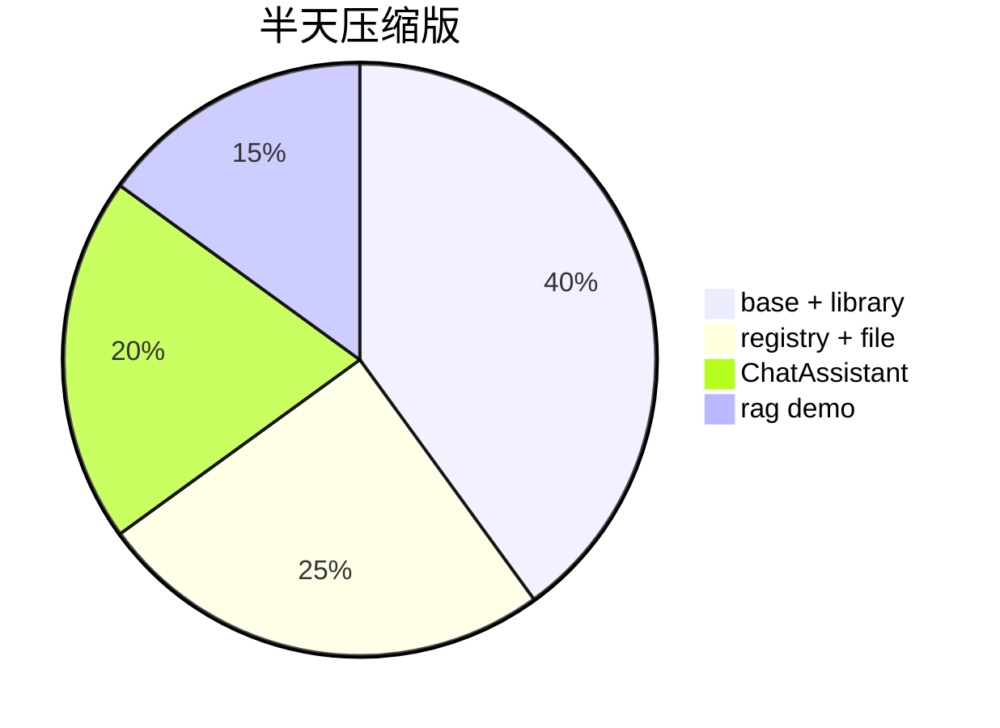

# Day 17 讲师补充阅读

**读者**：讲师、助教、自学进阶学员

---

## 1. 为何不用 Jinja2 / Mustache？

| 引擎 | 优点 | Sprint 3 不选原因 |
|------|------|------------------|
| Jinja2 | if/for、继承 | 新依赖、运维审批 |
| Mustache | 逻辑少 | 仍增依赖 |
| str.format | 标准库、Day 2 已学 | 表达能力够用 |

**策略**：条件分支放在 **Python 路由**（Day 18 意图分类），不放在模板语法。

---

## 2. system 唯一性讨论

OpenAI API 允许多条 system。`ChatAssistant.apply_template` 选择**替换**为单 system：

- 避免「默认助手 + 合规助手」双 system 指令冲突  
- `/clear` 保留 system 的设计与之一致  

若产品需要「基础 system + 场景 system」，可扩展为：

```python
base = DEFAULT_ASSISTANT.render(...)
scene = RAG_QA.render(...)
combined = base + "\n\n" + scene  # 或分层消息
```

本期不实现，课堂可作辩论题。

---

## 3. 模板版本与 A/B

生产常见字段（规划）：

```python
@dataclass
class PromptTemplate:
    version: str = "1.0.0"
```

A/B 实验：`registry.get("rag_qa_v2")` 或 metadata 表。今日仅 `name` 唯一，**改名即新版本**。

---

## 4. 安全：提示注入与变量

`{context}`、`{text}` 常来自用户或外部文档：

| 风险 | 缓解 |
|------|------|
| 文档写「忽略上文指令」 | RAG 模板强调「仅根据参考资料」 |
| 用户 text 含 `{company}` 破坏 format | 用户输入作 format 参数值，非拼进 template 字符串 |
| 日志泄露 | 不 log 完整 context |

**反模式**：

```python
# 危险：用户控制模板结构
bad = PromptTemplate(name="x", template=user_supplied_string)
```

---

## 5. 国际化（i18n）

约定：`default_assistant_zh`、`default_assistant_en` 两个 name。`apply_template` 前根据 locale 选择。无需改 `PromptTemplate` 类。

---

## 6. 与 OpenAI「Prompt Caching」关系

部分 API 对长 system 前缀缓存计费。固定模板 + 变动 context 时：

- 固定部分放 template 前段  
- `context` 放变量段  

利于缓存命中（厂商实现相关，了解即可）。

---

## 7. 测试金字塔补充

除 `tests/day17/test_prompts.py` 外，建议加：

- **快照测试**：render 结果 golden file（注意勿含动态日期）  
- **契约测试**：`required_vars` 与运营文档表格一致  

---

## 8. 课堂时间分配建议（若压缩为半天）



砍掉：企业案例 14 自学、竞赛 21 作业化。

---

## 9. 推荐预习材料

- OpenAI API — Chat Completions messages 结构  
- Day 12 `MessageHistory` 与 system 处理  
- `tools/doc_reader.py` 源码（RAG demo 依赖）  

---

## 10. Day 18 讲师备课要点

1. 准备 10 条用户话 → 期望模板名映射表  
2. 对比「规则分类」vs「LLM 分类」  
3. 演示错误分类时如何 fallback `default_assistant`  

---

## 11. 参考文献

- Brown et al., GPT-3 few-shot prompting  
- 智链内部：《理财产品宣传合规指引》（虚构）  
- 项目 `prompts/library.py` 注释与需求 ZL-NA-REQ-017
