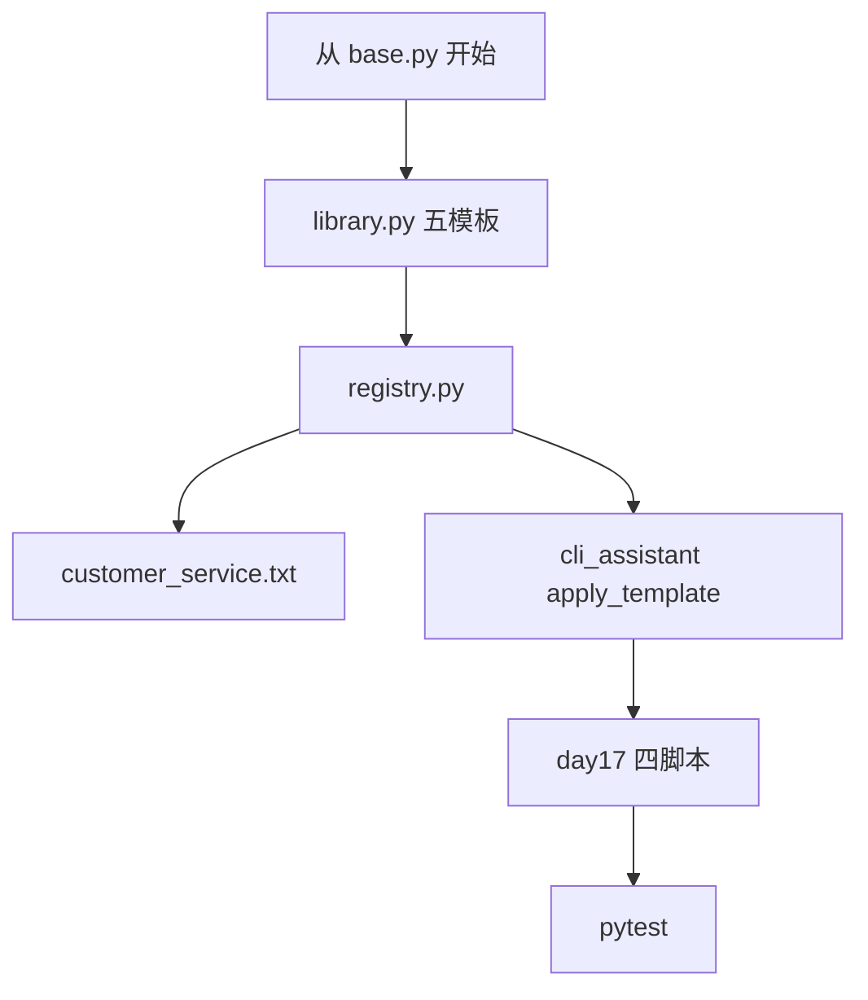

# Day 17 完整代码走查

**范围**：`prompts/*`、`chat/cli_assistant.py` 相关段、`day17/*`  
**建议时长**：90 分钟

---

## 1. prompts/base.py

### extract_variables

```python
_PLACEHOLDER_RE = re.compile(r"\{([a-zA-Z_][a-zA-Z0-9_]*)\}")
```

走查点：

- 为何不用 `str.format` 的 `string.Formatter`？—— 正则足够且依赖更少  
- 去重保序：`seen` set + `result` list  

### PromptTemplate.__post_init__

```python
if not self.required_vars:
    object.__setattr__(self, "required_vars", extract_variables(self.template))
```

走查点：dataclass 冻结字段时用 `object.__setattr__`。

### render 异常链

```python
except KeyError as exc:
    raise ConfigError(f"模板 {self.name!r} 渲染失败: {exc}") from exc
```

走查点：`from exc` 保留链式 traceback。

---

## 2. prompts/library.py

逐个常量：

| 符号 | 行级关注 |
|------|----------|
| DEFAULT_ASSISTANT | 单变量、人格三要素 |
| RAG_QA | 多行字符串、context 块 |
| DOC_SUMMARY | max_points 为 str |
| PRODUCT_FAQ | 合规句 |
| COMPLIANCE_REVIEW | 输出格式约束 |

```python
BUILTIN_TEMPLATES: dict[str, PromptTemplate] = {
    t.name: t for t in (...)
}
```

走查点：dict comp 以 `t.name` 为键，与 `get("rag_qa")` 一致。

---

## 3. prompts/registry.py

### __init__

```python
self._templates: dict[str, PromptTemplate] = dict(BUILTIN_TEMPLATES)
```

浅拷贝字典，值对象共享——只读模板无妨。

### load_from_file

```python
if lines and lines[0].startswith("# "):
    description = lines[0][2:].strip()
    body_lines = lines[1:]
```

走查点：`# ` 必须空格；`##` 不算描述行。

### load_directory

```python
directory = directory or get_path("prompts_dir")
for path in sorted(directory.glob("*.txt")):
```

走查点：仅 `*.txt`；sorted 保证加载顺序稳定。

### 模块末尾

```python
default_registry = PromptRegistry()
default_registry.load_directory()
```

**副作用**：import prompts.registry 即扫盘。

---

## 4. prompts/templates/customer_service.txt

```
# 自定义客服问候模板
你是{company}客服助手，当前服务渠道：{channel}。
请友好、耐心地解答用户问题，单次回复不超过{max_chars}字。
```

走查：三变量与 `registry_demos.py` render 参数一致。

---

## 5. chat/cli_assistant.py（节选）

### 初始化 system

```python
if self.prompt_template:
    msg = self.prompt_template.to_system_message(**self.template_variables)
    if not self._has_system_message():
        self.history.add(msg)
```

### apply_template

```python
non_system = [m for m in self.history.messages if m.role != "system"]
self.history = MessageHistory()
self.history.add_system(rendered)
for m in non_system:
    self.history.add(m)
```

走查点：新建 `MessageHistory` 而非原地删——避免迭代器陷阱。

### /template 分支

```python
if arg.lower() == "list":
    ...
try:
    rendered = self.apply_template(arg.split()[0])
    preview = rendered[:80] + ("..." if len(rendered) > 80 else "")
```

走查点：预览截断 80 字；错误捕获 `ConfigError, NexusError`。

---

## 6. day17/prompt_demos.py

```python
print(RAG_QA.preview(company="智链科技", context="...")[:200] + "...")
```

演示 preview 与截断显示。

---

## 7. day17/registry_demos.py

```python
cs = default_registry.get("customer_service")
cs.render(company="智链科技", channel="CLI", max_chars="200")
```

验证文件模板加载。

---

## 8. day17/rag_prompt_demo.py

```python
doc = read_document(get_path("sample_docs") / "raw_notice.txt", clean=True)
context = doc.cleaned or doc.content
system = RAG_QA.to_system_message(company="智链科技", context=context[:300])
```

走查点：`clean=True`；`[:300]` 演示截断。

---

## 9. day17/assistant_prompt_demo.py

```python
assistant.run_scripted(["/template list", "你好，请自我介绍。", "/exit"])
```

走查 `ChatAssistant.run_scripted` 与命令处理。

---

## 10. tests/day17/test_prompts.py

| 测试 | 覆盖 |
|------|------|
| test_extract_variables | 正则 |
| test_render_missing_var | ConfigError |
| test_preview_placeholders | `<context>` |
| test_load_from_file | tmp_path |
| test_assistant_apply_template | history system |
| test_registry_loads_customer_service | 集成 |

---

## 11. 走查流程图



---

## 12. 走查自检问题

1. `get("unknown")` 异常消息格式？  
2. `apply_template` 后 history 第一条 role？  
3. `default_registry` 几个 name？  
4. `RAG_QA` render 最少几个 kwargs？  
5. import 顺序错误会导致什么？

---

## 13. 答案提要

1. `未知模板: 'x'，可用: [...]`  
2. `system`  
3. 6（5 内置 + customer_service）  
4. 2：`company`, `context`  
5. 循环 import 罕见；注意 `PYTHONPATH=src`
