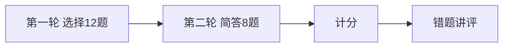

# Day 17 课堂知识竞赛

**形式**：小组抢答 + 个人闭卷  
**题量**：20 题（选择 12 + 简答 8）  
**建议时长**：25 分钟

---

## 第一部分：选择题（每题 5 分）

### 1

`PromptTemplate.render` 缺变量时抛出？

- A. KeyError  
- B. ValueError  
- C. ConfigError  
- D. StorageError  

答案
C

### 2

`required_vars` 默认如何得到？

- A. 手动写死  
- B. `extract_variables(template)`  
- C. 读 JSON 配置  
- D. API 返回  

答案
B

### 3

`RAG_QA` 必填变量不包括？

- A. company  
- B. context  
- C. product_name  
- D. 以上 C 不是必填  

答案
C

### 4

`default_registry` 加载文件模板默认目录？

- A. `templates/` 项目根  
- B. `get_path("prompts_dir")`  
- C. `/tmp`  
- D. 当前工作目录  

答案
B

### 5

`load_from_file` 首行 `# 描述` 进入哪个字段？

- A. template  
- B. name  
- C. description  
- D. 丢弃  

答案
C

### 6

`apply_template` 后 user 消息？

- A. 全部删除  
- B. 保留  
- C. 变成 system  
- D. 清空 history  

答案
B

### 7

`/template list` 调用？

- A. `library.BUILTIN_TEMPLATES.keys()`  
- B. `prompt_registry.list_names()`  
- C. `os.listdir`  
- D. `help()`  

答案
B

### 8

`preview(company="X")` 对未传 `context`？

- A. 抛异常  
- B. 显示 `<context>`  
- C. 空字符串  
- D. 省略该行  

答案
B

### 9

`to_system_message` 的 role？

- A. user  
- B. assistant  
- C. system  
- D. tool  

答案
C

### 10

`PRODUCT_FAQ` 必须包含的合规句？

- A. 仅供参考  
- B. 投资有风险，入市需谨慎  
- C. 本文档保密  
- D. 请联系人工  

答案
B

### 11

`rag_prompt_demo` 中 context 来源？

- A. 硬编码  
- B. doc_reader  
- C. 向量库  
- D. 用户输入  

答案
B

### 12

渲染语法与哪日课程一致？

- A. Day 5 JSON  
- B. Day 2 format  
- C. Day 12 urllib  
- D. Day 16 SSE  

答案
B

---

## 第二部分：简答题（每题 5 分）

### 13

写出 `extract_variables("A{b}C{a}")` 的返回顺序。

答案
`("b", "a")` 去重保序

### 14

列举三个内置模板 `name`（任意）。

答案
default_assistant, rag_qa, doc_summary, product_faq, compliance_review 任选三

### 15

`render` 与 `preview` 各适合什么场景？（各一句）

答案
render：生产/API；preview：调试与长度估算

### 16

`customer_service.txt` 三个变量名？

答案
company, channel, max_chars

### 17

为何 Day 17 不用 Jinja2？（一点即可）

答案
标准库优先、无新依赖、format 够用

### 18

Day 18 意图分类输出如何衔接今日模块？（一句）

答案
输出模板名 → apply_template

### 19

`COMPLIANCE_REVIEW` 要求的输出格式前缀？

答案
【风险等级：高/中/低】

### 20

流式输出（Day 16）与 Prompt 模板（Day 17）关系？（一句）

答案
正交：模板构造输入，流式控制输出显示

---

## 竞赛流程

---

## 评分与奖品（示例）

| 区间 | 奖励 |
|------|------|
| 90–100 | Prompt 工程小册子 + 复习卡片打印 |
| 70–89 | 电子版速查手册 |
| 60–69 | 补考 16 复习卡片 |
| &lt;60 | 晚自习一对一 15 分钟 |

---

## 讲师讲评要点

- 第 3 题：混淆 PRODUCT_FAQ 与 RAG_QA  
- 第 8 题：preview 是晚自习 REPL 重点  
- 第 20 题：串联 Sprint 3 叙事
