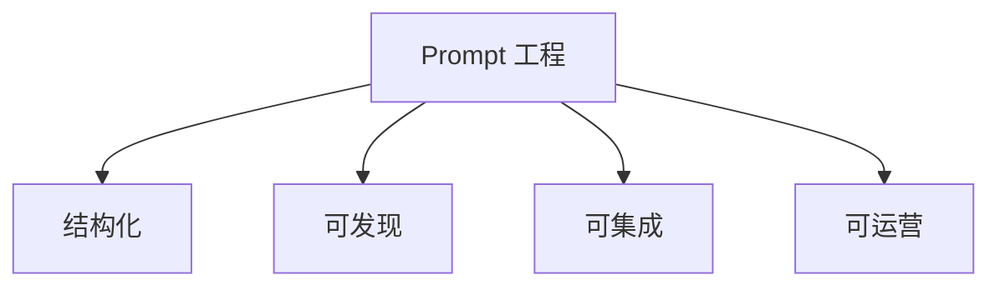
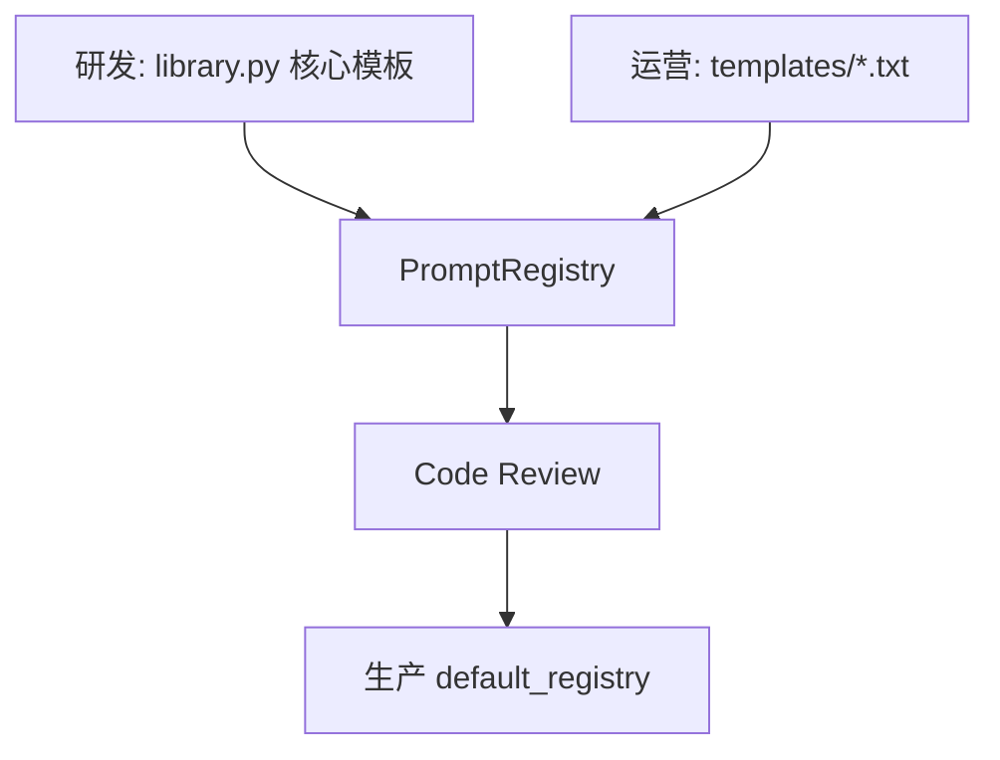
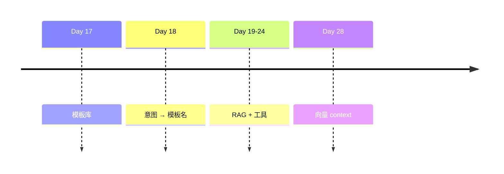

# Day 17 Prompt 工程深度讲义

**讲义级别**：Tech Lead 内训  
**时长**：可按 2 学时拆分

---

## 第一章：Prompt 工程定义

**Prompt 工程**是将业务规则、角色、格式约束编码为模型可消费输入的系统化实践。在 NexusAgent 中，今日落地为：

1. **结构化**：`PromptTemplate` 数据模型  
2. **可发现**：`PromptRegistry`  
3. **可集成**：`ChatMessage` + `LLMClient`  
4. **可运营**：`.txt` 文件模板  



---

## 第二章：消息架构

Chat Completions 本质是 **消息列表**：

```python
[
  {"role": "system", "content": "..."},
  {"role": "user", "content": "..."},
]
```

| 角色 | 稳定性 | 今日工程化 |
|------|--------|-----------|
| system | 高，会话级 | PromptTemplate |
| user | 每轮变化 | CLI 输入 |
| assistant | 模型生成 | LLM 输出 |

**最佳实践**：长规则、少变约束 → system；具体任务数据 → user 或 template 变量。

---

## 第三章：变量设计原则

### 3.1 语义清晰

| 好 | 差 |
|----|-----|
| `company` | `c` |
| `context` | `data` |
| `max_points` | `n` |

### 3.2 粒度适中

- 过细：10 个变量难维护  
- 过粗：一个 `blob` 含 JSON，难校验  

`RAG_QA` 选 `company` + `context` 是典型二分。

### 3.3 类型统一 str

与 format、文件、CLI 一致；数值在传入前 `str()`。

---

## 第四章：模板正文写作规范

1. **先身份后规则后格式**  
2. **否定句明确**：「不要编造」「仅根据资料」  
3. **输出格式可解析**：合规模板要求【风险等级】前缀  
4. **控制长度**：system 过长挤压 user 与 context  

示例结构：

```
[身份] 你是{company}的...
[边界] 若不确定...
[格式] 输出须...
[数据] 【参考资料】{context}
```

---

## 第五章：注册表与治理



| 资产 | 所有者 | 变更频率 |
|------|--------|----------|
| BUILTIN_TEMPLATES | 研发 | 低 |
| templates/*.txt | 运营/客服 | 中 |
| 会话 variables | 运行时 | 高 |

---

## 第六章：测试与质量

### 6.1 契约测试

```python
def test_rag_qa_has_grounding_phrase():
    text = RAG_QA.render(company="X", context="Y")
    assert "参考资料" in text
    assert "未找到" in text
```

### 6.2 回归

模板文案 PR 必须跑 `pytest tests/day17/`。

### 6.3 人工评测

合规、理财类模板需法务签字样本集。

---

## 第七章：RAG 与 Prompt 分工

| 组件 | 职责 |
|------|------|
| 检索 / doc_reader | 产生 context **内容** |
| RAG_QA 模板 | 规定 **如何用** context |
| LLM | 生成答案 |

**幻觉治理**在模板层写清 grounding 规则，检索层保证 context 相关。

---

## 第八章：与 Agent 路线图



Agent = 路由 + 模板 + 工具 + 记忆；今日完成 **模板** 一块。

---

## 第九章：反模式目录

1. God Template — 一个模板包打天下  
2. String Concat in Code — 业务里拼 system，绕过 Template  
3. Silent Fallback — 缺变量用空串  
4. Log Full Prompt — PII 泄露  
5. Ignore Token Budget — context 无上限  

---

## 第十章：度量指标（生产参考）

| 指标 | 说明 |
|------|------|
| template_render_error_rate | ConfigError 次数 / 渲染次数 |
| system_token_p50 | Day 15 计量 |
| template_switch_count | `/template` 使用频率 |
| grounding_failure_rate | 用户反馈「胡编」占比 |

---

## 第十一章：课堂讨论

**议题**：是否允许终端用户自定义 system（`/system`）与强制模板（`/template`）并存？

分组辩论 10 分钟，结论写入站会纪要。

---

## 第十二章：小结

> Prompt 工程不是「玄学调参」，而是 **把 system 提示词纳入软件工程**：命名、版本、测试、评审、发布。

**今日代码锚点**：`prompts/base.py` · `library.py` · `registry.py` · `apply_template`
