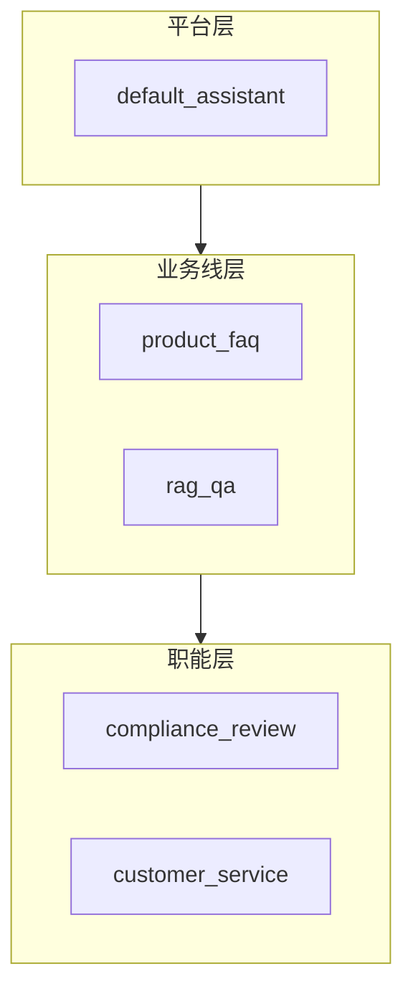
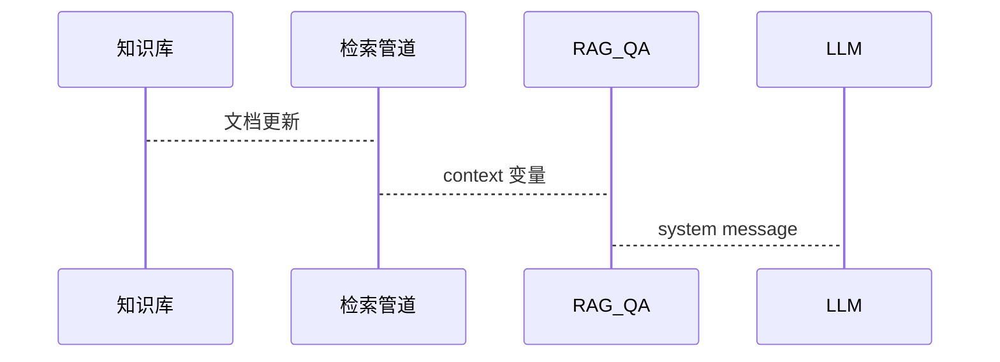
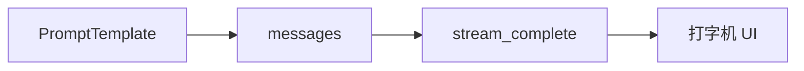

# Day 17 系统提示词企业实践

**视角**：智链科技平台组 + 合规 + 客服运营  
**关联需求**：ZL-NA-REQ-017

---

## 1. 为什么 system 要工程化？

| 痛点 | 硬编码 system | PromptTemplate |
|------|--------------|----------------|
| 变更周期 | 跟发版 | 文件/配置 PR |
| 多租户 | 复制代码分支 | `company` 变量 |
| 审计 | 难追溯 | Git + name |
| 测试 | 无契约 | pytest render |

企业内训结论：**system 是配置，不是常量。**

---

## 2. 分层实践模型



- **平台层**：通用人格、安全底线  
- **业务线层**：产品、知识库场景  
- **职能层**：合规、客服渠道  

会话通常 **单层 active template**；多层合并属高级模式（见 19_讲师补充阅读）。

---

## 3. 合规场景：PRODUCT_FAQ 与 COMPLIANCE_REVIEW

### 3.1 理财产品 FAQ

**监管要求**：风险提示不得弱化。

模板强制句：

> 投资有风险，入市需谨慎

**运营 SOP**：

1. 新品上线前更新 `product_name` 默认值文档  
2. 法务抽检 20 条对话  
3. 季度复审 `PRODUCT_FAQ.template` 全文  

### 3.2 宣传文案审阅

输出格式 `【风险等级：高/中/低】` 便于工单系统解析（未来可接结构化 JSON）。

**人工在环**：模板输出 ≠ 法律意见，须合规官确认。

---

## 4. 知识库场景：RAG_QA

### 4.1 Grounding 三件套

1. 「仅根据【参考资料】」  
2. 不足时「资料中未找到」  
3. context 与 user 问题分离  

### 4.2 context 供给链

| 阶段 | 来源 | 负责团队 |
|------|------|----------|
| Day 17 | doc_reader 全文/截断 | 研发教学 |
| Day 19+ | 文档分块 | 研发 |
| Day 28 | 向量 TopK | 算法 + 研发 |

**模板稳定，数据源演进**——企业实践关键。



---

## 5. 客服场景：customer_service.txt

### 5.1 渠道差异化

`channel` = CLI | Web | 企微 → 同一模板，不同变量。

### 5.2 字数限制

`max_chars` 写入 system，约束模型冗长（软约束，需评测）。

### 5.3 变更流程

```
运营起草 → 组长审核 → 研发 PR → CI pytest → 合并 → 重启/热加载
```

本期热加载未做，需重启进程。

---

## 6. ChatAssistant 企业部署建议

| 配置项 | 建议 |
|--------|------|
| 默认模板 | `default_assistant` |
| 是否开放 `/system` | 内测开放，生产关闭或审计 |
| `/template` | 一线仅 list；切换由意图路由（Day 18） |
| template_variables | 从租户配置注入 `company` |

---

## 7. 多租户变量表

| 租户 | company | 默认 product_name | 备注 |
|------|---------|-------------------|------|
| 智链科技 | 智链科技 | 稳健增利 A | 默认 |
| 合作银行 A | XX 银行 | 合作专属产品 | 白标 |

存储：配置文件或 DB，启动时写入 `ChatAssistant.template_variables`。

---

## 8. 监控与告警

- `ConfigError` 渲染失败 → 日志告警（配置错误）  
- system token 超阈值 → Day 15 联动  
- 合规模板缺失关键词 → CI 断言（扩展测试）  

---

## 9. 与 Day 16 流式并存

生产路径：



同一 `messages`，流式改善体验，不改变 system 构造。

---

## 10. 企业案例复盘清单

- [ ] 五类内置模板是否覆盖当前产品线？  
- [ ] `customer_service.txt` 谁有写权限？  
- [ ] RAG context 最大 token 谁审批？  
- [ ] 合规模板上次法务签字日期？  
- [ ] Day 18 意图路由 fallback 策略？  

---

## 11. 结语

系统提示词企业实践 = **模板资产化 + 变量租户化 + 合规契约化 + 检索数据化**。Day 17 代码是第一步，运营流程与 Day 18 路由同样重要。
