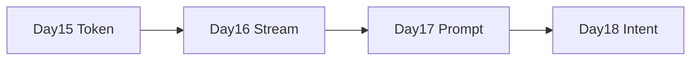
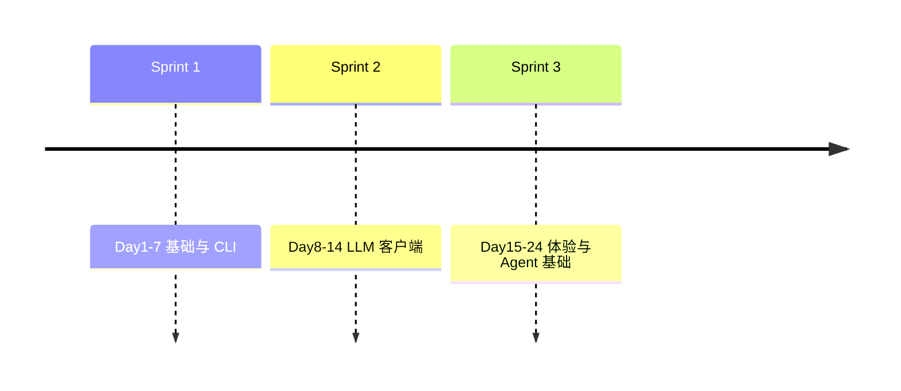

# Day 17 Sprint 3 阶段回顾

**位置**：Sprint 3 第三日（Day 15–17 小结）  
**下次回顾**：Day 24 Sprint 3 结束

---

## 1. Sprint 3 目标（复述）

Phase 2 Sprint 3 主题：**可观测性与体验升级**，为 RAG 与 Agent 打基础。

| 维度 | 目标 |
|------|------|
| 可观测 | Token 计量、usage 报告 |
| 体验 | 流式 SSE、Prompt 场景化 |
| 工程 | 标准库、可测、Mock |

---

## 2. 三日交付对照

| Day | 需求号 | 核心模块 | 关键词 |
|-----|--------|----------|--------|
| 15 | ZL-NA-REQ-015 | `llm/token_counter.py` | TokenUsage、计费意识 |
| 16 | ZL-NA-REQ-016 | `llm/streaming.py` | SSE、on_delta |
| 17 | ZL-NA-REQ-017 | `prompts/*` | Template、Registry |



---

## 3. 能力叠加矩阵

| 能力 | D15 | D16 | D17 |
|------|-----|-----|-----|
| 阻塞 complete | ✓ | ✓ | ✓ |
| 流式 stream_complete | | ✓ | ✓ |
| usage 报告 | ✓ | ✓ | ✓ |
| system 模板化 | | | ✓ |
| /template 命令 | | | ✓ |
| RAG system 构造 | | | ✓（预习） |

**组合示例**：

```python
system = RAG_QA.to_system_message(company="智链科技", context=ctx)
messages = [system, user_msg]
# 阻塞
client.complete(messages)
# 或流式
stream_client.stream_complete(messages, on_delta=print)
```

---

## 4. 代码量与测试（示意）

| 目录 | 测试文件 | 关注点 |
|------|----------|--------|
| day15 | test_token_counter.py | usage 解析 |
| day16 | test_streaming.py | SSE、Mock transport |
| day17 | test_prompts.py | render、registry、assistant |

**质量门禁**：三日 pytest 均需在 CI 全绿。

---

## 5. 学员能力曲线（林晓视角）

| 日期 | 我能独立… |
|------|-----------|
| Day 15 | 读 usage_summary，理解 prompt/completion tokens |
| Day 16 | 跑 streaming_demo，解释 data: [DONE] |
| Day 17 | 写 PromptTemplate，apply_template，联调 doc_reader |

---

## 6. 未完成 / 技术债

| 项 | 计划日 |
|----|--------|
| 意图自动选模板 | Day 18 |
| context token 预算自动截断 | Day 19+ |
| 模板热加载 | Backlog |
| Web SSE + 模板 UI | Phase 3 |

---

## 7. 与 Sprint 1–2 连接



- Day 2 format → Day 17 Template  
- Day 12 complete → Day 16 stream → 均消费 Day 17 messages  
- Day 5 解析 → Day 16 chunk → Day 15 usage  

---

## 8. 站会 Retro（Day 17 晚）

### Keep

- Mock 演示不依赖外网  
- 企业故事线（赵岩、合规邮件）  
- 五模板覆盖真实场景  

### Problem

- `apply_template` 缺变量报错对新手不友好 → 加强 preview 教学  
- `default_registry` import 副作用不够直观  

### Try

- Day 18 增加「意图 → 模板」一张总图  
- 作业收集 rag context 长度实验数据  

---

## 9. 下三日预览（Day 18–20）

| Day | 主题 |
|-----|------|
| 18 | 意图分类器 |
| 19 | 文档分块与索引预习 |
| 20 | 工具调用入门 |

---

## 10. 阶段自测（10 题速览）

1. Token 在流式中何时出现？  
2. `stream=True` 在哪构建？  
3. `PromptTemplate.render` 缺变量？  
4. `RAG_QA` 两变量？  
5. `customer_service` 从哪加载？  
6. `/template list` 实现？  
7. `apply_template` 保留什么消息？  
8. doc_reader 在 rag demo 作用？  
9. Day 16 与 17 正交关系？  
10. 下一需求主题？

**答案线索**：见 16_复习卡片 + 00_旁白 Day 18 预告。

---

## 11. 小结

Sprint 3 前三天完成 **「看得清 token、看得着输出、管得住人设」**。Day 17 是 Agent 的「剧本库」，Day 18 起开始「选剧本」。
