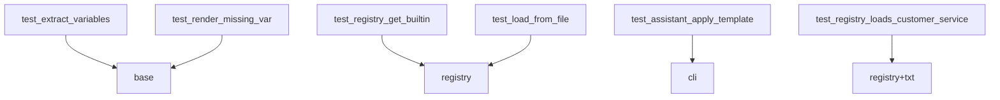

# Day 17 prompts 精读

**精读范围**：`nexus-agent-platform/src/prompts/` 全包  
**建议**：对照 IDE 分屏阅读

---

## 包结构

```
prompts/
├── __init__.py          # 公共导出
├── base.py              # PromptTemplate 核心
├── library.py           # 内置五模板
├── registry.py          # PromptRegistry
└── templates/
    └── customer_service.txt
```

---

## __init__.py 导出

阅读要点：对外 API 表面应稳定；业务代码 `from prompts import RAG_QA` 而非深层路径。

典型导出：

- `PromptTemplate`, `extract_variables`  
- `PromptRegistry`, `default_registry`  
- 五类内置常量  
- `BUILTIN_TEMPLATES`  

---

## base.py 逐函数

### extract_variables

```python
def extract_variables(template: str) -> tuple[str, ...]:
```

| 行 | 意图 |
|----|------|
| `_PLACEHOLDER_RE` | 限制合法占位符，防 format 注入奇怪键 |
| `seen` set | O(1) 去重 |
| `result` list | 保序 |

**练习**：对 `COMPLIANCE_REVIEW.template` 手算 `required_vars` → `("company", "text")`。

### PromptTemplate.__post_init__

校验 + 自动推断。注意 `field(default_factory=tuple)` 避免可变默认陷阱。

### render

```python
missing = [v for v in self.required_vars if v not in variables]
```

**精读**：用 `not in variables`，空字符串 `""` 算**已提供**。

### render_safe

捕获 `ConfigError` 仅；`ValueError` 构造期已挡。

### preview

仅对 `required_vars` 填占位，非 required 的额外 `{}` 仍由 format 处理。

### to_system_message

依赖 `models.ChatMessage`——Prompt 层不依赖 LLM 客户端，只依赖消息模型。

---

## library.py 逐常量

### DEFAULT_ASSISTANT

```python
template=(
    "你是{company} NexusAgent 智能助手。"
    "请用简洁、专业的中文回答用户问题。"
    "若不确定请明确说明，不要编造事实。"
),
```

多行隐式拼接，无换行符——渲染为一行连续中文。若需换行，显式 `\n`。

### RAG_QA

结构块：

1. 身份 + grounding 规则  
2. `【参考资料】\n{context}\n\n`  
3. 回答要求  

**token 注意**：固定部分约百字级，context 占大头。

### DOC_SUMMARY

`max_points` 在句中：`请用{max_points}个要点` —— 运营改「条」为「个」只需改模板。

### PRODUCT_FAQ

合规句与 `product_name` 绑定在同一 system，保证产品上下文与风险揭示同现。

### COMPLIANCE_REVIEW

枚举三项检查 + 输出格式——适合 few-shot 扩展（见 13_深度扩展）。

### BUILTIN_TEMPLATES

```python
{t.name: t for t in (...)}
```

**陷阱**：若两实例 `name` 相同，后者覆盖前者——当前无重复。

---

## registry.py 精读

### PromptRegistry._templates

私有 dict，唯一存储。无「注销」API——本期不需要。

### get

```python
raise ConfigError(
    f"未知模板: {name!r}，可用: {sorted(self._templates)}"
)
```

错误消息**可操作**：直接告诉用户可用列表。

### load_from_file

| 步骤 | 代码关注 |
|------|----------|
| 存在性 | `StorageError` + path |
| 编码 | `utf-8` |
| 描述行 | `# ` 前缀 |
| name | 参数覆盖 `path.stem` |
| 注册 | 立即 `register` |

### load_directory

```python
for path in sorted(directory.glob("*.txt")):
```

**不包含** `.md` 除非改 glob——需求写支持 .md 但目录加载仅 `*.txt`；`load_from_file` 可读 .md 若手动调用。

### 模块级 default_registry

```python
default_registry = PromptRegistry()
default_registry.load_directory()
```

import 副作用：测试隔离时用 fresh `PromptRegistry()`。

---

## templates/customer_service.txt

```
# 自定义客服问候模板
你是{company}客服助手，当前服务渠道：{channel}。
请友好、耐心地解答用户问题，单次回复不超过{max_chars}字。
```

与 `registry_demos.py` 参数一一对应。

---

## 与 chat/cli_assistant.py 接点

| cli 成员 | prompts 依赖 |
|----------|-------------|
| `prompt_registry` | 默认 `default_registry` |
| `prompt_template` | `PromptTemplate` 实例 |
| `template_variables` | render kwargs |
| `apply_template` | `registry.get` + `render` |

---

## 与 day17 演示对应

| 脚本 | 精读文件 |
|------|----------|
| prompt_demos.py | base, library |
| registry_demos.py | registry, customer_service.txt |
| rag_prompt_demo.py | library RAG_QA |
| assistant_prompt_demo.py | cli_assistant |

---

## 与 tests/day17 映射



---

## 精读思考题

1. 若 `required_vars=("company",)` 手动设置但 template 还有 `{context}`，render 会怎样？  
2. `load_directory` 返回 count 含义？  
3. 为何 `library` 不 import `registry`？  

**答案**：

1. `context` 未在 required 中不校验缺失，但 format 会 KeyError → 包装 ConfigError  
2. 成功加载的 txt 文件数  
3. 单向依赖，避免循环 import  

---

## 精读完成标准

- [ ] 能白板画出 `render` 流程  
- [ ] 能默写五模板 name 与变量  
- [ ] 能解释 `default_registry` 有几个 key 及来源  
- [ ] 能口述 `apply_template` 对 history 的操作
