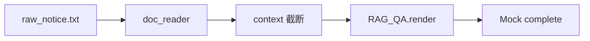
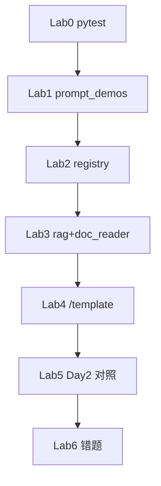

# Day 17 实操 Lab 手册

**实验环境**：`nexus-agent-platform` + `PYTHONPATH=src`  
**建议时长**：120 分钟  
**角色**：学员独立完成，助教巡场

---

## Lab 0：环境自检（10 min）

```bash
cd /path/to/nexus-agent-platform
export PYTHONPATH=src
export NEXUS_LLM_MOCK=1
python3 -m pytest tests/day17/ -v --tb=short
```

**通过标准**：全部 PASSED。

---

## Lab 1：PromptTemplate 基础（20 min）

### 步骤

```bash
python3 src/day17/prompt_demos.py
```

### 记录表

| 演示段 | 输出关键词 | required_vars |
|--------|-----------|---------------|
| default_assistant | 智链科技 | company |
| rag_qa preview | 参考资料、&lt;context&gt;? | |
| doc_summary | bullet | |

### REPL 扩展

```python
import sys; sys.path.insert(0, "src")
from prompts import DEFAULT_ASSISTANT, extract_variables
print(extract_variables(DEFAULT_ASSISTANT.template))
print(DEFAULT_ASSISTANT.render_safe())  # 观察 err
```

### 验收

能解释 `preview` 与 `render` 对缺 `context` 的行为差异。

---

## Lab 2：注册表与文件模板（25 min）

```bash
python3 src/day17/registry_demos.py
```

### 任务

1. 记录 `list_names()` 全部 6 个名称  
2. 打开 `src/prompts/templates/customer_service.txt` 对照 render 参数  
3. 新建**临时**注册表并加载：

```python
from pathlib import Path
from prompts import PromptRegistry

reg = PromptRegistry()
p = Path("src/prompts/templates/customer_service.txt")
reg.load_from_file(p)
assert "customer_service" in reg.list_names()
```

### 验收

`customer_service` 渲染含 `CLI` 与 `200` 字限制。

---

## Lab 3：RAG + doc_reader（25 min）

```bash
python3 src/day17/rag_prompt_demo.py
```

### 记录

| 字段 | 你的运行值 |
|------|-----------|
| system 长度（字符） | |
| 助手回复前 40 字 | |
| usage total_tokens | |

### 变体实验

修改 `context[:300]` 为 `[:50]` 与 `[:1000]`（若文件够长），重跑，记录 system 长度变化。



### 验收

能说明 context 来源字段：`doc.cleaned or doc.content`。

---

## Lab 4：ChatAssistant /template（25 min）

```bash
python3 src/day17/assistant_prompt_demo.py
```

### 任务

阅读 `assistant_prompt_demo.py`，在 REPL 复现：

```python
from chat import ChatAssistant
from prompts import DEFAULT_ASSISTANT
from llm import LLMClient
from llm.env import LLMEnvConfig
from models import ModelConfig

SAMPLE = {...}  # 见 test_prompts.py
env = LLMEnvConfig(api_key="x", base_url="https://api.example.com/v1", mock=True)
client = LLMClient(ModelConfig(), env=env, transport=lambda *_: SAMPLE)
a = ChatAssistant(client=client, prompt_template=DEFAULT_ASSISTANT,
                  template_variables={"company": "智链科技"}, track_tokens=False)
handled, msg, _ = a.handle_command("/template list")
print(msg)
```

### 挑战

切换 `compliance_review` 需 `text` 变量——用 `apply_template` 传入完整 variables，再 `/history` 查看 system 是否变化。

### 验收

`/template list` 含 `rag_qa`；切换后 history 第一条为 system。

---

## Lab 5：对照 Day 2（15 min）

完成 [18_与Day2_fstring对照表.md](18_与Day2_fstring对照表.md) 中一道练习题：把 f-string 改为 `PromptTemplate`。

---

## Lab 6：错题注入（10 min）

故意触发三种错误并记录消息：

| 操作 | 预期异常/提示 |
|------|--------------|
| `RAG_QA.render(company="X")` | ConfigError 缺 context |
| `PromptRegistry().get("nope")` | ConfigError 未知模板 |
| `/template rag_qa` 且无 context 变量 | 模板切换失败 |

对照 [10_常见问题与排错指南.md](10_常见问题与排错指南.md)。

---

## Lab 总流程



---

## 提交清单

| 产物 | 路径建议 |
|------|----------|
| Lab 1–3 记录表 | `homework/day17/lab_notes.md` |
| Lab 4 /history 截图或文本 | 学习平台 |
| Lab 6 错误消息摘录 | 同上 |

---

## 加分挑战

1. 在 `homework/day17/` 新增 `my_service.txt` 并通过 `load_from_file` 注册  
2. 写 3 个 assert 测试你的模板 `render`  
3. 预习 Day 18：写 5 条用户话 → 应选模板名映射表  

---

## 助教巡场 Checklist

- [ ] 学员 `PYTHONPATH` 正确  
- [ ] Lab 3 能跑通 Mock  
- [ ] 能区分 `default_registry` 与空 `PromptRegistry()`  
- [ ] 无人把 `preview` 结果发给真实 API  

---

## 结语

完成六 Lab 即覆盖 ZL-NA-REQ-017 全部验收路径：**定义 → 注册 → 渲染 → 集成 → RAG 联调 → 排错**。
