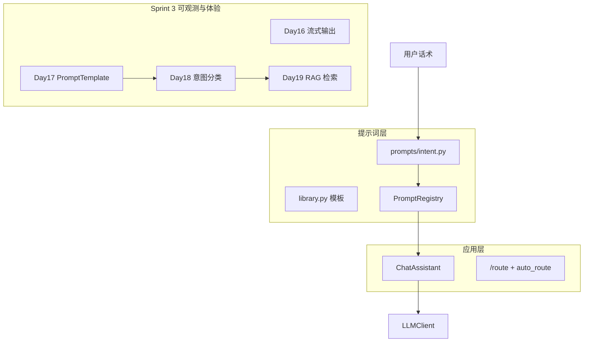

# Day 18 旁白解读：先听懂用户想干什么

> **前置要求**：完成 Day 17 `PromptTemplate`、`PromptRegistry`、`ChatAssistant.apply_template` 与 `/template` 命令

---

## 旁白

2026 年 7 月 23 日，周四。智链科技客服内测群里，运营小张连发三条消息：

1. 「请根据产品说明书回答收益率是多少？」  
2. 「帮我总结这份会议纪要要点。」  
3. 「审阅这段宣传语是否合规。」

林晓在 Day 17 的 REPL 里手动敲了三遍 `/template rag_qa`、`/template doc_summary`、`/template compliance_review`。小张吐槽：「用户不会记命令，助手应该**自己判断**。」

赵岩在晨会引用数据：「内测 72% 的对话第一句就暴露了场景意图，但 100% 的用户不会用斜杠命令。」

陈默在白板上接在 Day 17 的注册表后面画了一个菱形：

```
用户输入
    ↓
RuleBasedIntentClassifier.classify
    ↓
IntentMatch (intent, template_name, confidence)
    ↓
IntentRouter.build_variables → apply_template
    ↓
LLMClient.complete
```

> 「今天不教模型新技能，教**路由器**选模板。MVP 用关键词规则——快、可测、零 token。Day 19 再换 LLM 分类器。」

周航补充测试策略：

> 「`tests/day18/test_intent.py` 共 12 条用例，覆盖四类业务意图、general 回退、同分优先级、auto_route 与 `/route` 命令。CI 不连外网。」

下午，林晓运行 `intent_demos.py`，看见「理财产品年化收益」命中 `product_faq`；又跑 `routed_assistant_demo.py`，`auto_route=True` 时终端出现 `[路由: product_faq]` 前缀。她问陈默：

> 「如果一句话同时有『文档』和『合规』两个词怎么办？」

陈默指向 `INTENT_PRIORITY`：

> 「同分时合规优先——金融场景里审阅风险比问答更敏感。这是产品策略，不是算法真理。」

站会末尾，陈默预告 Day 19：

> 「`context_provider` 今天读 `raw_notice.txt` 截断 400 字；明天接向量检索，让 `rag_qa` 真正『根据资料』回答。」

---

## 今日在架构中的位置



---

## 林晓的学习建议

1. 先读 `prompts/intent.py` 全文，理解 `classify` 打分与同分逻辑  
2. 运行 `intent_demos.py`，对 `SAMPLES` 每条手写预期 intent  
3. 运行 `router_demos.py`，对照 `build_variables` 返回的键名  
4. 阅读 `tests/day18/test_intent.py` 全部 12 条，当作活文档  
5. `NEXUS_LLM_MOCK=1 routed_assistant_demo.py`，观察 `/route` 与 `auto_route` 差异  
6. 在 REPL 试验：`ChatAssistant(..., intent_router=router, auto_route=True)`

---

## 今日关键词

| 术语 | 含义 |
|------|------|
| Intent | 业务场景标签，如 `rag_qa`、`doc_summary` |
| IntentMatch | 分类结果数据类，含置信度与命中关键词 |
| RuleBasedIntentClassifier | 关键词规则引擎 |
| IntentRouter | 分类 + 变量构建 + `route_and_apply` |
| auto_route | `chat_turn` 前自动切换模板 |
| INTENT_PRIORITY | 同分意图的优先级元组 |

---

## 与昨日衔接

Day 17 回答「**有哪些模板、怎么渲染**」；Day 18 回答「**用户这句话该用哪个模板**」。手动 `/template` 保留给调试与运营；生产路径走 `IntentRouter`。
