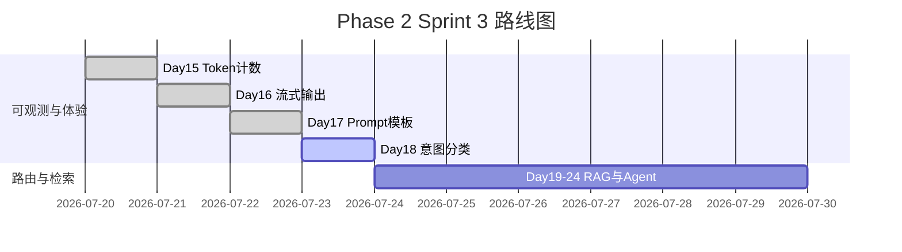

# Day 18 企业背景与今日任务

**日期**：2026 年 7 月 23 日  
**Sprint**：Sprint 3 第四日 — 意图路由与自动选模板

## 晨会纪要

### 赵岩（产品）

> 「Day 17 模板库上线后，运营反馈：**切换模板太专业**。用户只会自然说话——『帮我总结』『查一下文档』『这段文案合规吗』。我们需要**意图分类器**，在对话第一轮自动选对 system。」

### 陈默（架构）

> 「新增 `prompts/intent.py`：`RuleBasedIntentClassifier` 关键词打分；`IntentRouter` 串联分类、`build_variables`、`apply_template`。`ChatAssistant` 增加 `intent_router`、`auto_route` 与 `/route` 预览命令。」

### 周航（DevOps）

> 「`tests/day18/test_intent.py` 12 条用例进 CI。演示脚本 `day18/*` 不依赖外网，`NEXUS_LLM_MOCK=1` 可跑完整联调。」

### 林晓（学员代表）

> 「规则引擎会不会很脆？用户说『概括一下』和『总结一下』能一样吗？」

陈默：「MVP 用 `DEFAULT_KEYWORD_RULES` 覆盖高频词；同义词扩展放作业和 Day 19 LLM 分类预习。」

## 任务分配

| ID | 任务 | 负责人 | 优先级 |
|----|------|--------|--------|
| ZL-NA-REQ-018 | 实现 `prompts/intent.py` | 全员 | P0 |
| ZL-NA-201 | `IntentMatch` + `RuleBasedIntentClassifier` | 林晓 | P0 |
| ZL-NA-202 | `INTENT_TEMPLATE_MAP` + `INTENT_PRIORITY` | 林晓 | P0 |
| ZL-NA-203 | `IntentRouter.build_variables` | 助教 | P0 |
| ZL-NA-204 | `ChatAssistant` `/route` + `auto_route` | 助教 | P0 |
| ZL-NA-205 | `day18/*` 演示脚本 | 助教 | P1 |
| ZL-NA-206 | `tests/day18/test_intent.py` 全绿 | 周航 | P0 |

## Definition of Done

- [ ] `python3 src/day18/intent_demos.py` 五条样例分类正确
- [ ] `python3 src/day18/router_demos.py` 输出变量键列表
- [ ] `NEXUS_LLM_MOCK=1 python3 src/day18/routed_assistant_demo.py` 可见路由前缀
- [ ] `pytest tests/day18/test_intent.py -v` 12 passed
- [ ] 能口述：`classify` 打分公式与同分 `INTENT_PRIORITY`
- [ ] 能解释：`/route` 与 `auto_route` 的行为差异
- [ ] 能说明：`build_variables` 如何为 `rag_qa` 注入 `context`

## 今日节奏

| 时段 | 内容 |
|------|------|
| 09:00-09:30 | 意图分类概论、Day 17 模板回顾 |
| 09:30-10:30 | `RuleBasedIntentClassifier` 手写练习 |
| 10:45-12:00 | `IntentRouter` 与变量构建走读 |
| 14:00-15:30 | `ChatAssistant` 集成、`/route` 与 `auto_route` |
| 15:45-17:00 | `routed_assistant_demo` 联调与测试讲评 |

## 环境准备

```bash
cd nexus-agent-platform
export PYTHONPATH=src
export NEXUS_LLM_MOCK=1

python3 src/day18/intent_demos.py
python3 src/day18/router_demos.py
python3 src/day18/routed_assistant_demo.py
python3 -m pytest tests/day18/test_intent.py -v
```

## Sprint 3 全景（Day 15–24 预览）



## 与 Day 17 的差异

| 维度 | Day 17 Prompt 模板 | Day 18 意图分类 |
|------|-------------------|-----------------|
| 关注点 | **有哪些**模板、怎么渲染 | **选哪个**模板 |
| 核心类 | `PromptTemplate`、`PromptRegistry` | `RuleBasedIntentClassifier`、`IntentRouter` |
| 用户命令 | `/template list`、`/template 名称` | `/route 话术`（预览分类） |
| 自动化 | 手动切换 | `auto_route=True` 每轮自动切换 |
| 与 RAG 关系 | `RAG_QA` 定义 context 占位 | `context_provider` 注入真实片段 |
