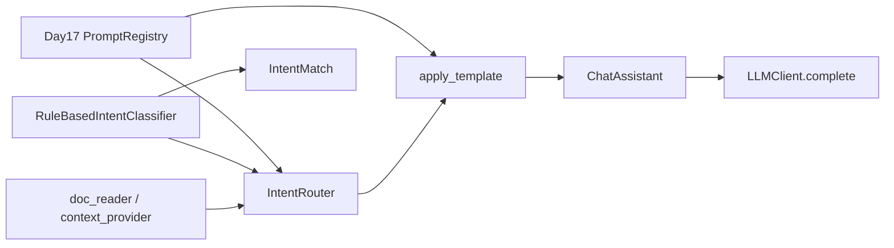

# ZL-NA-REQ-018 需求文档

**需求编号**：ZL-NA-REQ-018  
**需求名称**：意图分类器与模板路由  
**优先级**：P0  
**Sprint**：Sprint 3 第四日  
**状态**：已交付

---

## 1. 背景

智链科技 NexusAgent 在 Day 17 建立 Prompt 模板库后，运营仍须手动 `/template` 切换场景。产品要求：用户以自然语言输入时，系统**自动识别意图**并选用对应模板，降低使用门槛，为后续 Agent 多工具路由打基础。

## 2. 目标用户

- 终端用户（自然语言对话，无斜杠命令记忆负担）
- 产品经理（调整关键词规则与意图优先级）
- 后端开发（扩展 `IntentRouter`、替换分类器实现）
- 测试与 CI（确定性规则、可重复断言）

## 3. 功能需求

### FR-001 IntentMatch 结果模型

| 项 | 描述 |
|----|------|
| 模块 | `prompts/intent.py` |
| 类 | `IntentMatch`（dataclass） |
| 字段 | `intent`、`template_name`、`confidence`、`matched_keywords`、`user_text` |
| 方法 | `summary() -> str` 人类可读一行摘要 |

### FR-002 规则意图分类器

| 项 | 描述 |
|----|------|
| 类 | `RuleBasedIntentClassifier` |
| 配置 | `rules`（默认 `DEFAULT_KEYWORD_RULES`）、`template_map`（默认 `INTENT_TEMPLATE_MAP`）、`priority`（默认 `INTENT_PRIORITY`） |
| 方法 | `classify(text: str) -> IntentMatch` |
| 打分 | 命中关键词数量；空输入或零命中 → `general` |
| 同分 | 按 `INTENT_PRIORITY` 选取；置信度 `min(0.95, 0.55 + 0.1 * max_score)` |

### FR-003 意图与模板映射

| 项 | 描述 |
|----|------|
| 常量 | `INTENT_TEMPLATE_MAP` |
| 映射 | `rag_qa`→`rag_qa`、`doc_summary`→`doc_summary`、`compliance_review`→`compliance_review`、`product_faq`→`product_faq`、`general`→`default_assistant` |
| 关键词 | `DEFAULT_KEYWORD_RULES` 四类业务 + general 回退 |

### FR-004 IntentRouter 路由器

| 项 | 描述 |
|----|------|
| 类 | `IntentRouter` |
| 依赖 | `classifier`、`registry`（默认 `default_registry`）、`context_provider`、`company`、`default_product` |
| 方法 | `classify`、`build_variables(match)`、`route_and_apply(assistant, user_text)` |
| 变量策略 | `rag_qa` 注入 `context`；`doc_summary` 注入 `document`+`max_points`；`compliance_review` 注入 `text`；`product_faq` 注入 `product_name` |

### FR-005 ChatAssistant 集成

| 项 | 描述 |
|----|------|
| 构造参数 | `intent_router: IntentRouter | None`、`auto_route: bool = False` |
| 命令 | `/route [用户话术]` — 仅分类预览，不切换模板、不调 LLM |
| 自动路由 | `auto_route=True` 时 `chat_turn` 开头调用 `route_and_apply` |
| 回复前缀 | 路由信息 `[路由: template_name]` 拼入 assistant 回复 |

### FR-006 演示脚本

| 项 | 描述 |
|----|------|
| `intent_demos.py` | 五条样例话术分类打印 |
| `router_demos.py` | 分类 + `build_variables` 键名展示 |
| `routed_assistant_demo.py` | `auto_route` + `/route` 脚本化联调 |

### FR-007 单元测试

| 项 | 描述 |
|----|------|
| 文件 | `tests/day18/test_intent.py` |
| 数量 | 12 条 |
| 覆盖 | 四类意图、general 回退、变量构建、`route_and_apply`、`auto_route`、`/route`、同分优先级、`summary()` |

## 4. 非功能需求

| 编号 | 要求 |
|------|------|
| NFR-001 | 分类器零 LLM 调用，单测毫秒级 |
| NFR-002 | 规则与映射可构造注入，便于 A/B 与单测 |
| NFR-003 | 与 Day 17 `apply_template` 兼容，不破坏 `/template` |
| NFR-004 | `context_provider` 可选，缺省显示「（暂无检索上下文）」 |

## 5. 验收标准

```bash
export PYTHONPATH=src
python3 src/day18/intent_demos.py
python3 src/day18/router_demos.py
NEXUS_LLM_MOCK=1 python3 src/day18/routed_assistant_demo.py
python3 -m pytest tests/day18/test_intent.py -v
```

全部通过，且 `test_priority_compliance_over_rag` 验证合规优先策略。

## 6. 范围外（后续迭代）

- Day 19+：LLM 零样本 / 少样本意图分类  
- 多意图复合路由（一条消息触发多模板）  
- 意图置信度阈值与人类转接  
- 在线学习与用户反馈闭环  

## 7. 依赖关系


