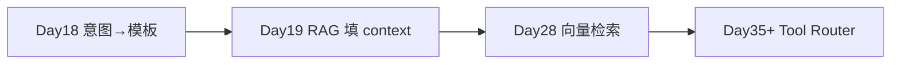

# ZL-NA-REQ-018 需求文档（扩展）

**关联**：`02_需求文档.md`  
**读者**：架构师、测试、后续 LLM 分类迭代

---

## E-001 关键词规则明细

`DEFAULT_KEYWORD_RULES` 当前版本：

| 意图 | 关键词 | 产品 rationale |
|------|--------|----------------|
| compliance_review | 合规、审阅、审查、宣传语、敏感、违规 | 合规场景触发词覆盖审核动作与风险对象 |
| doc_summary | 总结、摘要、概括、要点、汇总、归纳 | 摘要类动词，与「问答」区分 |
| product_faq | 理财、产品、收益、基金、年化、风险 | 智链理财业务高频咨询词 |
| rag_qa | 文档、资料、根据、查询、说明书、条款、文件中 | 明示「依据材料」的问答 |

**扩展指南**：新增意图须同步更新 `INTENT_TEMPLATE_MAP` 与 `INTENT_PRIORITY`。

---

## E-002 置信度语义

| 场景 | confidence | 说明 |
|------|------------|------|
| 空输入 | 0.5 | 弱默认 |
| 零命中 | 0.6 | general 回退 |
| 命中 n 个词 | min(0.95, 0.55+0.1n) | 命中越多越高，封顶 95% |

置信度**不用于**本期自动拒答；Day 22+ 可设阈值转人工。

---

## E-003 build_variables 契约

| template_name | 必填变量 | 来源 |
|---------------|----------|------|
| rag_qa | company, context | context_provider() 或占位 |
| doc_summary | company, max_points, document | document=user_text |
| compliance_review | company, text | text=user_text |
| product_faq | company, product_name | default_product |
| default_assistant | company | base only |

与 Day 17 `library.py` 的 `required_vars` 须一致，否则 `apply_template` 抛 `ConfigError`。

---

## E-004 同分优先级产品决策记录

**用例**：「请根据文档审阅宣传语合规风险」

- 命中 `rag_qa`：文档、根据  
- 命中 `compliance_review`：审阅、宣传语、合规  

同分 3:3 时，`INTENT_PRIORITY` 中 `compliance_review` 靠前 → 选合规审阅。

赵岩签字：「金融合规优先于信息检索。」

---

## E-005 /route 与 auto_route 行为矩阵

| 模式 | 分类 | apply_template | 调 LLM | 典型用途 |
|------|------|----------------|--------|----------|
| `/route 话术` | ✓ | ✗ | ✗ | 运营调试、规则验收 |
| `auto_route=False` + 普通输入 | ✗ | ✗ | ✓ | 保持 Day 17 行为 |
| `auto_route=True` | ✓ | ✓ | ✓ | 生产默认路径 |

---

## E-006 测试用例追溯

| 测试函数 | 验证点 |
|----------|--------|
| test_classify_rag_qa | 文档类话术 → rag_qa |
| test_classify_doc_summary | 总结类 → doc_summary |
| test_classify_compliance | 审阅类 → compliance_review |
| test_classify_product_faq | 理财类 → product_faq |
| test_classify_general_fallback | 你好 → general |
| test_router_build_variables_rag | context_provider 注入 |
| test_router_build_variables_compliance | text 键存在 |
| test_route_and_apply_changes_template | 助手 template 切换 |
| test_assistant_auto_route | 端到端 product_faq |
| test_assistant_route_command | /route 返回 doc_summary |
| test_intent_match_summary | summary 格式 |
| test_priority_compliance_over_rag | 同分优先级 |

---

## E-007 与 Agent 路线图

今日意图名可演进为 Tool 名：`rag_qa` → `search_docs` 等。

---

## E-008 风险与缓解

| 风险 | 缓解 |
|------|------|
| 关键词漏检 | 运营维护规则表；日志统计未命中话术 |
| 关键词误检 | INTENT_PRIORITY + 后续 LLM 复核 |
| 每轮切换模板丢失上下文 | apply_template 保留 user/assistant 历史 |
| context 过长 | Day 28 截断与 token 预算 |
