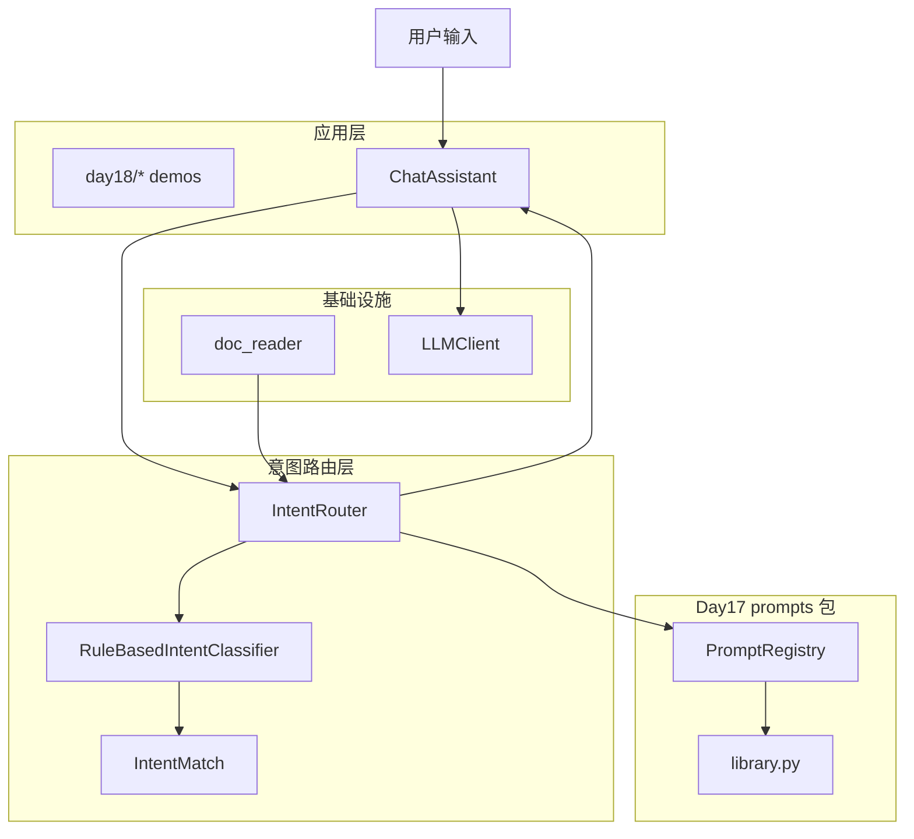
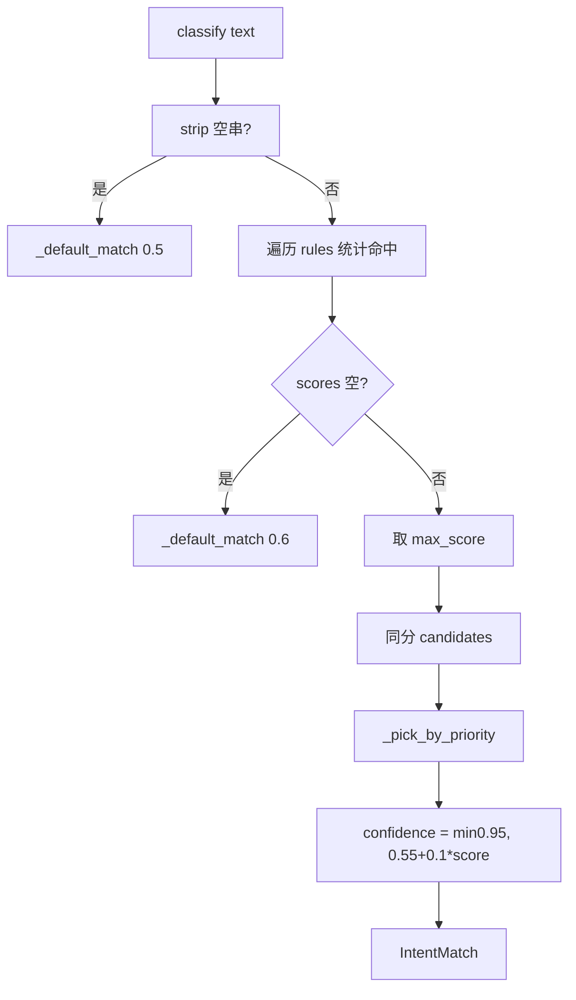
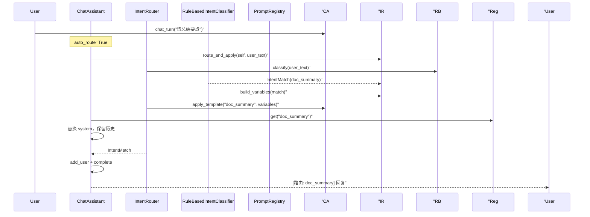

# Day 18 架构设计

**模块**：`prompts/intent.py` + `ChatAssistant` 扩展  
**需求**：ZL-NA-REQ-018

---

## 1. 分层架构



## 2. 核心类与常量

| 符号 | 模块 | 职责 |
|------|------|------|
| `INTENT_TEMPLATE_MAP` | intent.py | 意图名 → 注册表模板名 |
| `DEFAULT_KEYWORD_RULES` | intent.py | 意图 → 关键词列表 |
| `INTENT_PRIORITY` | intent.py | 同分决胜顺序 |
| `IntentMatch` | intent.py | 分类结果 + summary() |
| `RuleBasedIntentClassifier` | intent.py | 关键词打分 classify |
| `IntentRouter` | intent.py | 分类、变量、route_and_apply |
| `intent_router` | cli_assistant.py | 可选路由器实例 |
| `auto_route` | cli_assistant.py | 是否每轮自动路由 |
| `/route` | cli_assistant.py | 分类预览命令 |

## 3. classify 控制流



## 4. route_and_apply 序列



## 5. 与 Day 17 集成点

| Day 17 组件 | Day 18 用法 |
|-------------|-------------|
| `PromptRegistry.get` | `route_and_apply` 按 template_name 取模板 |
| `apply_template` | 路由后切换 system |
| `RAG_QA` | rag_qa 意图 + context_provider |
| `DOC_SUMMARY` | document=user_text |
| `COMPLIANCE_REVIEW` | text=user_text |
| `PRODUCT_FAQ` | product_name=default_product |

## 6. 扩展点（Day 19+）

```python
# 替换分类器，保持 IntentRouter 接口
class LLMIntentClassifier:
    def classify(self, text: str) -> IntentMatch: ...

router = IntentRouter(classifier=LLMIntentClassifier())
```

`ContextProvider = Callable[[], str]` 可换为 `Callable[[str], str]` 接收 query 做检索。

## 7. 文件清单

```
nexus-agent-platform/
├── src/prompts/intent.py
├── src/chat/cli_assistant.py      # intent_router, auto_route, /route
├── src/day18/
│   ├── intent_demos.py
│   ├── router_demos.py
│   └── routed_assistant_demo.py
└── tests/day18/test_intent.py
```

## 8. 设计原则

1. **分类与渲染分离**：Classifier 只输出 template_name，不调用 LLM  
2. **策略外置**：rules、priority、template_map 均可构造注入  
3. **可观测**：`IntentMatch.summary()` + 回复前缀 `[路由: ...]`  
4. **渐进增强**：规则 MVP → LLM 分类 → 向量 context，各层可独立替换
