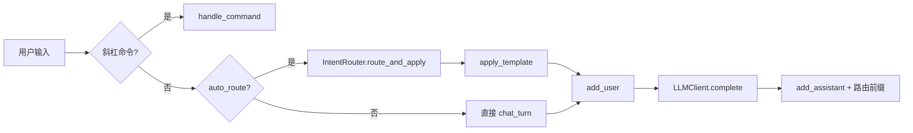
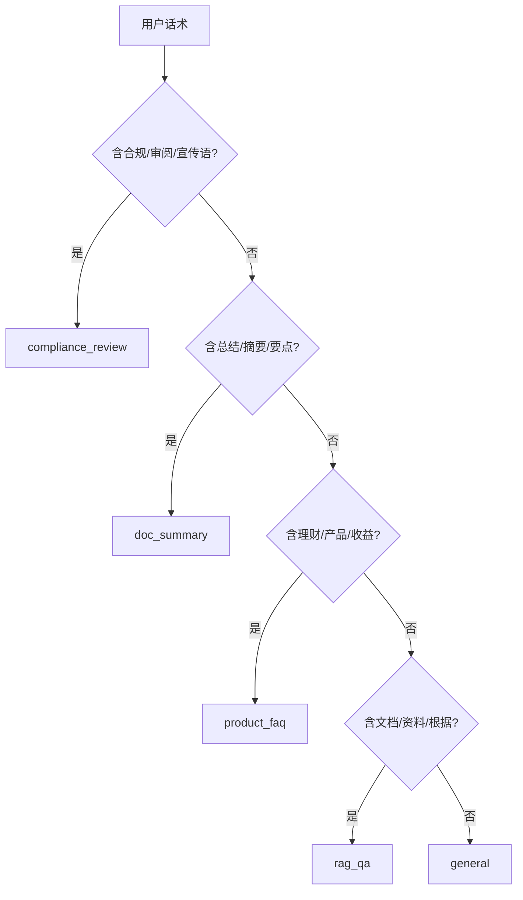
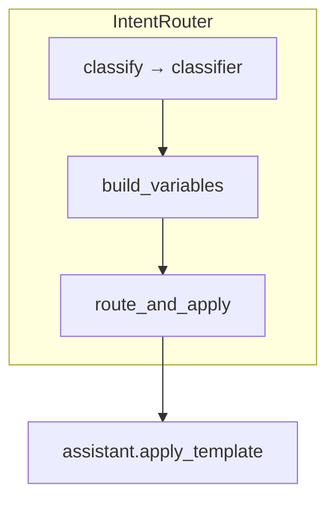
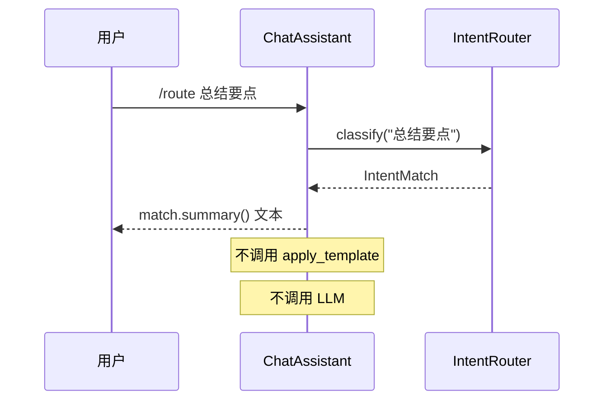
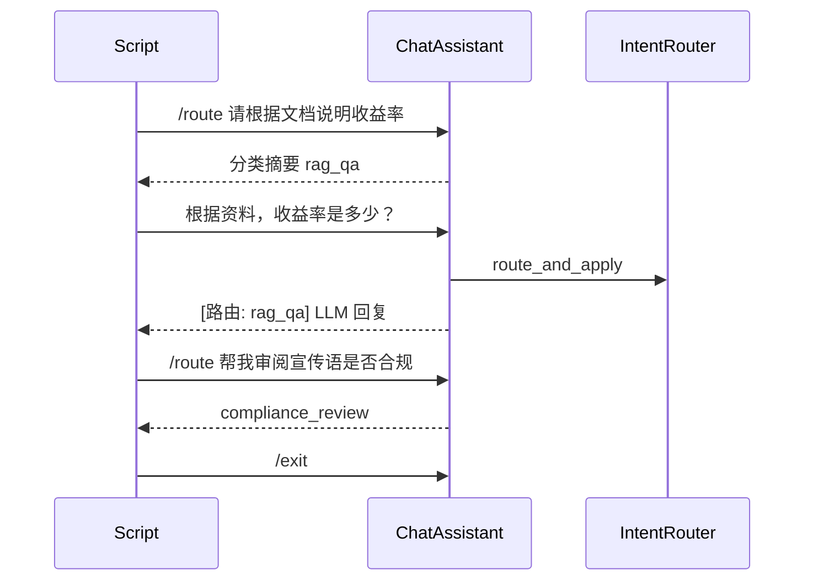
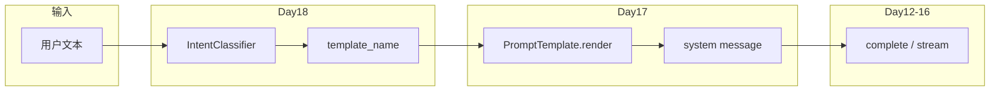

# Day 18 流程图与示意图

**主题**：意图分类与模板路由全链路

---

## 1. 用户对话主流程（auto_route）



## 2. 意图分类决策树（简化）



> 实际实现为**并行打分 + 同分优先级**，非严格 if-else 树；上图便于产品沟通。

## 3. IntentRouter 内部结构



## 4. 关键词命中示意

```
输入: "请根据产品说明书回答收益率是多少？"

rag_qa 规则命中: [文档, 说明书]  → score=2
product_faq 命中: [产品, 收益]    → score=2
同分 → INTENT_PRIORITY: compliance > doc_summary > product_faq > rag_qa
      → 选 product_faq（compliance/doc 未命中）
```

## 5. /route 命令流程



## 6. routed_assistant_demo 脚本流



## 7. 模块依赖 ASCII 图

```
┌─────────────────────────────────────────┐
│           ChatAssistant                  │
│  intent_router, auto_route, /route       │
└─────────────────┬───────────────────────┘
                  │ route_and_apply
┌─────────────────▼───────────────────────┐
│            IntentRouter                  │
│  build_variables + default_registry      │
└───────┬─────────────────────┬───────────┘
        │ classify            │ get(name)
┌───────▼──────────┐   ┌──────▼──────────┐
│ RuleBasedIntent  │   │ PromptRegistry  │
│ Classifier       │   │ + library       │
└──────────────────┘   └─────────────────┘
```

## 8. Sprint 3 数据流总览



## 9. 测试覆盖地图

| 区域 | 测试 |
|------|------|
| 分类器四类+general | test_classify_* |
| 变量构建 | test_router_build_variables_* |
| 助手集成 | test_route_and_apply_*、test_assistant_* |
| 优先级 | test_priority_compliance_over_rag |
| 可观测 | test_intent_match_summary |
