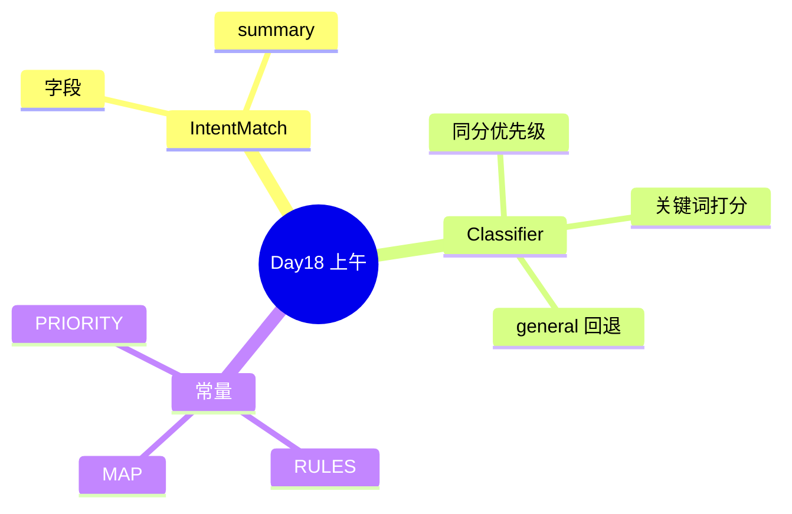

# Day 18 课堂笔记（上午）

**讲师**：陈默  
**记录**：林晓  
**时段**：09:00–12:00

---

## 09:00 开场：从模板到路由

陈默回顾 Day 17：

- `PromptRegistry` 是**目录**  
- `apply_template` 是**切换**  
- 缺的是**自动选择**

白板公式：

```
用户意图 ──classify──► 模板名 ──apply_template──► system prompt
```

赵岩展示内测数据：手动 `/template` 使用率 &lt; 3%。

---

## 09:30 IntentMatch 与数据类设计

```python
@dataclass
class IntentMatch:
    intent: str
    template_name: str
    confidence: float
    matched_keywords: list[str] = field(default_factory=list)
    user_text: str = ""
```

林晓笔记：

- `intent` 是业务标签；`template_name` 是注册表键——允许一对多扩展  
- `summary()` 给 `/route` 和日志用，格式固定便于 grep  

---

## 10:00 RuleBasedIntentClassifier 走读

核心循环：

```python
for intent, keywords in self.rules.items():
    matched = [kw for kw in keywords if kw in text]
    if matched:
        scores[intent] = (len(matched), matched)
```

**讨论**：为何用 `in text` 而非分词？

- MVP 简单、中文无空格也能跑  
- 缺点：「收益」可能误命中子串——作业可讨论  

同分逻辑 `_pick_by_priority`：

```python
for intent in self.priority:
    if intent in candidates:
        return intent
```

---

## 10:45 动手：intent_demos.py

林晓运行：

```bash
python3 src/day18/intent_demos.py
```

记录五条样例输出，与预期对照：

| 输入 | 预期 template |
|------|---------------|
| 请根据产品说明书回答收益率 | rag_qa 或 product_faq（同分看优先级） |
| 帮我总结会议纪要要点 | doc_summary |
| 请审阅宣传语是否合规 | compliance_review |
| 理财产品年化收益 | product_faq |
| 你好今天天气不错 | default_assistant |

---

## 11:15 INTENT_TEMPLATE_MAP 与 library 对齐

| intent | template_name | Day17 常量 |
|--------|---------------|------------|
| rag_qa | rag_qa | RAG_QA |
| doc_summary | doc_summary | DOC_SUMMARY |
| compliance_review | compliance_review | COMPLIANCE_REVIEW |
| product_faq | product_faq | PRODUCT_FAQ |
| general | default_assistant | DEFAULT_ASSISTANT |

陈默强调：**改模板名只改 map，不动分类器**。

---

## 11:45 上午小结



**林晓疑问**（下午继续）：`confidence` 能用来拒绝回答吗？  
**陈默**：本期不用；作业 C 讨论阈值设计。

---

## 关键词汇

| 中文 | 英文符号 |
|------|----------|
| 意图 | intent |
| 规则分类器 | RuleBasedIntentClassifier |
| 命中关键词 | matched_keywords |
| 默认意图 | general |
