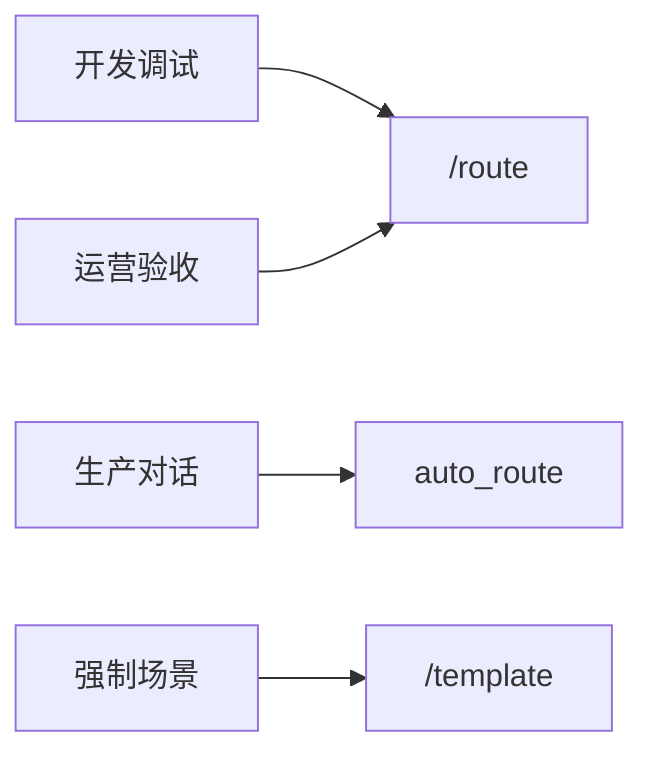

# Day 18 课堂笔记（下午）

**讲师**：陈默 + 助教  
**记录**：林晓  
**时段**：14:00–17:00

---

## 14:00 IntentRouter 三位一体

陈默三个方法口诀：**分、变、用**

1. `classify` — 委托 classifier  
2. `build_variables` — 按 template_name 填槽  
3. `route_and_apply` — 调 `assistant.apply_template`

`build_variables` 走查：

```python
if name == "rag_qa":
    context = self.context_provider() if self.context_provider else "（暂无检索上下文）"
    return {**base, "context": context}
```

林晓：「`context_provider` 就是 Day 17 `rag_prompt_demo` 里读文档的函数？」  
陈默：「对，今天 lambda 读 `raw_notice.txt` 前 400 字；明天换检索。」

---

## 14:45 router_demos.py 实验

```bash
python3 src/day18/router_demos.py
```

观察输出：

- 总结报告 → `doc_summary`，变量键 `company, max_points, document`  
- 审查稳赚不赔 → `compliance_review`，变量键含 `text`  

---

## 15:15 ChatAssistant 集成

新增构造参数：

```python
ChatAssistant(
    client=client,
    intent_router=router,
    auto_route=True,
)
```

`chat_turn` 关键片段：

```python
if self.intent_router and self.auto_route:
    match = self.intent_router.route_and_apply(self, user_text)
    route_info = f"[路由: {match.template_name}] "
```

`/route` 命令：**只 classify，不 apply** —— 林晓踩坑：以为 `/route` 会切换模板，实测不会。

---

## 15:45 routed_assistant_demo 联调

```bash
NEXUS_LLM_MOCK=1 python3 src/day18/routed_assistant_demo.py
```

脚本顺序：

1. `/route 请根据文档说明收益率` → 打印分类  
2. 普通输入「根据资料，收益率是多少？」→ auto_route + LLM  
3. `/route 帮我审阅宣传语是否合规`  
4. `/exit`  

周航演示 CI：

```bash
python3 -m pytest tests/day18/test_intent.py -v
# 12 passed
```

---

## 16:30 测试讲评

重点用例 `test_priority_compliance_over_rag`：

```python
m = RuleBasedIntentClassifier().classify(
    "请根据文档审阅宣传语合规风险"
)
assert m.template_name == "compliance_review"
```

林晓理解：同分 3 词时，合规排在 rag 前面。

`test_assistant_auto_route`：验证 `product_faq` 且回复含「路由」或 mock「好的」。

---

## 16:50 下午小结

| 能力 | 入口 |
|------|------|
| 只看分类 | `/route 话术` |
| 自动生产 | `auto_route=True` |
| 手动兜底 | `/template 名称`（Day 17） |



---

## 林晓今日收获

1. 意图分类是**策略层**，不替代 Prompt 工程  
2. `apply_template` 仍保留历史，路由不会清空聊天  
3. 规则引擎可测、可 PR 改关键词，无需重训模型  

**待晚自习**：读 `10_常见问题`，完成练习册前 3 题。
