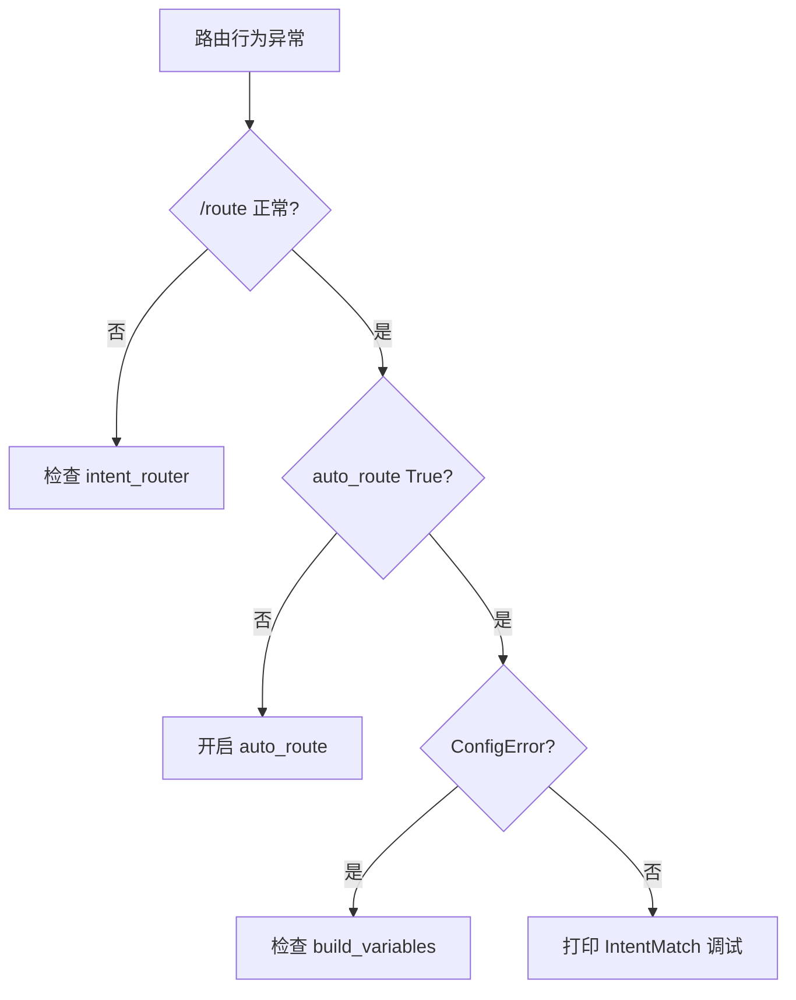

# Day 18 常见问题与排错指南

**适用**：学员自助排查、助教 FAQ

---

## Q1：`ModuleNotFoundError: No module named 'prompts'`

**原因**：未设置 `PYTHONPATH`。

**解决**：

```bash
cd nexus-agent-platform
export PYTHONPATH=src
```

---

## Q2：`/route` 返回「意图路由未启用」

**原因**：`ChatAssistant` 未传入 `intent_router`。

**解决**：

```python
from prompts import IntentRouter
router = IntentRouter()
assistant = ChatAssistant(client=client, intent_router=router)
```

---

## Q3：`auto_route` 开了但模板不变

**检查清单**：

1. `auto_route=True` 是否传入构造器  
2. 是否走了 `handle_command` 而非 `chat_turn`  
3. 输入是否为空串（直接返回「请输入有效内容」）  
4. 分类是否落在 `general`（变化不明显）

**调试**：先 `/route 你的话术` 看 `summary()`。

---

## Q4：`apply_template` 抛 `ConfigError` 缺变量

**原因**：`build_variables` 与模板 `required_vars` 不匹配。

**常见**：自定义模板新增变量，但未改 `IntentRouter.build_variables`。

**解决**：对照 `02_需求文档_扩展.md` E-003 表格。

---

## Q5：同一句话术分类与预期不符

**步骤**：

1. 打印 `matched_keywords`  
2. 计算各 intent 得分  
3. 查 `INTENT_PRIORITY`  

**示例**：「请根据文档说明收益率」可能 `rag_qa` 与 `product_faq` 同分，product 优先。

---

## Q6：`test_assistant_auto_route` 本地失败

**可能**：

- 未 Mock LLM → 检查 `LLMEnvConfig(mock=True)`  
- `reply` 断言：`"路由" in reply or "好的" in reply` — mock 内容须含其一  

---

## Q7：`context_provider` 返回空

**现象**：`rag_qa` 渲染后 context 为「（暂无检索上下文）」。

**原因**：未传 `context_provider` 或读文件失败。

**解决**：参考 `routed_assistant_demo._load_sample_context`。

---

## Q8：每轮对话模板乱跳

**说明**：这是当前设计——`auto_route` 每轮 `route_and_apply`。

**缓解**（作业/扩展）：

- 仅首条 user 消息路由  
- 或 session 级锁定模板直到 `/template` 手动改  

---

## Q9：中文关键词大小写

**说明**：规则区分大小写；中文一般无此问题。英文扩展时注意 `.lower()` 预处理（本期未做）。

---

## Q10：pytest 找不到 `tests/day18`

**解决**：

```bash
cd nexus-agent-platform
python3 -m pytest tests/day18/test_intent.py -v
```

须在项目根目录执行。

---

## 排错流程图



---

## 联系助教

附上：输入话术、`/route` 输出、`pytest` 失败栈、Python 版本。
