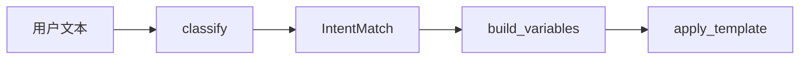

# Day 18 意图分类详解

**专题**：从规则引擎到模板路由 — NexusAgent 意图分类全链路

---

## 1. 为什么需要意图分类？

Day 17 解决了「**怎么说**」（Prompt 模板）；用户进入对话时还有「**要干什么**」：

| 用户表达 | 期望行为 |
|----------|----------|
| 根据说明书回答 | RAG 问答，注入 context |
| 总结三点 | 摘要模板，document=原文 |
| 审阅宣传语 | 合规模板，输出风险等级 |
| 理财收益如何 | 产品 FAQ |
| 你好 | 通用助手 |

手动 `/template` 对运营友好，对终端用户不友好。**意图分类器**是模板选择的前置层。

---

## 2. IntentMatch 数据模型

```python
@dataclass
class IntentMatch:
    intent: str
    template_name: str
    confidence: float
    matched_keywords: list[str] = field(default_factory=list)
    user_text: str = ""

    def summary(self) -> str:
        kw = ", ".join(self.matched_keywords) if self.matched_keywords else "（默认）"
        return (
            f"意图={self.intent} → 模板={self.template_name} | "
            f"置信度={self.confidence:.0%} | 命中={kw}"
        )
```

| 字段 | 设计意图 |
|------|----------|
| intent | 业务语义，便于日志与监控 |
| template_name | 对接 `PromptRegistry.get` |
| confidence | 预留阈值与人工转接 |
| matched_keywords | 可解释性，运营验收规则 |

---

## 3. RuleBasedIntentClassifier 算法

### 3.1 打分

对每个意图 `intent`，统计 `keywords` 中出现在 `text` 的子串个数：

```python
matched = [kw for kw in keywords if kw in text]
scores[intent] = (len(matched), matched)
```

### 3.2 决胜

1. 取 `max_score`  
2. 收集所有 `score == max_score` 的 intent → `candidates`  
3. `_pick_by_priority(candidates)` 按 `INTENT_PRIORITY` 选第一个  

### 3.3 回退

- 空文本 → `general`, confidence=0.5  
- 无命中 → `general`, confidence=0.6  

### 3.4 置信度

```python
confidence = min(0.95, 0.55 + 0.1 * max_score)
```

命中 1 词 → 65%；4 词 → 95% 封顶。

---

## 4. 常量配置

### INTENT_TEMPLATE_MAP

```python
INTENT_TEMPLATE_MAP = {
    "rag_qa": "rag_qa",
    "doc_summary": "doc_summary",
    "compliance_review": "compliance_review",
    "product_faq": "product_faq",
    "general": "default_assistant",
}
```

意图名与模板名解耦：未来 `rag_qa` 可映射到 `rag_qa_v2`。

### DEFAULT_KEYWORD_RULES

见 `02_需求文档_扩展.md` E-001。

### INTENT_PRIORITY

```python
INTENT_PRIORITY = (
    "compliance_review",
    "doc_summary",
    "product_faq",
    "rag_qa",
    "general",
)
```

**产品原则**：合规 &gt; 摘要 &gt; 产品咨询 &gt; 文档问答 &gt; 通用。

---

## 5. IntentRouter 职责



### build_variables 分支

| template_name | 额外变量 |
|---------------|----------|
| rag_qa | context |
| doc_summary | max_points="3", document=text |
| compliance_review | text |
| product_faq | product_name |
| default | 仅 company |

`context_provider: Callable[[], str]` 延迟求值，便于读文件或检索。

---

## 6. ChatAssistant 集成语义

| API | 行为 |
|-----|------|
| `/route [q]` | `classify(q)` → `summary()` |
| `auto_route` + `chat_turn` | `route_and_apply` 后 complete |
| `/template` | 仍可用，覆盖自动路由结果 |

回复格式：`[路由: template_name] {llm_content}`

---

## 7. 规则引擎优缺点

| 优点 | 缺点 |
|------|------|
| 零 token、确定性 | 同义词、口语覆盖不足 |
| 单测简单 | 长句多意图难以表达 |
| 运营可改关键词 | 子串误匹配（如「风险」） |

Day 19+ LLM 分类见 `13_深度扩展_LLM意图分类.md`。

---

## 8. 与 Agent 路由的关系

今日：**一句话 → 一个模板**  
明日：**意图 → 检索 → 填 context**  
远期：**意图 → Tool 调用图**（ReAct / Plan-and-Execute）

意图名是 Agent 工具路由的稳定 ID 前缀。

---

## 9. 调试清单

1. `python3 src/day18/intent_demos.py`  
2. `/route` 单句验收  
3. `pytest tests/day18/test_intent.py -v`  
4. 日志 grep `意图=`  

---

## 10. 延伸阅读

- `17_IntentRouter速查手册.md`  
- `22_意图路由深度讲义.md`  
- `25_intent精读.md`  
