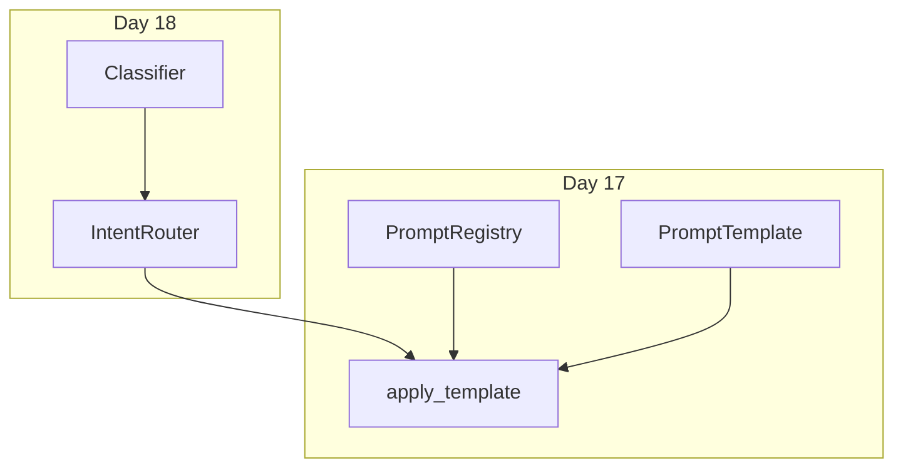

# Day 18 与 Day 17 模板对照表

**目的**：串联「模板库」与「意图路由」两层抽象

---

## 1. 能力对照

| 维度 | Day 17 | Day 18 |
|------|--------|--------|
| 核心问题 | 有哪些 Prompt？如何渲染？ | 用户这句话用哪个 Prompt？ |
| 主模块 | `prompts/base.py`, `library.py`, `registry.py` | `prompts/intent.py` |
| 核心类 | `PromptTemplate`, `PromptRegistry` | `RuleBasedIntentClassifier`, `IntentRouter` |
| Chat 命令 | `/template list`, `/template 名` | `/route [话术]` |
| 自动化 | 手动切换 | `auto_route=True` |
| 输出物 | 渲染后的 system 字符串 | `IntentMatch` + 模板名 |

---

## 2. 意图 → 模板 → Day17 常量

| Day18 intent | template_name | Day17 library 常量 | 主要变量 |
|--------------|---------------|------------------|----------|
| rag_qa | rag_qa | RAG_QA | company, context |
| doc_summary | doc_summary | DOC_SUMMARY | company, max_points, document |
| compliance_review | compliance_review | COMPLIANCE_REVIEW | company, text |
| product_faq | product_faq | PRODUCT_FAQ | company, product_name |
| general | default_assistant | DEFAULT_ASSISTANT | company |

---

## 3. API 调用链对照

### Day 17 手动路径

```
用户: /template rag_qa
  → prompt_registry.get("rag_qa")
  → apply_template("rag_qa")
  → PromptTemplate.render
  → 更新 system message
```

### Day 18 自动路径

```
用户: 请根据文档查询
  → RuleBasedIntentClassifier.classify
  → IntentMatch(template_name="rag_qa")
  → IntentRouter.build_variables (注入 context)
  → apply_template("rag_qa", variables)
  → PromptTemplate.render
  → 更新 system message
  → LLMClient.complete
```

**共享节点**：`apply_template` 与 `PromptTemplate.render`。

---

## 4. 变量来源对照

| 变量 | Day 17 默认 | Day 18 auto_route |
|------|-------------|-------------------|
| company | template_variables | IntentRouter.company |
| context | 手动或 demo 脚本 | context_provider() |
| document | 少见 | user_text |
| text | 少见 | user_text |
| product_name | 少见 | default_product |

---

## 5. 命令语义对照

| 命令 | 是否读 registry | 是否改 system | 是否调 LLM |
|------|-----------------|---------------|------------|
| /template list | ✓ | ✗ | ✗ |
| /template rag_qa | ✓ | ✓ | ✗ |
| /route 总结 | ✗（仅 classify） | ✗ | ✗ |
| 普通输入 + auto_route | ✓ | ✓ | ✓ |

---

## 6. 演示脚本对照

| Day 17 | Day 18 | 侧重点 |
|--------|--------|--------|
| prompt_demos.py | intent_demos.py | 渲染 vs 分类 |
| registry_demos.py | router_demos.py | 注册表 vs 变量构建 |
| rag_prompt_demo.py | routed_assistant_demo.py | 单模板 RAG vs 自动选模板 |
| assistant_prompt_demo.py | （合并入 routed） | /template vs /route |

---

## 7. 测试对照

| Day 17 tests/day17 | Day 18 tests/day18 |
|--------------------|---------------------|
| render / preview | classify 五场景 |
| registry load | build_variables |
| apply_template | route_and_apply |
| /template 命令 | /route, auto_route |

---

## 8. 迁移检查清单（Day17→18）

- [ ] 五类内置模板已在 registry  
- [ ] `apply_template` 保留非 system 历史  
- [ ] `INTENT_TEMPLATE_MAP` 与 list_names 一致  
- [ ] `build_variables` 满足各模板 required_vars  
- [ ] `/template` 仍可用于强制覆盖 auto_route  

---

## 9. 概念映射图



---

## 10. 学员一句话总结

> Day 17 造**弹药**（模板），Day 18 造**火控**（选哪种子弹）；`apply_template` 是击发装置。
