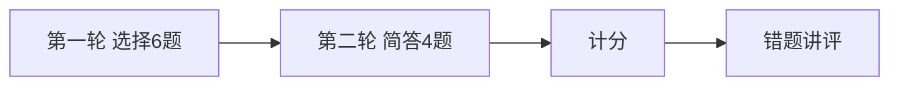

# Day 18 课堂知识竞赛

**形式**：小组抢答 + 个人闭卷  
**题量**：10 题（选择 6 + 简答 4）  
**建议时长**：20 分钟

---

## 第一部分：选择题（每题 10 分）

### 1

`RuleBasedIntentClassifier` 零关键词命中时返回的 intent 是？

- A. rag_qa  
- B. doc_summary  
- C. general  
- D. 抛异常  

答案
C — general，confidence 0.6

### 2

`INTENT_PRIORITY` 中排在最前（同分优先）的意图是？

- A. rag_qa  
- B. product_faq  
- C. compliance_review  
- D. doc_summary  

答案
C

### 3

`/route` 命令会调用 `apply_template` 吗？

- A. 会  
- B. 不会  
- C. 仅 rag_qa 会  
- D. 仅 auto_route 时才会  

答案
B — 仅 classify + summary

### 4

`rag_qa` 意图经 `build_variables` 必须注入的变量是？

- A. document  
- B. context  
- C. text  
- D. product_name  

答案
B

### 5

`auto_route=True` 时路由发生在 `chat_turn` 的哪个阶段？

- A. LLM 返回之后  
- B. add_user 之前  
- C. add_assistant 之后  
- D. 仅会话初始化时  

答案
B

### 6

`tests/day18/test_intent.py` 共有多少条测试？

- A. 10  
- B. 11  
- C. 12  
- D. 15  

答案
C

---

## 第二部分：简答题（每题 10 分）

### 7

写出置信度计算公式（含封顶）。

答案
confidence = min(0.95, 0.55 + 0.1 × 命中关键词数)

### 8

列举 `DEFAULT_KEYWORD_RULES` 中任意两个意图及其各一个关键词。

答案
例：doc_summary→总结；product_faq→理财（任意正确组合）

### 9

`route_and_apply` 与 Day 17 哪个方法直接交互？一句话说明作用。

答案
apply_template — 按 template_name 切换 system 并保留非 system 历史

### 10

输入「请根据文档审阅宣传语合规风险」为何选 compliance_review 而非 rag_qa？（同分策略）

答案
两意图同分 3 时，INTENT_PRIORITY 中 compliance_review 优先于 rag_qa

---

## 竞赛流程

---

## 评分与奖品（示例）

| 区间 | 奖励 |
|------|------|
| 90–100 | IntentRouter 速查手册打印 + 复习卡片 |
| 70–89 | 电子版 17 速查 |
| 60–69 | 补考 16 复习卡片 |
| &lt;60 | 晚自习一对一 15 分钟 |

---

## 讲师讲评要点

- 第 3 题：混淆 `/route` 与 `auto_route`  
- 第 5 题：顺序错误会导致 system 未更新就 complete  
- 第 10 题：串联 `test_priority_compliance_over_rag` 与产品策略  
