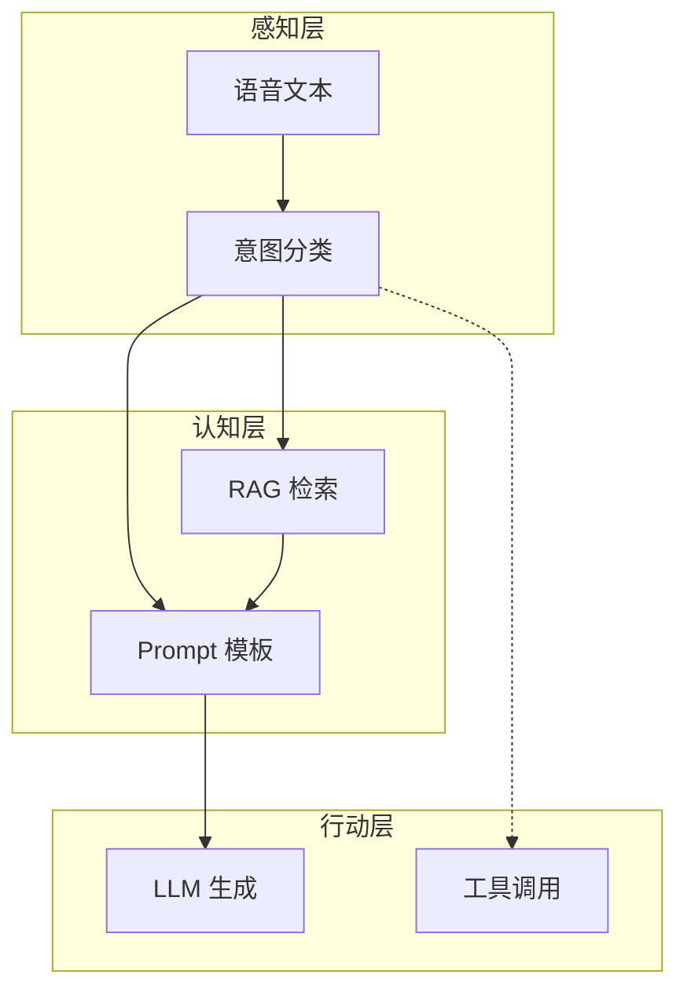

# Day 18 意图路由深度讲义

**适用**：第二周复习、架构分享  
**讲师**：陈默

---

## 第一章：路由在 Agent 栈中的位置



Day 18 实现感知层中的 **IM** 与认知层 **PT** 的桥接。

---

## 第二章：路由模式分类

| 模式 | 代表 | NexusAgent 对应 |
|------|------|-----------------|
| 规则路由 | 关键词、正则 | RuleBasedIntentClassifier |
| 模型路由 | LLM 分类 | Day 19 预习 |
| 嵌入路由 | 向量近邻 | Day 28 扩展 |
| 混合路由 | 规则 + 模型 | 13_深度扩展 |

---

## 第三章：规则打分的形式化

设意图集合 \( I \)，关键词集合 \( K_i \) 对应意图 \( i \)。

\[
score(i, text) = \sum_{kw \in K_i} \mathbf{1}[kw \subseteq text]
\]

\[
i^* = \arg\max_i score(i) \quad \text{（同分用 priority 决胜）}
\]

\[
confidence = \min(0.95,\ 0.55 + 0.1 \cdot score(i^*))
\]

---

## 第四章：IntentRouter 设计模式

### 4.1 策略模式

`classifier` 可替换，Router 稳定。

### 4.2 外观模式

`route_and_apply` 隐藏 classify + build_variables + apply_template 三步。

### 4.3 依赖注入

`registry`、`context_provider`、`company` 构造注入，利于测试与多租户。

---

## 第五章：变量构建与槽位填充

意图分类本质是 **dialog act**；`build_variables` 是 **slot filling**：

| 槽位 | 触发意图 | 填充源 |
|------|----------|--------|
| context | rag_qa | 检索 / 读文件 |
| document | doc_summary | user_text |
| text | compliance_review | user_text |
| product_name | product_faq | 配置默认品 |

Day 19 升级：context 槽由检索服务填充。

---

## 第六章：会话级路由策略

### 6.1 每轮路由（当前实现）

优点：意图切换灵敏  
缺点：多轮问答可能抖动  

### 6.2 首句锁定

仅第一条 user 消息 `route_and_apply`，后续保持模板直到 `/template`。

### 6.3 置信度门控

低于阈值不切换，回复澄清选项（作业 C）。

### 6.4 显式确认

「检测到您要总结文档，是否继续？」— 高合规场景可选。

---

## 第七章：可观测性

建议日志字段：

```json
{
  "intent": "doc_summary",
  "template_name": "doc_summary",
  "confidence": 0.75,
  "matched_keywords": ["总结", "要点"],
  "user_text_hash": "..."
}
```

指标：意图分布、general 占比、路由后用户满意度。

---

## 第八章：安全与合规

1. **提示注入**：分类输入与 system 分离  
2. **敏感意图**：compliance 审计留痕  
3. **错误路由**：高风险的 product_faq 误答 → priority 与阈值  

---

## 第九章：性能

规则分类：微秒级，可同步。  
LLM 分类：毫秒–秒级，宜异步或缓存（相同话术）。

---

## 第十章：演进路线图

```
Day18 规则 → Day19 LLM 分类 → Day28 向量 context
         → Day35 Tool Router（意图即 tool 名）
```

**不变量**：`IntentMatch` + `template_name` 接口。

---

## 第十一章：课堂讨论记录

林晓：「能否用 embedding 做意图？」  
陈默：「可以，把用户句与意图描述向量比相似度；维护成本在标注与刷新。」

赵岩：「合规必须 100%？」  
陈默：「没有 100%，只有分层：规则兜高频 + 人工复核长尾。」

---

## 第十二章：延伸阅读

- `11_意图分类详解.md`  
- `13_深度扩展_LLM意图分类.md`  
- `25_intent精读.md`  
