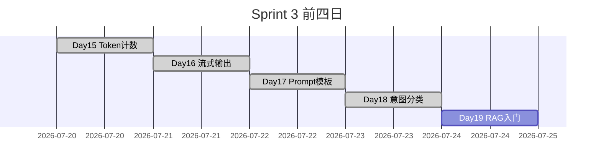
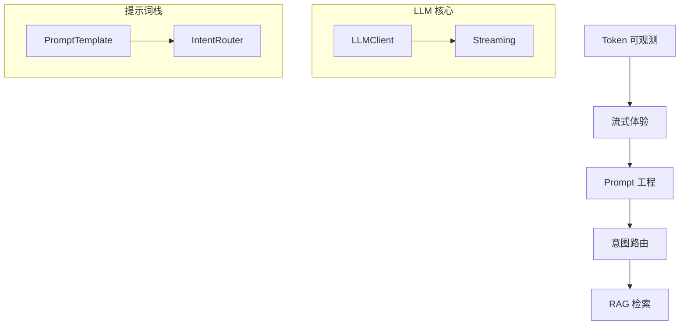

# Day 18 Sprint 3 阶段回顾

**范围**：Day 15–18（本课为 Sprint 3 前四日）  
**日期锚点**：2026-07-23

---

## Sprint 3 进度条



**完成度**：4/10 日（40%）— 可观测、体验、提示词、路由基础已就绪。

---

## 四日能力矩阵

| Day | 主题 | 核心交付 | 用户可见 |
|-----|------|----------|----------|
| 15 | Token 计数 | TokenSessionTracker | /tokens |
| 16 | 流式输出 | StreamingLLMClient | 逐字显示 |
| 17 | Prompt 模板 | PromptRegistry, /template | 场景 system |
| 18 | 意图分类 | IntentRouter, /route, auto_route | 自动选场景 |

---

## 技术栈累积图



---

## 林晓的四日学习弧

| 日 | 顿悟 |
|----|------|
| 15 | 「原来每轮对话花了多少 token 能看见」 |
| 16 | 「显示和生成可以拆开」 |
| 17 | 「system 是数据不是硬编码」 |
| 18 | 「用户不必知道模板名，路由器代劳」 |

---

## 代码资产清单（Sprint 3 至今）

```
src/
  llm/           # Day 12+  client, streaming, tokens
  prompts/
    base.py      # Day 17
    library.py
    registry.py
    intent.py    # Day 18
  chat/cli_assistant.py  # 累积命令
  day15/ ... day18/
tests/day15/ ... day18/
```

---

## 命令演进

| 命令 | 引入日 |
|------|--------|
| /tokens | Day 15 |
| （流式无新命令） | Day 16 |
| /template | Day 17 |
| /route | Day 18 |

---

## 测试覆盖趋势

| 日 | 测试文件 | 约条数 |
|----|----------|--------|
| 15 | test_tokens | ~8 |
| 16 | test_streaming | ~10 |
| 17 | test_prompts | ~15 |
| 18 | test_intent | 12 |

**周航备注**：保持「演示可跑 + pytest 无网」原则。

---

## 尚未覆盖（Day 19–24 预告）

- 向量检索与 embedding  
- chunk 策略与 context 拼接  
- Agent 工具调用与多步规划  
- 评测集与 RAG 质量指标  

---

## 回顾测验（自测）

1. Day 16 与 Day 17 正交关系？  
2. Day 18 输出如何衔接 Day 17？  
3. 为何 Sprint 3 先 Prompt 再意图再 RAG？  

<details><summary>参考答案</summary>

1. 流式管输出显示，模板管 system 输入  
2. template_name → apply_template  
3. 先定「怎么说」再定「选哪种说法」最后「说什么事实」（context）

</details>

---

## 团队感言（虚构）

**赵岩**：「用户终于不用背命令了。」  
**陈默**：「路由接口留好，明天只换 context 水管。」  
**林晓**：「Sprint 3 过半前，我要把 12 条测试默写出来。」

---

## 下一阶段目标

Day 19：RAG 入门 — `context_provider` 从 `doc_reader` 走向检索管线。
