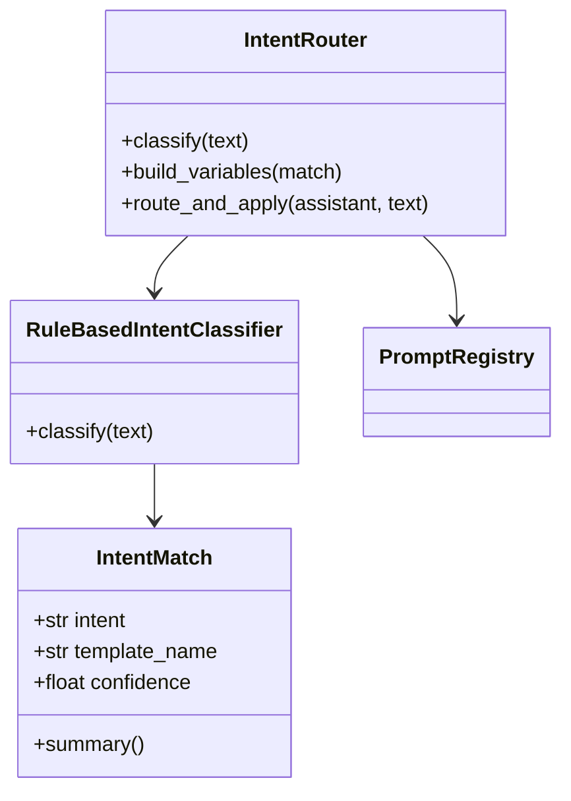

# Day 18 intent.py 精读

**文件**：`nexus-agent-platform/src/prompts/intent.py`  
**行数**：约 175 行  
**阅读方式**：自上而下 + 测试反查

---

## 1. 文件职责边界

| 负责 | 不负责 |
|------|--------|
| 意图分类 | LLM 调用 |
| 模板名决策 | Prompt 渲染 |
| 变量 dict 构建 | 消息历史管理 |
| route_and_apply 编排 | 流式输出 |

渲染与历史归 Day 17 `apply_template`。

---

## 2. 导入依赖

```python
from prompts.registry import PromptRegistry, default_registry
```

IntentRouter 只**读** registry，不注册模板 — 单一职责。

---

## 3. INTENT_TEMPLATE_MAP 精读

```python
INTENT_TEMPLATE_MAP: dict[str, str] = {
    "rag_qa": "rag_qa",
    ...
    "general": "default_assistant",
}
```

**设计点**：

- 键：分类器输出 intent（可扩展）  
- 值：`PromptRegistry.get` 的参数（必须存在）  
- `general` → `default_assistant` 命名历史原因，映射隔离变更影响  

---

## 4. DEFAULT_KEYWORD_RULES 精读

四类业务 + 隐式 general（无词条）。

添加意图三步：

1. rules 加列表  
2. map 加映射  
3. priority 插入位置  

缺一步 → 分类正确但模板错或同分行为异常。

---

## 5. INTENT_PRIORITY 精读

```python
INTENT_PRIORITY: tuple[str, ...] = (
    "compliance_review",
    "doc_summary",
    "product_faq",
    "rag_qa",
    "general",
)
```

`_pick_by_priority`：

```python
for intent in self.priority:
    if intent in candidates:
        return intent
return candidates[0]
```

`general` 在 priority 末尾但通常不参与同分（无关键词时不进 scores）。

---

## 6. IntentMatch.summary 格式契约

```python
f"意图={self.intent} → 模板={self.template_name} | "
f"置信度={self.confidence:.0%} | 命中={kw}"
```

测试 `test_intent_match_summary` 锁定 `"意图=" in summary` — 改动格式须同步测试与文档。

---

## 7. classify 边界情况表

| 输入 | intent | confidence |
|------|--------|------------|
| `""` / 空白 | general | 0.5 |
| 无命中 | general | 0.6 |
| 命中 n 词 | 最高分 intent | min(0.95, 0.55+0.1n) |

---

## 8. build_variables 分支完整性

```python
base: dict[str, str] = {"company": self.company}
```

所有分支 `return {**base, ...}` 保证 `company` 一致。

**default 分支**：`return base` — 对应 `default_assistant` 仅需 company。

---

## 9. route_and_apply 副作用

```python
assistant.apply_template(match.template_name, variables=variables)
```

副作用在 assistant：

- 改 `prompt_template`  
- 改 `template_variables`  
- 重建 history 的 system  

Classifier 本身**无状态**。

---

## 10. 与 tests 逐条映射

| 源码行为 | 测试 |
|----------|------|
| rag 关键词 | test_classify_rag_qa |
| summary 关键词 | test_classify_doc_summary |
| compliance 关键词 | test_classify_compliance |
| product 关键词 | test_classify_product_faq |
| 你好 | test_classify_general_fallback |
| context_provider | test_router_build_variables_rag |
| text 键 | test_router_build_variables_compliance |
| apply 副作用 | test_route_and_apply_changes_template |
| 端到端 | test_assistant_auto_route |
| /route | test_assistant_route_command |
| summary | test_intent_match_summary |
| priority | test_priority_compliance_over_rag |

---

## 11. 扩展修改指南

### 加新意图 `invoice_query`

```python
# rules
"invoice_query": ["发票", "报销", "账单"],
# map
"invoice_query": "customer_service",  # 或新模板
# priority — 按业务插入
```

### 换 LLM 分类器

实现相同 `classify(text) -> IntentMatch`，构造 `IntentRouter(classifier=...)`.

---

## 12. 代码气味与改进（讨论）

| 现况 | 可选改进 |
|------|----------|
| 子串 `in text` | 归一化、分词 |
| 固定 max_points=3 | 从话术解析数字 |
| context_provider 无参 | 改为 `(query) -> str` |

本期刻意保持 MVP 简单。

---

## 13. 精读作业

1. 手抄 `classify` 函数（加深记忆）  
2. 为 `invoice_query` 写一条 pytest  
3. 对比 `intent.py` 与 `registry.py` 依赖方向（谁 import 谁）  

---

## 14. 一图总结


