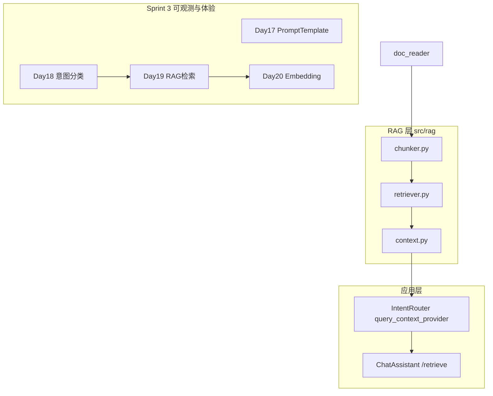

# Day 19 旁白解读：让助手真正「根据资料」回答

> **前置要求**：完成 Day 18 `IntentRouter`、`query_context_provider` 预习、`/route` 与 `auto_route`

---

## 旁白

2026 年 7 月 24 日，周五。智链科技 Sprint 3 第五日晨会，赵岩打开内测对话记录：

> 「用户问『年化收益率是多少』，助手答得含糊。日志 显示 `context` 永远是 `raw_notice.txt` 前 400 字——跟问题无关。」

林晓举手：「Day 18 的 `context_provider` 不读用户问题，只是 lambda 截断全文。」

陈默在白板上把 Day 18 的菱形接长：

```
用户输入
    ↓
IntentRouter.classify
    ↓
rag_qa → build_variables
    ↓
query_context_provider(query)   ← 今日新增
    ↓
RAGContextService.retrieve_context
    ↓
doc_reader → chunk_text → KeywordRetriever.search
    ↓
拼接 context → apply_template → LLM
```

> 「今天建 RAG 最小闭环：**分块、检索、拼接**。MVP 用关键词重叠打分，不引向量库。Day 20 再换 Embedding。」

周航补充：

> 「`tests/day19/test_rag.py` 共 12 条用例：分块边界、检索命中、`max_chars` 截断、`query_context_provider` 与 `/retrieve` 命令。全部离线。」

下午 Lab，林晓运行 `chunk_demos.py`，看见 `raw_notice.txt` 被切成 6 块，每块带 `chunk_id` 与 `source`。她又跑 `retriever_demos.py`：

```
检索「年化收益率是多少」共 2 条：
  1. score=67% source=raw_notice.txt 命中=年化, 收益
```

她问陈默：「为什么中文要切二字片段？」

陈默指向 `retriever.py` 的 `_tokenize`：

> 「没有分词库时，bigram 兜底提高『收益率』类复合词命中率。这是工程妥协，不是 NLP 真理。」

傍晚 `routed_rag_demo.py` 跑通：用户说「根据文档，年化收益率是多少？」，终端先出现 `[路由: rag_qa]`，LLM 收到的 system 里 `context` 已含 `[片段1·raw_notice.txt·67%]` 标注的真实段落。

站会末尾预告 Day 20：

> 「关键词检索怕同义词——『收益』和『回报率』对不上。明天学 Embedding，用余弦相似度找语义近邻。」

---

## 今日在架构中的位置



---

## 林晓的学习建议

1. 先读 `src/rag/chunker.py`，理解 `overlap` 与段落合并  
2. 运行 `chunk_demos.py`，对照 `TextChunk` 各字段  
3. 读 `retriever.py` 的 `_tokenize` 与 `_score_tokens`  
4. 运行 `retriever_demos.py`，对 `QUERIES` 四条手写预期命中  
5. 阅读 `tests/day19/test_rag.py` 全部 12 条  
6. `NEXUS_LLM_MOCK=1 routed_rag_demo.py`，对比 `/retrieve` 与 `auto_route` 对话  

---

## 今日关键词

| 术语 | 含义 |
|------|------|
| TextChunk | 带 source、index、字符偏移的文本块 |
| chunk_text / chunk_documents | 单文/批量分块入口 |
| KeywordRetriever | 关键词重叠检索器 |
| RetrievalResult | 单条命中：chunk + score + matched_tokens |
| RAGContextService | 检索并拼接 context 的服务层 |
| query_context_provider | 接收用户 query 的上下文提供函数 |
| /retrieve | Chat 命令，预览检索摘要 |

---

## 与昨日衔接

Day 18 回答「**用户想干什么**」并选模板；Day 19 回答「**rag_qa 的 context 从哪来**」。`context_provider` 静态占位升级为 `query_context_provider` 驱动的检索管线，让「根据资料」名副其实。
