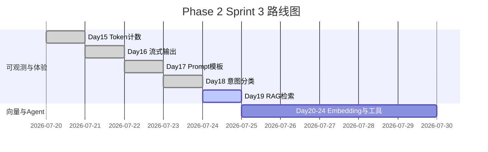

# Day 19 企业背景与今日任务

**日期**：2026 年 7 月 24 日  
**Sprint**：Sprint 3 第五日 — RAG 检索入门与查询感知上下文

## 晨会纪要

### 赵岩（产品）

> 「Day 18 路由到 `rag_qa` 后，用户仍抱怨答非所问。根因是 **context 与 query 无关**——无论问收益率还是客服电话，注入的都是同一段截断。今日必须做**查询感知检索**。」

### 陈默（架构）

> 「新增 `src/rag/` 包：`chunker` 分块、`retriever` 关键词检索、`context` 服务层。`IntentRouter` 增加 `query_context_provider`；`ChatAssistant` 增加 `rag_service` 与 `/retrieve` 预览命令。」

### 周航（DevOps）

> 「`tests/day19/test_rag.py` 12 条进 CI，依赖 `sample_docs` 离线数据。演示脚本 `day19/*` 不连外网。」

### 林晓（学员代表）

> 「chunk_size 设多少合适？太小碎片多，太大检索不精准。」

陈默：「默认 200 字符、overlap 40，与 `raw_notice.txt` 篇幅匹配；调参放作业。」

## 任务分配

| ID | 任务 | 负责人 | 优先级 |
|----|------|--------|--------|
| ZL-NA-REQ-019 | 实现 RAG 检索管线 | 全员 | P0 |
| ZL-NA-301 | `TextChunk` + `chunk_text` + `chunk_documents` | 林晓 | P0 |
| ZL-NA-302 | `KeywordRetriever` + `RetrievalResult` | 林晓 | P0 |
| ZL-NA-303 | `RAGContextService` + `DocumentIndex` | 助教 | P0 |
| ZL-NA-304 | `query_context_provider` + `/retrieve` | 助教 | P0 |
| ZL-NA-305 | `day19/*` 演示脚本 | 助教 | P1 |
| ZL-NA-306 | `tests/day19/test_rag.py` 全绿 | 周航 | P0 |

## Definition of Done

- [ ] `python3 src/day19/chunk_demos.py` 输出分块列表与 chunk_id
- [ ] `python3 src/day19/retriever_demos.py` 四条查询有命中摘要
- [ ] `python3 src/day19/rag_context_demo.py` 打印拼接 context
- [ ] `NEXUS_LLM_MOCK=1 python3 src/day19/routed_rag_demo.py` 联调通过
- [ ] `pytest tests/day19/test_rag.py -v` 12 passed
- [ ] 能口述：分块策略、overlap 作用、检索打分公式
- [ ] 能解释：`query_context_provider` 与 `context_provider` 优先级
- [ ] 能说明：`/retrieve` 与 `/route` 的行为差异

## 今日节奏

| 时段 | 内容 |
|------|------|
| 09:00-09:30 | RAG 概论、Day 18 context 痛点回顾 |
| 09:30-10:30 | `chunker.py` 手写练习与 overlap 实验 |
| 10:45-12:00 | `KeywordRetriever` 与打分走读 |
| 14:00-15:30 | `RAGContextService` 与 `query_context_provider` 集成 |
| 15:45-17:00 | `routed_rag_demo` 联调与测试讲评 |

## 环境准备

```bash
cd nexus-agent-platform
export PYTHONPATH=src
export NEXUS_LLM_MOCK=1

python3 src/day19/chunk_demos.py
python3 src/day19/retriever_demos.py
python3 src/day19/rag_context_demo.py
python3 src/day19/routed_rag_demo.py
python3 -m pytest tests/day19/test_rag.py -v
```

## Sprint 3 全景（Day 15–24 预览）



## 与 Day 18 的差异

| 维度 | Day 18 意图路由 | Day 19 RAG 检索 |
|------|----------------|-----------------|
| 关注点 | **选哪个**模板 | **rag_qa 注入什么** context |
| 核心模块 | `prompts/intent.py` | `src/rag/*` |
| 上下文来源 | `context_provider()` 静态 | `query_context_provider(query)` 检索 |
| 用户命令 | `/route` 预览意图 | `/retrieve` 预览检索 |
| 自动化 | `auto_route` 切换模板 | 检索随 query 动态变化 |
